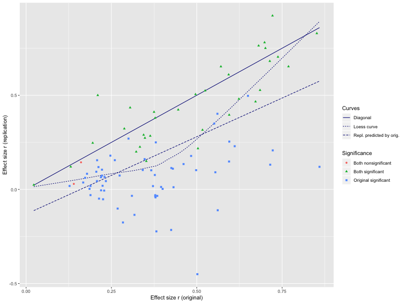

```{r, echo = FALSE}
library(tidyverse)
```

## Goals of this exercise

As science gets more complex, making work reproducible for others to
build upon is vital. Therefore, it is worth spending some effort that
to ensure that code we use to accomplish our tasks have the following
characteristics, among others.

1. Accomplishes the task as simply as possible;
2. Organizes input and output in a clean manner;
3. Uses well-known and tested tools to accomplish the task instead of
   rolling one's own, thereby increasing the chance that the
   reproducibility will remain high into the future
4. Includes commentary that makes the intent of computation clear
5. Produces the results in the publication/work

In this exercise, we will work through parts of the `masterscript.R`
from the [Github repository](https://github.com/CenterForOpenScience/rpp.git) for a
high-profile [Science paper](https://doi.org/10.1126/science.aac4716)
that highlighted reproducibility issues in the psychology
literature. The article (file `aac4716.full.pdf`) and supplement (file
`Aarts-SM.pdf`) are provided.

The relevant data `rpp_data.csv` and functions `functions.r` are
already downloaded and provided . Referenced line numbers are for the
original files distributed with this exercise.

__0.__ Here are lines 1-88 of `masterscript.R`, modified to work with the already downloaded files
   `rpp_data.csv` and `functions.r`. We need this downstream but
   nothing to do for you here except evaluate the code chunk.
```{r q1_a}
######################################################################################
# Master script Tilburg University Analyses                                          #
# Responsible for this file: CHJ Hartgerink (c.h.j.hartgerink@tilburguniversity.edu) # 
#                            RCM van Aert (r.c.m.vanaert@tilburguniversity.edu)      #
#                            MALM van Assen (m.a.l.m.vanassen@tilburguniversity.edu) #
######################################################################################

#setwd(choose.dir())

# If you are having problems with reading in the data run this
# Thanks @hcp4715
# Sys.setlocale("LC_ALL", "English")

# source functions
if(!require(httr)){install.packages('httr')}
library(httr)
##info <- GET('https://osf.io/b2vn7/?action=download', write_disk('functions.r', overwrite = TRUE)) #downloads data file from the OSF
source('functions.r')
if(!require(Hmisc)){install.packages('Hmisc')}
library(Hmisc)
if(!require(metafor)){install.packages('metafor')}
library(metafor)

# Read in Tilburg data
##info <- GET('https://osf.io/fgjvw/?action=download', write_disk('rpp_data.csv', overwrite = TRUE)) #downloads data file from the OSF
MASTER <- read.csv("rpp_data.csv")[1:167, ]
colnames(MASTER)[1] <- "ID" # Change first column name to ID to be able to load .csv file

# ALL ANALYSES INCLUDE PAIRWISE SELECTION.

#-----------------------------
jour <- numeric()

for(i in 1:nrow(MASTER)) {
  if(as.character(MASTER$Journal..O.[i]) == "JEPLMC") {
    jour[i] <- 1
  } else if(as.character(MASTER$Journal..O.[i]) == "JPSP") {
    jour[i] <- 2
  } else if(as.character(MASTER$Journal..O.[i]) == "PS") {
    if(as.character(MASTER$Discipline..O.[i]) == "Cognitive") {
      jour[i] <- 3
    } else if(as.character(MASTER$Discipline..O.[i]) == "Social") {
      jour[i] <- 4
    } else { jour[i] <- 5 }
  }
  else { jour[i] <- NA }
}


```

__1.__ (1pt) Why is line 8 above (`setwd(choose.dir())`) above problematic?

```{r q1_b, eval = FALSE}
choose.dir() is a Windows-specific function as the documentation notes and therefore not portable
as evidenced here: https://www.rdocumentation.org/packages/utils/versions/3.6.2/topics/choose.dir

```

__2.__ (2pts) Using the `MASTER` dataset, generate the following
   version of Table S1 (page 12) in the supplement file
   (`Aarts-SM.pdf`). Name your resulting table `q2_tab`.  Save the
   test statistic and p-value in variables `chisq_stat` and `p_value`
   respectively. Hint: `dplyr::filter`, `dplyr::transmute`,
   `dplyr::recode`, `base::table`, `stats::mcnemar.test`.

|               | Nonsignificant| Significant|
|:--------------|--------------:|-----------:|
|Nonsignificant |              2|           1|
|Significant    |             62|          35|

```{r q2}

###############
library(magrittr)
library(tidyr) 
library(dplyr)

#recode values with output as table
q2_tab <- tibble(T_sign_O = MASTER$T_sign_O, T_sign_R  = MASTER$T_sign_R) %>%
 dplyr::transmute(T_sign_O=recode(T_sign_O,  '0' = "Nonsignificiant", '1' = "Significant"),T_sign_R=recode(T_sign_R , '0' = "Nonsignificiant", '1' = "Significant"))  %>%
 table() 


##Alternative: recode values with output as knitr 
q2_knitr <- tibble(T_sign_O = MASTER$T_sign_O, T_sign_R  = MASTER$T_sign_R) %>%
 dplyr::transmute(T_sign_O=recode(T_sign_O,  '0' = "Nonsignificiant", '1' = "Significant"),T_sign_R=recode(T_sign_R , '0' = "Nonsignificiant", '1' = "Significant"))  %>%
  table() %>%
   knitr::kable()


##Chi-sq Test
mcnemar_test <- stats::mcnemar.test(q2_tab, correct=FALSE)
chisq_stat <- as.double(mcnemar_test[1])
p_value <- as.double(mcnemar_test[3])


```

```{r q2_result}
## Do not modify this chunk
if (exists("q2_tab")) {
    knitr::kable(q2_tab)
}
if (exists("chisq_stat") && exists("p_value")) {
    cat(sprintf("Chi-sq statistic %f, p-value = %f\n", chisq_stat, p_value))
}
```

__3.__ (2pts) Reproduce table significance proportions per journal
   stated in penultimate para on page 12 of supplement as a tibble
   named `q3_tibble`.  Hint: `dplyr::mutate`, `dplyr::filter`,
   `dplyr::transmute`, `dplyr::summarize`, `knitr::kable`,
   `stats::mcnemar.test`. You can use the `jour` variable the authors
   created earlier in question 0 above. The corresponding lines in
   `masterscript.R` are 75-112.

|Journal | Orig. N| Orig. pct.| Repl. N| Repl. pct.| Either N| Either pct|
|:-------|-------:|----------:|-------:|----------:|--------:|----------:|
|JEPLMC  |      27|  0.9642857|      13|  0.4642857|       13|  0.4814815|
|JPSP    |      31|  0.9687500|       7|  0.2187500|        7|  0.2258065|
|PS      |      39|  0.9750000|      16|  0.4000000|       15|  0.3846154|

```{r q3}


JEPLMC <- dplyr::filter(MASTER[131:132], jour == 1) %>%
  drop_na() %>%
  table() 


JPSP <- dplyr::filter(MASTER[131:132], jour == 2) %>%
  drop_na() %>%
  table() 


PS <- dplyr::filter(MASTER[131:132], jour == 3| jour == 4| jour==5) %>%
  drop_na() %>%
  table() 


temptibble <- tibble(JEPLMC=JEPLMC[1:4], JPSP=JPSP[1:4], PS=PS[1:4])
q3_tibble <- tibble(
  "Journal" = colnames(temptibble),
  "Orig. N" = unlist(lapply(temptibble, function(x) sum(x[2]+x[4]))),
  "Orig. Pct." = unlist(lapply(temptibble, function(x) sum(x[2]+x[4])/sum(x[1]+x[2]+x[3]+x[4]))),
  "Repl. N" = unlist(lapply(temptibble, function(x) sum(x[3]+x[4]))),
  "Repl. Pct" = unlist(lapply(temptibble, function(x) sum(x[4]+x[3])/sum(x[1]+x[2]+x[3]+x[4]))),
  "Either N" = unlist(lapply(temptibble, function(x) x[4])),
  "Either pct" = unlist(lapply(temptibble, function(x) x[4]/sum(x[2]+x[4])))
) 


```

```{r q3_result}
## Do not modify this chunk
if (exists("q3_tibble")) {
    knitr::kable(q3_tibble)
}
```

__4.__ (3pts) Using `ggplot2` reproduce Figure S4 as shown here. The
   relevant lines in `masterscript.R` are 272-311. Name your plot
   object `fig_s4`.  __Note:__ It is sufficient to produce what we
   have shown here, and the actual colors of points etc. can be
   different. However, the color-coding must be there. We use `"navy
   blue"` for the line colors. _Hint:_ First create a plot data set
   from `MASTER` that has the variables you need. Then create another
   dataset for the diagonal line, regression smoother (`stats::lm`),
   and loess (`stats::loess.smooth`) and then make a call to
   `ggplot2::geom_line`. This will match the results of the
   authors. (Using `ggplot2::geom_smooth` will return different
   results!)

```{r, out.width = "600px", echo = FALSE}

```

```{r q4}

library(tidyverse)

##Build data set for the plot; this uses the recoded values from previous exercise.
plot_data <- mutate(MASTER, Significance = case_when(
  T_sign_O == 0 & T_sign_R == 0 ~ "Both Nonsignificant",
  T_sign_O == 1 & T_sign_R == 0  ~ "Original Significant",
  T_sign_O == 1 & T_sign_R == 1  ~ "Both Significant"
)) %>%
  select(Significance, Rep_effect = T_r..R., Orig_effect = T_r..O.) %>%
  drop_na()


##Linear regression + Diagnol

lm <- lm(Rep_effect~ Orig_effect, data = plot_data) %>%
  fortify() %>%
  select(Orig_effect, .fitted) 

lines_lm <- tibble("Base" = lm$Orig_effect, "Repl. predicted by orgi." = lm$.fitted, "Diagnol" = lm$Orig_effect) %>%
  gather(key = "Curve", value = "Value", -Base)

##Loess

loess <- loess.smooth(x = plot_data$Orig_effect, y = plot_data$Rep_effect, evaluation = length(plot_data$Orig_effect)) %>%
  as.data.frame()

lines_loess <- tibble("Base" = loess$x, "Loess Curve" = loess$y) %>%
  gather(key = "Curve", value = "Value", -Base)


##Plot
fig_s4 <- ggplot2::ggplot() +
  geom_line(data = lines_data, aes(x = Base, y = Value, linetype = Curve), color = "#000099") +
  geom_line(data = lines_data1, aes(x = Base, y = Value, linetype = Curve), color = "#000099") +
  geom_point(data = plot_data, aes(x = Orig_effect, y = Rep_effect, shape = Significance, color = Significance) ) +
  geom_vline(xintercept = 0, color="grey") + 
  geom_hline(yintercept = 0, color="grey") +
  labs(x = "Effect size r (original)", y= "Effect size r (replication)") 


```

```{r q4_result}
## Do not modify this chunk
if (exists("fig_s4")) {
    print(fig_s4)
}
```

__5.__ (2pts) State at least three few nontrivial ways in which this
   replicability code could be improved. Topics to consider:
   separation of concerns, reusability, readability, portability. Cite
   the lines of `masterscript.R` when discussing each topic. Your
   answers will just be plain text below. 

```{r, eval = FALSE}
## Fill in text here.

##Maker sure line numbers aren't distorted because of adding my own notes.

1.  Reusability: In lines [78-108], we have various functions unique to each list and variable. These functions/formulas are applicable across other areas of the code, and it would be much better to apply the same functions across as many lists/variables as possible.
  
2. Organization and Tidy Data Sets: In [Lines 32-88] you can see a stray vector "jour", that is not attached to the rest of the data, which could cause for confusion later (better to just mutate onto existing data frame). Using tidy data sets would be helpful which would ultimately require less manipulation of the data, seeing that even the base MASTER data set could be cleaned up. Another example is the plot data used above, in which we can create a tidy data set to consolidate series on the graph. 

3.  Explanations of proceedures: For example, on lines [32-48], it would be good to have a note to explain why we are using these specific columns "Journal" and "Discipline" together, and under what circumstance there would be NA values [line 47]. This is a microcasm throughout with another example on line [111] using 'cbind', and you need to read ahead in order to understand why the data is being prepared in this manner. 

4.  Readability: In lines [140-162], there is an example where it is very difficult to follow what components are being put into the graph and for what reason. There are very few notes, and in dense blocks of code, it is important to understand how the components come together for reproducability. Another example is when dataframes are being sliced [lines 257-261] in ways that may not seem very concise to the reader.


```

