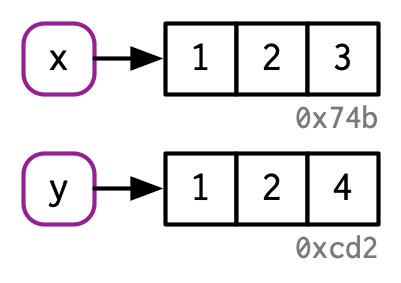

```{r, echo = FALSE}
## Install the microbenchmark package if needed
installIfNeeded <- function(packages, ...) {
  for (package in packages) {
    installedPackages <- installed.packages()[, 1]
    if (! (package %in% installedPackages))
      install.packages(package, repos = "https://cloud.r-project.org")
  }
}
installIfNeeded(c("lobstr"))
library(lobstr)
```

## 3.1.1. Names and bindings

This section is from [Advanced R](https://adv-r.hadley.nz/names-values.html)

Consider the assignment:

```{r}
x <- c(1, 2, 3)
```

Normally, one would read it as an assignment of the vector of values
1, 2, 3, somewhere in memory to a variable named `x`. But what R
actually does is 

- It creates a vector of values `c(1, 2, 3)` somewhere in memory
- It binds `x`, i.e. associates it, to that vector

_In other words, the object, or value, doesn’t have a name; it’s
actually the name that has a value._

This can be pictorially represented as follows where the number
indicates a memory address, which is fixed here at `0x74b` for
discussion.


Here the name `x` is pointing to the value stored in memory. Thus, a
name is a binding, or reference to a value. 

So what happens when you assign `y` to `x`?

```{r}
y <- x
```

R merely creates another name `y` and makes it point to the same
place!

So we have: 


This can be seen using the function `obj_addr` function from the
package `lobstr` that you can install from CRAN.

```{r}
lobstr::obj_addr(x)
lobstr::obj_addr(y)
```

## 3.1.2 Copy on modify

Now let us modify `y`. 

```{r}
y[[3]] <- 4
```

What actually happens? 

In object-oriented programming (OOP), if you have references to two
objects `x` and `y`, then changing `y` changes `x` as well:
referential semantics!

But even though everything in R is an object, the behavior is
different, unlike standard OOP.

What actually happens is a silent _copy on modify_. First, let us
print the values of `x` and `y`.

```{r}
x
y
```

The picture now is:




R did two things:

- Copy the original value of `x` to a new address
- Modify the third element to the value 4
- Bind `y` to this new address

We can once again check the address:

```{r}
lobstr::obj_addr(x)
lobstr::obj_addr(y)
```

## 3.1.3. Tracing copies

You can trace when objects are being copied This can be seen using the
function `base::tracemem()` which will begin tracing address changes
to any object name you provide; `base::untracemem()` will stop
tracing.

```{r}
x <- c(1, 2, 3)
cat(tracemem(x), "\n")
y  <- x
y[[3]]  <- 4
base::untracemem(x)
```

___

Same copy-on-modify rules apply to function calls as well.


```{r}
f <- function(a) {
  a
}

x <- c(1, 2, 3)
cat(tracemem(x), "\n")

z <- f(x)
# there's no copy here!

untracemem(x)
```

## 3.1.4. Lists

It’s not just names (i.e. variables) that point to values; elements of
lists do too. Consider this list

```{r}
l1 <- list(1, 2, 3)
```

This list is more complex because instead of storing the values
itself, it stores references to them:


Let's modify this list.

```{r}
l2 <- l1
```


```{r}
l2[[3]] <- 4
```


## 3.1.5. Further reading

Please read the rest of the section in [Advanced R: Names and
Values](https://adv-r.hadley.nz/names-values.html) for more examples. 


## Session Info
```{r}
sessionInfo()
```
