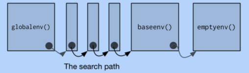

In RStudio, you might have noticed that you have a pane called
__Environment___.  As you create objects in R, they show up in that
pane. So what are environments?

You can think of environments as a collection of name value pairs
(called a frame) together with an enclosure, itself another
environment. The names are symbols. So it is really a nesting of
frames.

In an interactive session, you are in the global environment
`.GlobalEnv`, which you can print.


```{r}
.GlobalEnv
```

You can list all objects in your global environment using `ls()` or
`objects()`.

```{r}
ls()
```

```{r}
objects()
```

___

A comment on the _dot_ naming convention. This is usually used in R to
name things that you don't want to expose to everyone. Like hidden
files in Unix.

Looking up a name/symbol involves searching for it in the sequence of
frames, proceding up the enclosing environments all the way to the top
root, an empty environment.

An object is un-addressable if it is not bound to a name in an
accessible environment. In fact, R will trash such an object when it
sees fit as part of _garbage collection_.


```{r}
is.environment(.GlobalEnv)
globalenv()
environment() ## current environment
```
___

Note that nothing stops you from renaming `.GlobalEnv`, although
peculiar.

```{r, error = TRUE}
.GlobalEnv <- "foobar"
.GlobalEnv
ls(.GlobalEnv)
```

However, it is still there and can be accessed via the function
`globalenv()`. 

```{r}
ls(globalenv())
```

(Here, you see what is in _my_ global environment. Your environment,
of course, will have different things.)

This is one reason why it is bad practice to use things like
`.GlobalEnv` in your code directly rather than using accessor
functions like `globalenv()`.


## 3.2.1. Creating and Assigning in Environments

Environments can be created using the function `new.env`. Note that
the default enclosing environment is the place where you are defining
the environment.

```{r}
e1 <- new.env()
e1
```

What's in the frame of `e1`?

```{r}
ls(e1)
```

There are several ways to assign objects in environments:

1. Using the list style

```{r}
e1[["a"]] <- 1  ## list style assigment
e1[["x"]] <- 4
ls(e1)
rm(x,envir = e1)
ls(e1)
```

2. Using the `assign` function

```{r}
assign("b", 2, envir = e1) ## using assign function
ls(e1)
```

3. Using the `$` syntax, like lists again.

```{r}
e1$x <- runif(10)  ## dollar style assignment
ls.str(e1)  ## ls.str prints more usefully
```

___

You can also use list style syntax for retrieving values in
environments.

```{r}
get(x = "a", pos = e1)  ## get "a" from e1
get(x = "a", envir = e1)
e1$b
e1[["x"]] ## list style
```

However, you have to be aware that `$` and `[[` look only in the
environment and return `NULL` for unbound variables, but `get` behaves
differently, as we will soon see below.

___

To check whether an object exists, use use `exists`.

```{r}
exists("x", envir = e1)
```

To remove objects, you can use `rm`.

```{r}
x <- 1:10
rm("x", envir = e1)  ## blow away x in e1
```

That merely removed the object `x` from the environment `e1`. 

Let us now try to retrieve `x`.

```{r}
e1$x
```

That makes sense. But

```{r}
get("x", e1) ## Huh?
```

The `get` function has an argument `inherits` which is `TRUE` by
default, causing it to search for objects that might be in enclosing
environments. (Recall the nested structure of environments!)

```{r, error = TRUE}
get("x", e1, inherits = FALSE) ## Ok
```

___

Sometimes, you really do want the environment to have `inherits=FALSE`
behavior, by default. In that case, you can do the following.

```{r, error = TRUE}
e2 <- new.env(parent = emptyenv())
e2$foo <- "a"
get("foo", e2)
get("bar", e2)
```

Nothing can be assigned into the empty environment. Try.

___

To summarize, an environment is similar to a named list, with four
important exceptions:

- Every name must be unique.
- The names in an environment are not ordered.
- An environment has a parent.
- Environments are not copied when modified. (more on this later)


## 3.2.2. Search paths

Most environments are created by R for you automatically. For example,
each package you use using `library()` becomes one of the parents of
the global environment.

The function `search` will list all the attached packages, that is,
those that have been added to the search path. 

```{r}
search()
```

Pictoral representation (source: Wickham's _Advanced R_) showing parents.




Note the effect of adding a library. First, before loading a library.
```{r}
search()
```

Next, after loading a library.
```{r}
library(ggplot2, quietly = TRUE)
search()
```

The function `searchpaths` returns a character vector pointing to the
actual (file) path used to load the code.

```{r}
searchpaths()
```

The order of the environments listed in `search()` determines how R
locates objects. And you can list out the order explicity via:

```{r, error = TRUE}
e <- environment() ## current env
while (TRUE) {
    e <- parent.env(e)  ## parent env.
    print(e)
}
```

___


You are free to modify the search paths using commands such as
`attach` or `detach` but there are restrictions: detaching the
workspace in position 1 or the base package will cause an error.

However, I frown upon this unless done in a disciplined manner. 

For example, I've seen many scripts that do the following. Consider
the `mtcars` data set that is built into R.

```{r}
str(mtcars)
```

They would like to use the variables `mpg`, `cyl`, `hp` etc. in code
without having to type `mtcars$mpg`, `mtcars$cyl`, `mtcars$hp`
etc. Say, just for the sake of argument, a linear fit

```{r, error = TRUE}
lm(disp ~ mpg)
```
which will fail for now, instead of 

```{r, eval = TRUE}
lm(mtcars$disp ~ mtcars$mpg)
```

So an easy way to make this possible is to `attach` the `mtcars` data
frame as an environment!

```{r}
attach(mtcars)
```
which now changes the search path.

```{r}
search()
```

So the following now works.

```{r}
lm(disp ~ mpg)
```

But you better be prepared to `detach` the data frame to restore the
search path else you can have unpredictable behavior.

```{r}
detach(mtcars)
```

The key issue is that such code modifies a _global_ variable, the
search path, which is not good practice, because it can produce
unpredictable behavior, something that a functional style of
programming tries to avoid.

Functional Programming is a way of writing programs where all
computation is done via _function calls_.  In such a paradigm,
functions merely return values based on inputs and do modify
state. Therefore the functions have no side-effects. Which means it
helps to write provably correct programs. 

## Session Info
```{r}
sessionInfo()
```
