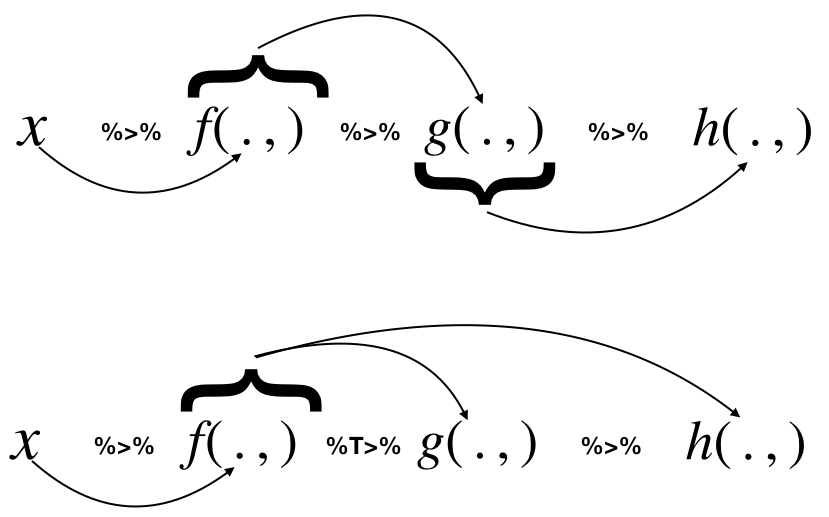

```{r, echo = FALSE, results = 'hide', message = FALSE}
## Install a package if not already installed
installIfNeeded <- function(packages, ...) {
    toInstall <- packages[!(packages %in% installed.packages()[, 1])]
    if (length(toInstall) > 0) {
        install.packages(toInstall, repos = "https://cloud.r-project.org")
    }
}

## Ensure packages exist and activate them
needPackages <- function(packages) {
    installIfNeeded(packages)
    for (x in packages) {
        library(x, character.only = TRUE)
    }
}
needPackages(c("tidyverse", "survminer"))
mtu2 <- readRDS("mtu2.RDS")

dplyrResult <- dplyr::summarize(
    .data = dplyr::group_by(
        .data = mtu2,
        Date = base::as.Date(DateAndTime)
    ),
    Precipitation = base::mean(base::range(Precipitation))
)
```

## 5.1.1. The Tee Operator

We saw the `%T>%` operator is a variant of `%>%` in that it returns
the _left hand side_ value, rather than the right hand side. This is
useful in cases where you need to call a function for its side effect
rather than its value.


The following picture _essentially_ describes what the `%>%` and the
`%T>%` operator do. 



The tee operator can be useful for debugging in a longish pipeline:
change the `%>%` to a `%T>%` and insert a print statement to see what
is happening.

## 5.1.2. Robustness

Functions in the `magrittr` package will not confuse `.` with a
placeholder. For example, consider this from the `magrittr` vignette:

```{r}
car_data <-
  mtcars %>%
  subset(hp > 100) %>%
  aggregate(. ~ cyl, data = ., FUN = . %>% mean %>% round(2)) %>%
  transform(kpl = mpg %>% multiply_by(0.4251)) %>%
  print
```

In the call to `aggregate`, the `.` is used as a placeholder for
defining a function. Specifically, a pipeline with a dot (`.`) as LHS
will create a unary function.  If you did not use the `magrittr`
feature, you'd have to do something like:

```{r}
aggregate(. ~ cyl,
          data = mtcars,
          FUN = function(x) round(mean(x), 2),
          subset = hp > 100
          )
```
which takes a bit more effort to parse.

___

### Carried away?

```{r}
set.seed(123)
1:3 %>%
    lapply(., FUN = . %>% rnorm)

1:3 %>%
    lapply(., FUN = . %>% rnorm(10)) %>%
    sapply(., FUN = mean)
```

I don't believe these are any great improvements.

## 5.1.3. Additional operators

_Exposition pipe operator:_ `%$%` exposes the names within the
left-hand side object to the right-hand side expression. A short hand
for `with`. Handy when functions do not themselves have a data
argument. Example from `magrittr` vignette.

```{r, eval = FALSE}
iris %>%
  subset(Sepal.Length > mean(Sepal.Length)) %$%
  cor(Sepal.Length, Sepal.Width)
```

Equivalent to:

```{r}
local({
    d <- iris %>%
        subset(Sepal.Length > mean(Sepal.Length))
    with(d,
         cor(Sepal.Length, Sepal.Width)
         )
    ## OR
    ## cor(d$Sepal.Length, d$Sepal.Width)
})
```

Others include _compound assignment operator_ `%<>%`. If you use it
as the first pipe, the result of the pipeline will be assigned to the
left hand side object.

__Aliases__: Aliases are provided from common operators such as
`mutliply_by`, `add` all refering to obvious functions. Using them
improves readability in the `magrittr` syntax. See `?multiply_by`.


## 5.1.4. Remarks

We do not intend to cover every nuance of pipes; for that we refer you
to the vignette that accompanies the `magrittr` package. But we note
that not everything can be implemented in pipes. Obviously there has
to be a sequential nature to the tasks performed. Also for the sake of
comprehension, the pipeline itself should not be too long. Also one
should not get carried away:

```{r}
dplyrResult %>% summary
```
will work, but does it add great value compared to
`summary(dplyrResult)`. A matter of taste!

So there is a tension between changing the language entirely based on
the piping abstraction versus using functional constructs.  I use both
while keeping readability and maintainability as a top priority.

## 5.1.5. Summary

Pipes are a useful abstraction for both thinking about and
implementing data analytic tasks. In data analytic piplelines, 

- They can simplify the process of constructing a complex pipeline,
  step by step;
- they can accurately reflect the order in which transformations and
  computations on data are performed;
- they are easily modified: inserting a new processing step becomes
  easier since the various steps are delineated;
- intermediate results can be examined for errors easily;
- they can be used to create anonymous functions and variables that
  are only really needed in the pipeline and not elsewhere. This leads
  to less clutter in programs;
- they lead to more readable and maintainable code

Piping works especially well with a coherent set of packages: e.g.
`tidyverse`, where functions have been designed with use in pipelines
in mind. 

In other cases, where one needs to invoke a function where the first
argument is not the LHS (left hand side) of an expression, one can use
a named argument with `.` as the value and the `.` will be replaced by
the LHS.

Please do refer to the vignette:

```{r, eval=FALSE}
vignette("magrittr", package = "magrittr")
```

## 5.1.6. Some Issues

Despite the fact that `magrittr` pipes work well most of the time,
beware that there are cases where they will fail. This is because
`magrittr` cannot predict how users might have constructed functions. 

For example, consider replacing the simple `plot` in the survival plot 

```{r, error = TRUE}
library(survival)
library(survminer)
lfuDate <- as.Date("12/31/2009", format = "%m/%d/%Y") ## last follow up date

## 1.
"data.csv" %>%
    readr::read_csv(
               col_types =
                   readr::cols(
                              txDate = readr::col_date( format = "%m/%d/%Y"),
                              eventDate = readr::col_date( format = "%m/%d/%Y"))
           ) %>%
    ## 2.
    dplyr::mutate(event = ifelse(!is.na(eventDate), 1, 0),
                  time = ifelse(!is.na(eventDate),
                                eventDate - txDate, lfuDate - txDate)) %>%
    ## 3. and 4
    survival::survfit(Surv(time, event) ~ 1, data = .) %T>%
    ## 5.
    ## plot(conf.int = FALSE) %>%
    survminer::ggsurvplot(conf.int = FALSE) %>%
    ## 6.
    summary %>%
    ## 7.
    print
```

There are ways to get around this (for example, keeping the data frame
in scope) but those modifications will often compete against the
readability of the code. So pipes are not a panacea.

## Session Info
```{r}
sessionInfo()
```

