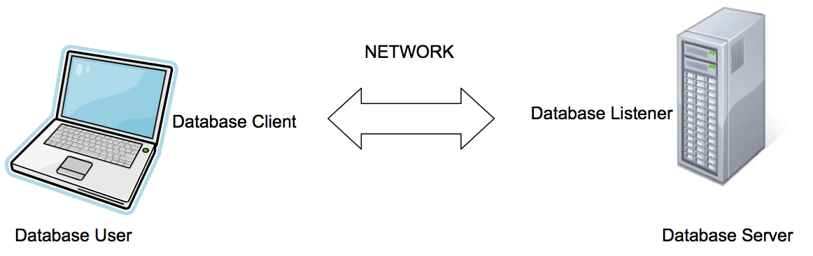
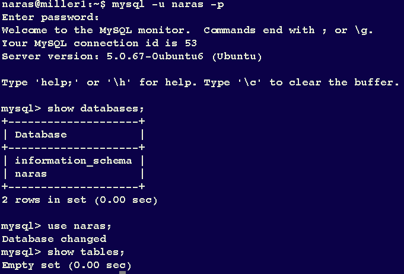
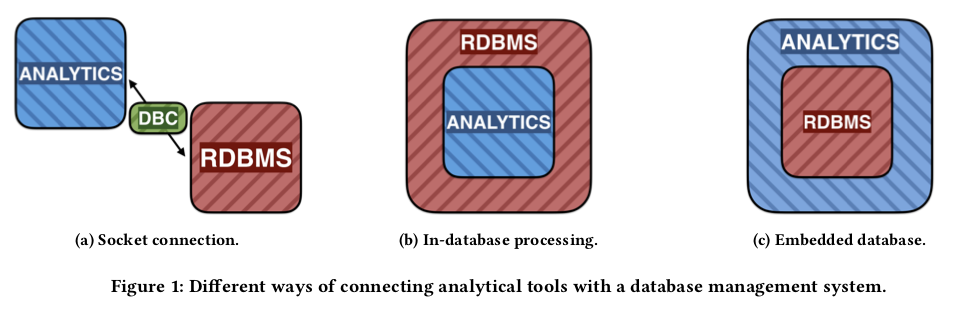
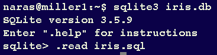

```{r requirements, echo = FALSE}
## Install a package if not already installed
install_if_needed <- function(packages, ...) {
    toInstall <- packages[!(packages %in% installed.packages()[, 1])]
    if (length(toInstall) > 0) {
        install.packages(toInstall, repos = "https://cloud.r-project.org")
    }
}

## Ensure packages exist and activate them
need_packages <- function(packages) {
    install_if_needed(packages)
    for (x in packages) {
        library(x, character.only = TRUE)
    }
}
need_packages(c("tidyverse", "RSQLite", "DBI"))
```

## 7.1.1. Introduction

Data sets beyond a certain critical size and complexity are often
handled by means of specialized software. These are often relational
and non-relational databases (DBMS). They provide out-of-memory,
persistent, data storage.

You'll surely encounter databases in the real-world and in areas such
as text mining, machine learning, web search, bioinformatics, medical
applications, actuarial science etc.

For us, DBMS allow us to work efficiently with subsets of data
extracted from what is often a large dataset. DBMS are good at
searching, extracting and collating data in ways we desire. We can
then do statistical analyses on the extracts.

___

These days you can download and install excellent DBMS. Examples:
  `MySQL`, `Postgres`, `Hypersonic`, `H2`, `Oracle` just to name a
  few.

There are also databases with a light footprint such as `SQLite`.
`SQLite` is popular in many apps and is also used in
[Bioconductor](https://bioconductor.org).

One interacts with a database using a language to specify _queries_,
which is a description of what needs to be extracted/seleted from the
database. This language is `SQL`, (Structured Query Language) and we
will just understand some of it by means of examples.

Setting up a database such as `Oracle`, `MySQL`, or any other
_enterprise_ system requires some administrative knowledge regarding
security and privileges. (Beyond the scope of this class.)


## 7.1.2 Connections to Databases



- The database _server_ runs a process that is _listening_ for
  requests on a specific _port_. For example, `MySQL` listens on port
  3306 and `Oracle` on port 1521 (typically).

- The database user runs a _client_ program that can talk to the
  listener. For example, `sqlplus` for `Oracle`, `mysql` for `MySQL`,
  `psql` for `Postgres` are terminal clients. However, the key thing
  to realize is that any programming language can also be used as a
  client, as long you have the appropriate drivers installed. This
  includes R.

- The user types commands into the database client which communicates
  with the database to accomplish tasks the user desires.

This naturally leads to the concepts of a _database URL_, _database
port_, connection credentials, etc., that you will need to connect to
an enterprise level database, if desired.  Once you have that, yuo can
connect to the database and access data that is already there.



___

## 7.1.2.1. Types of connections



(Source: Raasveldt and Muhleisen)

Three main methods of combining relational databases with analytical
tools 

a. Connect the analytical tool to a database through a database
   connection. The client can then issue queries to the database over
   this client connection and retrieve any data stored in the
   database. Database agnostic approach, allows the user to stay
   within their familiar scripting language environment (R or Python,
   etc.). Large amounts of data from the database to the client is
   very inefficient and can be a significant bottleneck in analysis
   pipelines.

Example: Use RODBC or RMySQL, ROracle to connect to a database. 

___


(Source: Raasveldt and Muhleisen)

b. An alternative solution is to use in-database processing
   methods. Embed analysis pipelines inside the database, the overhead
   of data export can be entirely avoided. Removes the data transfer
   overhead between the scripting language and the database, it still
   requires the user to run and manage a separate database
   server. Users work inside database and so cannot use tools they are
   familiar with. Also safety issues of running arbitrary code.
   
Example: Oracle Machine Learning for R provides functions that invoke
R scripts that run in one or more R engines that are embedded in the
Oracle database. More
[here](https://docs.oracle.com/en/database/oracle/r-enterprise/1.5.1/oreug/R-interface-for-embedded-R-execution.html#GUID-3227A0D4-C5FE-49C9-A28C-8448705ADBCF)

___


(Source: Raasveldt and Muhleisen)

c. Embed database in the scripting language. The database can be
   accessed using the same database-agnostic interface as a standard
   database client connection, but because the database resides in the
   same address space as the scripting language, data can be trans-
   ferred between the two systems with significantly less overhead.
   Embedded databases are extremely popular.
  
Example: [`SQLite`](https:sqlite.org), [`duckdb`](https://www.duckdb.org)


## 7.1.3. Basic SQL Commands

A few SQL commands can go a long way. (We'll use `MySQL` as an example
here.)

Data in databases is organized in _schemas_ which describe the objects
stored in the database and relationships among them. These objects are
often __tables__; you'd not go too far wrong if you thought they were
like data frames!


| Task & SQL Query                  | Command                       |
|----------------------------------:|------------------------------:|
| Change the default database       | `USE database`                |
| Find names of available databases | `SHOW DATABASES`              |
| Find names of tables in a         | `SHOW TABLES IN <database>`   |
| Find names of columns in a table  | `SHOW COLUMNS IN <table>`     |
| Find types of columns in a table  | `DESCRIBE <table>`            |


When you type these commands in a SQL client such `mysql` for `MySQL`,
terminate queries by a semicolon so that the client sends it over to
the server and returns the results.

(SQL is case-insensitive. Also remember it is not a programming
language, just a query one.)


## 7.1.4. Database table

In a database, data is stored in tables: for example a `demographics`
table:

| `ID`  | `AGE`  | `GENDER` | `SBP`  | `DBP`  | `SMOKER`  |
|------:|-------:|---------:|-------:|-------:|----------:|
|S001   | 24     |  M       | 120    | 80     | N         |
|S002   | 29     |  M       | 140    | 90     | Y         |
|S003   | 24     |  F       | 112    | 69     | Y         |
|S004   | 40     |  M       | 109    | 70     | N         |
| ..    | ..     |  ..      | ..     | ..     | ..        |

___

Typically databases contain a number of tables containing related
information. For example, we could have other tables containing
genotyping information for these subjects.

A `genotype` table.

| `ID`  | `SNP_ID`  | `GENOTYPE`  |
|------:|----------:|------------:|
|S001   | SNP1      |  AA         |
|S001   | SNP2      |  AA         |
| ..    | ..        |  ..         |
|S002   | SNP1      |  BB         |
|S002   | SNP2      |  AA         |
| ..    | ..        |  ..         |
|S003   | SNP3      |  AB         |
|S004   | SNP4      |  AA         |
| ..    | ..        |  ..         |

And a master `snp` table for the genotyping results produced by the
test in use.

| `SNP_ID`  | `ALLELE_A`  | `ALLELE_B` |
|----------:|------------:|-----------:|
|SNP1       | A           | G          |
|SNP2       | C           | T          |
|SNP1       | A           | G          |
|SNP1       | G           | C          |
|...        | ...         | ...        |

___

_Note_ that there is a natural relationship between the `demographics`,
`genotype` and `snp` tables.

Constraint on tables as well as relationships between tables can be
specified. For example, we may ask that the field `SNP_ID` in the
genotype table reference the _foreign key_ `SNP_ID` in the in the
table `snp` table. Similarly for the `ID` column in tables
`demographics` and `genotype` tables.

## 7.1.5. Creating tables

So far, we have not discussed creating tables in a database. For most
applications, someone has already done so for you. However, SQL
provides the `CREATE TABLE` statement for this purpose.

Here is SQL to create a simple table.

```{r, eval = FALSE}
create table iris (sepal_length numeric(5,1),
                   sepal_width numeric(5,1),
                   petal_length numeric(5,1),
                   petal_width numeric(5,1),
                   species varchar(10));
```

Things to note: types, precision, table column names.

How do you actually accomplish this table creation? Typically via a
script or a tool.

With R as a client, it is even easier as we shall see shortly.

## 7.1.6. Queries

Queries allow us to get data out of databases. The most important
SQL query is `SELECT`.  The general form of the

```{r, eval = FALSE}
SELECT columns or computations
       FROM table
       WHERE condition
       GROUP by columns
       HAVING condition
       ORDER BY column [ASC | DESC]
LIMIT offset, count;
```
___

Many of the clauses in the `SELECT` statement are optional.


| SQL                           | Effect                           |
|------------------------------:|---------------------------------:|
| `SELECT * FROM demographics`  | selects all rows and columns in  |
|                               | in demographics table            |
|                               |                                  |
| `SELECT id, age, sbp - dbp`   | Three column result with column  |
|   `AS pp from demographics`   | names `id`, `age` and `pp`       |
|                               |                                  |
| `SELECT * FROM demographics`  | Selects all males below 25       |
|   `WHERE age < 25 and`        |                                  |
|   `gender = 'M'`              |                                  |
|                               |                                  |
| `SELECT id, age, sbp - dbp`   | Error:  can't use variables      |
|   `AS pp FROM demographics`   | created in `select` for `where`  |
|   `WHERE pp < 30`             |                                  |
|                               |                                  |
| `SELECT id, age, sbp - dbp`   | selects those with `pp` less     |
|   `AS pp FROM demographics `  | than 30 sorted by age            |
|    `HAVING pp < 30 `          |                                  |
|    `ORDER by age`             |                                  |

There are many other facilities.

For character variables, the `LIKE` operator can be used with `'%'` to
represent zero or more of any character and `'_'` to represent exactly
one character. Also `RLIKE` can be used with regular expressions.

## 7.1.7. SQL Aggregation

The `GROUP BY` clause allows some aggregation. The grouping variable
must be included in the `SELECT` statement.

| SQL Aggregation Function      | Result                           |
|------------------------------:|---------------------------------:|
| `COUNT`                       | Count number of occurences       |
|                               | `dplyr` equivalent is `n()`      |
|                               |                                  |
| `AVG`, `MIN`, `MAX`,          | Mean, min, max, sample variance  |
|   `VAR_SAMP`, `STDDEV_SAMP`   | and stadard deviation            |
|                               |                                  |

Examples:

1. How many rows in table demographics?
```{r, eval = FALSE}
SELECT COUNT(*) from demographics
```
2. Create a two-column table of `gender` and `count` showing counts by
gender.
```{r eval = FALSE}
SELECT gender, COUNT(*) from demographics GROUP by gender
```
3.  A more involved query to get count, mean and standard deviation of systolic
blood pressure by gender is:

```{r, eval = FALSE}
SELECT gender, count(*), AVG(sbp) as sbp_bar,
       STDDEV_SAMP(sbp) as sbp_sd from demographics GROUP by gender
```

## 7.1.8. Table Joins

As data in tables are often related, SQL allows you to query data
using several tables by joining on common values. The most common
one is what is called an `inner join`.

For example, suppose we want to extract the systolic blood pressure
and the genotype for `SNP03` for all subjects, we need to
execute a join query the demographics and the genotype tables.

```{r, eval = FALSE}
select demographics.id as id, demographics.sbp as sbp,
       genotype.snp_id as snp_id, genotype.genotype as
       genotype from demographics, genotype where
         (demographics.id = genotype.id and genotype.snp_id = "SNP03");
```

The inner join occurs where we say that the demographics and genotype
ids need to match.  The results returned would be something like this:

|ID   | SBP|SNP_ID |GENOTYPE |
|:----|---:|:------|:--------|
|S001 | 120|SNP03  |BB       |
|S002 | 142|SNP03  |AB       |
|S003 | 113|SNP03  |AB       |
|S004 | 102|SNP03  |AA       |


## 7.1.9. Modifying Database Records

Values in a database table are changed by means of the `UPDATE`
  command.

```{r, eval = FALSE}
UPDATE table SET var = value WHERE condition LIMIT n;
```

Many variables can be updated at once by using as many `var = value`
  as necessary.  The `WHERE` condition serves to select the record or
  records you want to update. Not using it makes the update happen on
  every record.

  Deleting records is done via the `DELETE` statement.

```{r, eval = FALSE}
DELETE FROM table WHERE condition limit n;
```

Of course, use this with caution.

Tables and databases are deleted as follows:

```{r, eval = FALSE}
DROP TABLE table;
```

and

```{r, eval = FALSE}
DROP database dbname;
```

## 7.1.10. Notes

It is important to keep in mind that database tables can grow easily
row-wise, but not necessarily column-wise. There are limits to how
many columns a table can have.

One can enforce constraints on tables, declaring that a particular
column is a `primary key`, which means that it is something like a
unique identifier. So two rows cannot have the same primary key.

Each table can have its own primary keys and joins are often made on
these keys.

For example, it is reasonable to have one SNP table that contains
information about all the SNPS that are in dbSNP say. Then one can
force the genotype table to ensure that the SNP ids used are exactly
one of those in the SNP table. Furthermore, you can also force
unique combinations of subject `ID` and `SNP_ID`.  These are typical
design issues that database table creators take into account. They
also address issues of performance by creating indexes, which make
lookups faster.


## 7.1.11. SQLite

To get started, one can use `SQLite`, which is installed by default on
Macs. (On windows, you can install it directly from
[The SQLite Page](https://sqlite.org/download) including the
command-line tools.) Note however, if you use `RSQLite` package in R,
then you don't need to worry about either of these being installed;
that package includes a compiled version of SQLite with it. However,
in the latter case, you won't be able to interact at the command line
with it; you will only be able to do so via R.

SQLite is an easy way to experiment with databases.  It is very
lightweight, file based, but quite powerful.

On your Mac or Unix, just invoke as `sqlite3` on the command line with
  the name of a file that will contain the database (created if it
  does not exist) as shown in the screenshot here.



Here is a sample session where I have the above SQL in a file named
  `iris.sql`. There I have specified create table statements and row
  insertion statements quite explicitly.  But that can be tedious.

If you have data in csv file, say `iris.csv`, such as (note, no
header):
```{r, eval = FALSE}
5.1,3.5,1.4,0.2,setosa
4.9,3,1.4,0.2,setosa
4.7,3.2,1.3,0.2,setosa
...
```

SQLite makes it easy to import it once table has been created.

```{bash, eval = FALSE}
sqlite> .mode csv
sqlite> .import "./iris.csv" iris
sqlite> select * from iris limit 5;
5.1|3.5|1.4|0.2|setosa
4.9|3|1.4|0.2|setosa
4.7|3.2|1.3|0.2|setosa
4.6|3.1|1.5|0.2|setosa
5|3.6|1.4|0.2|setosa

sqlite> select count(*) from iris;
150

sqlite> select species,count(*) from iris group
        by species;
setosa|50
versicolor|50
virginica|50

sqlite> SELECT species, count(*), AVG(sepal_length)
        as spl_bar from iris GROUP by species;
setosa|50|5.006
versicolor|50|5.936
virginica|50|6.588
sqlite>
```

Note that SQLite does not have all the aggregation functions. Also it
does not have a date and time type, although you can handle it using
conversions. 

## 7.1.12. SQLite from R

[SQLite](https://www.sqlite.org "SQLite") is a very useful
self-contained, serverless, file-based database. You can learn a lot
about databases by just trying out stuff with SQLite. The package
`RSQLite` provides a client that can be used to connect to SQLite
databases.

The usual procedure for connecting to any database is the same:

1. Load the client R package which will provide the driver code
2. Connect to the database. Depending on the database, you will need
   proper credentials
3. Use the connection object to run queries, update data etc.

### A simple example.

`USAArrests` is data frame in R.

```{r}
data(USArrests)
str(USArrests)
head(USArrests)
```
___

We can move data from R to SQLite as we show below.

To use databases, one uses a database abstraction layer that is common
to every database. This is provided by the `DBI` package, which allows
one to 

- load a driver matched to a database flavor
- create a connection to the database
- obtain information on available tables, table column types etc.
- run queries against the database to obtain results
- clean up resources.

```{r}
m <- dbDriver(drvName = "SQLite")
con <- dbConnect(drv = m, dbname = "test.sqlite")
```

If a SQLite database of that name already exists, it will be opened,
otherwise, one will be created.


```{r}
data(USArrests)
dbWriteTable(conn = con,
             name = "USArrests", value = USArrests,
             overwrite = TRUE)
dbListTables(con)
```

Notice the direct analogy between data frames and database tables.


You can run queries using `dbSendQuery`. The result of a query is what
is called a _result set_.

```{r}
##
rs <- dbSendQuery(conn = con,
                  statement = "select * from USArrests")
dbGetInfo(rs)
d1 <- fetch(res = rs, n = 5)
d1 ## prints first five rows
class(d1)
d2 <- fetch(res = rs, n = 3)
d2 ## next three rows
```

Good hygiene to always clean up.

```{r}
dbClearResult(res = rs)
dbDisconnect(conn = con)
```

The file `geno.db` included is a SQLite database you can play with
using `RSQLite`. 


## 7.1.13. SQLite data and `dplyr`

Consider our reservoir level data. We can create a SQLite database for
it as follows.

```{r}
mtu_precipitation <- readRDS("mtu2.RDS")
m <- dbDriver(drv = "SQLite")
con <- dbConnect(m, dbname = "mtu.sqlite")
dbWriteTable(con, "mtu_precipitation", mtu_precipitation, overwrite = TRUE)
dbListTables(con)
```

So the table `mtu_precipitation` was created in the database.


```{r}
dbListFields(conn = con, name = "mtu_precipitation")
dbDisconnect(conn = con)
```

As expected.

___

_What is so special about stuffing this table into a
SQLite database?_

Well, the hope is that `dplyr` works in a _uniform_ way whether your
data is in a database or in a data frame or in a `tibble`.  This is
(almost) true!

Let's see that. Recall, we did the following (slightly modified below).

```{r}
dplyr_result <- mtu_precipitation %>%
    dplyr::group_by(Date = base::as.Date(DateAndTime)) %>%
    dplyr::summarize(Precipitation = base::mean(base::range(Precipitation)))
```

We could get the exact same result with the data in the database as
follows.

```{r}
mtuDb <- src_sqlite(path = "mtu.sqlite")
tbl(src = mtuDb, "mtu_precipitation")
```

Huh! What happened?

Well, SQLite uses number of seconds from origin. So although it is
accurate, this makes for some gyrations to get around the lack of
actual date time types in SQLite.

One approach is to do the conversion in R, after _collecting_.

```{r}
tbl(src = mtuDb, "mtu_precipitation") %>%
    dplyr::collect() %>%
    mutate(Date = as.Date(as.POSIXct(DateAndTime, origin = "1970-01-01")))
```

And then proceed! (The `dplyr::collect` function gets data into a
local tibble in R, forcing the database results to be computed.)

```{r}
dplyr_result2 <- tbl(src = mtuDb, "mtu_precipitation") %>%
    collect %>%
    mutate(Date = as.Date(as.POSIXct(DateAndTime, origin = "1970-01-01"))) %>%
    dplyr::group_by(Date) %>%
    dplyr::summarize(Precipitation = base::mean(base::range(Precipitation)))

```

Let's check we get the same result:

```{r}
identical(dplyr_result, dplyr_result2)
```

## 7.1.13. Session Info

```{r}
sessionInfo()
```
