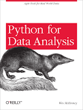
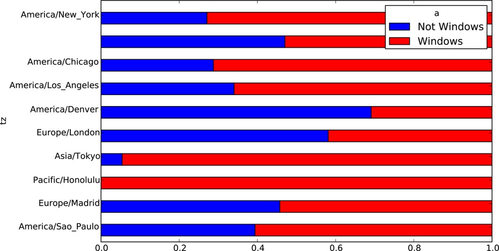

```{r requirements, echo = FALSE, message = FALSE}
## Install a package if not already installed
installIfNeeded <- function(packages, ...) {
    toInstall <- packages[!(packages %in% installed.packages()[, 1])]
    if (length(toInstall) > 0) {
        install.packages(toInstall, repos = "https://cloud.r-project.org")
    }
}

## Ensure packages exist and activate them
needPackages <- function(packages) {
    installIfNeeded(packages)
    for (x in packages) {
        library(x, character.only = TRUE)
    }
}
needPackages(c("tidyverse", "gridExtra", "lattice", "png"))
```

## 10.3.1. Introduction

The package `ggplot2` is extensive, rich in features, and quite
formidable to master.

It implements what Hadley Wickham calls _A Layered Grammar of
Graphics_ building on Wilkinson's Grammar of Graphics.

It is widely used. 

```{r, echo = FALSE}
library(grid)
img <- readPNG("amanda-nyt.png")
grid.raster(img)
```

___

The interpretation of a graphic is

- a dataset together with
- a mapping from data to aesthetic attributes (color, shape,
    size) of geometric objects (points, lines, bars)
- statistical transformations of data summarize data. These are
  called _stats_
- geometric objects represent what is seen on the
    plot: points, lines, polygons, etc. They are called _geoms_
- scales are invertible maps that map values in the data space
    to values in an aesthetic space
- _facets_ that generate the same plot for different subsets of the dataset

___

To put it in succinctly:

```
plot ::= coord scale+ facet? layer+
layer ::= data mapping stat geom position?
```

That is, a plot is defined by a coordinate system (`coord`), one or
more scales (`scale`), an optional faceting specification (`facet`),
and one or more layers (`layer`).

A layer is defined as an R data frame (`data`), a specification mapping
columns of that frame into aesthetic properties (`mapping`), a
statistical approach to summarize the rows of that frame (`stat`), a
geometric object to visually represent that summary (`geom`), and an
optional position adjustment to move overlapping geometric objects out
of their way (`position`).

A good way to see some examples is via `example(qplot)`.

___

## 10.3.2. Scatterplot context

Let us look at the elements of a plot in a scatterplot context.

- Each observation has a horizontal and vertical _position_, _size_,
  _color_ and _shape_; these are the _aesthetics_, properties that can
  be seen on a graphic. Aesthetics can be mapped to a variable or be constant
- Using a `geom` determines the type of plot, the
  `point` geometry for scatterplot, for example
- The values need to be _scaled_ from data units to physical units
using a _coordinate_ system

Combining all these, the _data_, _geom_, _scales_ and _coordinate_ system, and plot
_annotations_ generates the scatterplot graphic.

___

## 10.3.3. Some geoms

- `geom = "point"` draws points
- `geom ="smooth"` fits a smoother to data and plots
    the smooth plus standard error
- `geom = "quantiles"` displays conditional density
    estimates (extension of boxplots)
- `geom = "density2d"` adds contours of a 2d density
    estimate (useful when overplotting is a concern)
- `geom = "path"` and` `geom ="line"` do the obvious
- `geom = "boxplot"` produces a box and whisker plot
- `geom = "histogram"` and `geom = "density"` produce
    histograms or density plots

Available statistics and aesthetics are all described in Hadley's book
and also seen in `Deducer`'s plot builder.

___

### 10.3.3.1. Aside

`Deducer` is a package that uses Java and runs inside a graphical
interface such as JGR (pronounced Jaguar). It allows one to build
plots interactively and writes out the resulting `ggplot2`
code. I have found `Deducer` useful for learning `ggplot2` because one can
examine how to build up plots.

However, the reliance on Java means that it needs to run in
multi-threaded mode for GUI interaction and so you have to work harder
to make it go on your platform. As mentioned in the earlier lectures,
you need to ensure configure your R for Java (only once) using

```{bash, eval = FALSE}
R CMD javareconf
```

Finally, install the packages `Deducer` and `JGR` (_Jaguar_ a Java GUI
for R) as usual. Then the following will launch `JGR` as a new application.

```{r, eval = FALSE}
library(JGR)
launchJGR()
```

In that application, you can now type `library(Deducer)` to go through
a video and examples.

__NOTE__ Deducer may not work on Windows. 

___

## 10.3.4. Layers

As noted above, a _layer_ is a combination of data, mappings, stat,
  geom, and a position adjustment. You can add as many layers as you
  want. A layer has

- a dataset which must be a data frame. Note that each layer can have
  its own dataset, which means you can plot multiple datasets on a
  single plot
- a set of aesthetic mappings showing how variables in data map to
  aesthetic properties of a layer
- a _geom_ that describes the geometric object used to draw the
  layer
- a _stat_, which transforms the data in a useful way (default is
  identity)
- an optional position adjustment to avoid overplotting

The power of `ggplot` is that you can build complex plots layer by
layer.

I often find myself figuring out details in the context of a
particular graphic I want to produce, but my general tactic is always
what is stated above, building layer by layer.

___

## 10.3.5. Simple Examples

If you want very simple plots, `qplot` is provided. Here are some
parts of `example(qplot)`.

```{r}
library(ggplot2)
data(mtcars)
str(mtcars)
```

___

### Scatterplot
```{r}
qplot(mpg, wt, data = mtcars)
```

___

### Scatterplot with color per cylinder

```{r}
qplot(mpg, wt, data = mtcars, colour = cyl)
```

___

### Scatterplot with point size per cylinder

```{r}
qplot(mpg, wt, data = mtcars, size = cyl)
```

___

### Facetted scatterplot

Here, you have the same graph drawn for subsets of data for comparison
purposes (V/S versus automatic or manual transmission).

```{r}
qplot(mpg, wt, data = mtcars, facets = vs ~ am)
```

___

### Facetted Boxplot

Including a `jitter` geom to show actual points.

```{r}
qplot(factor(cyl), wt, data = mtcars, geom = c("boxplot", "jitter"))
```

---

## 10.3.6. Barley Data Example

Let's redo the barley dataset plot in `ggplot`.

```{r}
library(lattice)
qplot(yield, data = barley, geom = "density", col = site, main = "Implicit stat")
```

The function `qplot` for quick plot is easiest to use. Note that using
`geom = "density"` above defines a `stat` implicitly. In fact, in
version 2.0 of `ggplot2` the parameter `stat` is deprecated.  This is
also the reason why `qplot` can only go so far; the interdependence of
parameters made necessary by having one simple function do everything
means that plot construction is not completely obvious.

Side-by-side plots can be created, but beware of some details. If you
try:

```{r, eval = FALSE}
opar <- gpar(mfrow = c(1, 2))
...
gpar(opar)
```
you'll find that it has no effect because `grid` upon which `ggplot` is based
has different concepts of viewports etc. Other packages such as
`gridExtra` have some useful functions for various

```{r}
library(gridExtra)
p1 <- qplot(yield, data = barley, geom="density", col = site)
## Explicit invocation
p2 <- qplot(yield, data = barley, geom="histogram", fill = site)
grid.arrange(p1, p2, ncol=2)
```

___

## 10.3.7. Faceting

Sites in the barley dataset are naturally candidates for facets.

Here is the density plot, faceted.

```{r}
qplot(yield, data = barley, geom = "density") + facet_wrap(~ site)
```

```{r}
qplot(yield, variety, data = barley, color = year) + facet_wrap(~site)
```

___

## 10.3.8. Programming

Like `lattice`, ggplot objects can be manipulated and incrementally
built/updated.

```{r}
q0 <- qplot(yield, data = barley, geom = "density", col = site)
class(q0)
typeof(q0)
glimpse(q0)
```

Suppose we create a faceted plot.

```{r}
q <- qplot(yield, data = barley, stat = "density", geom = "line") + facet_wrap(~ site)
glimpse(q0)
```

While `qplot` can do a lot, it is really meant to provide an analog of
the `plot` function in base graphics. So if you want to do something
more involved, you will find yourself working directly with `ggplot`
objects.

___

First off, we note that the call `ggplot()` initializes a `ggplot`
object.

```{r, eval = FALSE}
ggplot()
ggplot(data = dataFrame)
ggplot(data = dataFrame, mapping = aes(x, y, <other aesthetics>))
```

These invocations are often used when building plots layer by layer.

Here is a way to build up the plot incrementally.

```{r}
p <- ggplot()
p <- p + geom_point(aes(x = yield,
                        y = variety,
                        colour = year,
                        group = year),
                    data=barley)
p <- p + facet_wrap(facets = ~site)
p
```

___

## 10.3.9. Alpha Blending

Alpha Blending is a way to control over plotting to avoid splotches of
color that obscure structure.

```{r}
library(ggplot2)
df <- data.frame(x = rnorm(2000), y = rnorm(2000))
```

If you plot the data directly, you can barely see the points.

```{r}
norm <- ggplot(df, aes(x, y))
norm + geom_point()
norm + geom_point(shape = 1)
norm + geom_point(shape = ".") # Pixel sized
```


Using alpha blending to alleviate overplotting in sample data from a
bivariate normal.

___

### Alpha value = 1/3

```{r}
library(scales)
norm + geom_point(colour = alpha("black", 1/3))
```

___

### Alpha value = 1/5

```{r}
norm + geom_point(colour = alpha("black", 1/5))
```

___

### Alpha value = 1/10

```{r}
norm + geom_point(colour = alpha("black", 1/10))
```

---

## 10.3.10. Example: Sipat data from an analysis for Dr. J. Maldonado

This is a dataset containing depression scores for transplant
patients.

```{r}
load("sipat-ex.RData")
p <- ggplot()
p <- p + geom_density(aes(x = score, color = txType),
                      data = sipat)
p
```

We can fill the curves.

```{r}
p <- ggplot()
p <- p + geom_density(aes(x = score, fill = txType),
                      data = sipat)
p
```

To prevent obscuring, we can specify transparency/alpha. Notice, that
the data argument can be specified one time for all plot operations,
or separately for each additional layer if different. Here there is
only one data set.

```{r}
p <- ggplot(data = sipat)
p <- p + geom_density(aes(x = score, fill = txType,
                          alpha = 0.5))
p
```

The last, unfortunately, adds a useless legend for the alpha value. To
suppress that you can use the `scale_alpha_continuous`
or the `scale_alpha_discrete` function in `ggplot2`. 

```{r}
p <- ggplot(data = sipat)
p <- p + geom_density(aes(x = score, fill = txType, alpha = 0.5)) +
    scale_alpha_continuous(guide = FALSE)
p
```

Similar effects can be obtained using using `qplot` as well, as shown
below. But understanding the full power of `ggplot2` is worth the
effort. 

```{r}
qplot(score, data = sipat, geom = "histogram", fill = txType)
qplot(score, data = sipat, geom = "density", color = txType)
qplot(score, data = sipat, geom = "density", fill = txType)
qplot(score, data = sipat, geom = "density", fill = txType, alpha = 0.5)
```

## 10.3.11. Python for Data Analysis by Wes Mckinney Example



The book discusses an example.

```
In 2011, URL shortening service bit.ly partnered with the United
States government website usa.gov to provide a feed of anonymous data
gathered from users who shorten links ending with .gov or .mil. As of
this writing, in addition to providing a live feed, hourly snapshots
are available as downloadable text files.
```

The goal is to process this data and produce some descriptive stats by
time zones and also a graphic showing the top 10 time zone by
operating system used for browsing. The graphic in the book is the
following:



I downloaded the data from the website (`bitly.RDS`) and we will
process the data as they do and produce the graphics shown there using
`ggplot2`.


0. What does the data contain?

```{r}
data <- readRDS("bitly.RDS")
class(data)
glimpse(data[[1]])
```

___

1. First we produce a table of frequencies for timezone.

```{r}
tz <- unlist(lapply(data, function(x) x$tz))
tz[tz == ""] <- "Unknown"
tzTable <- sort(table(tz), decreasing=TRUE)
head(tzTable, 3)
tail(tzTable, 3)
```

___

2. Let us construct a data frame of the time zones and operating
systems. We replace empty time zones with `"Unknown"` and canonicalize
the operating system which is stored in the variable `a`.

```{r}
library(dplyr)
getElement <- function(list, var) list[[var]]
tzAndOs <- tibble(tz = unlist(lapply(data, getElement, var = "tz")),
                  agent = unlist(lapply(data, getElement, var = "a"))) %>%
    mutate(tz = ifelse(tz == "", "Unknown", tz),
           os = ifelse(grepl("Windows", agent), "Windows", "Nonwindows")) %>%
    select(tz, os)
```

___

3. We select the top 10 timezones and construct a data frame.

```{r}
topTenTz <- tzAndOs %>%
    group_by(tz) %>%
    summarize(count = n()) %>%
    arrange(desc(count)) %>%
    slice(seq_len(10)) %>%
    select(tz, count)
```
___

4. First a barplot.

```{r}
library(ggplot2)
g <- ggplot(data = topTenTz, aes(x = tz, y = count)) +
    geom_bar(stat = "identity" )
g
````

Well, we need to flip the axes.
___

```{r}
g + coord_flip()
```

While we are at it, let's also change the color.

___

```{r}
ggplot(data = topTenTz, aes(x = tz, y = count)) +
    geom_bar(stat = "identity", color = "#E69F00", fill = "#E69F00") +
    coord_flip()
```

___

5. We only want to focus on the top ten time zones, so we need to do a
join on the two data frames `tzAndOs` and `topTenTz`.

So here we go. Note how we force the `topTenTz` time zone ordering in
the last `mutate` below.

```{r}
topTenTzAndOs <- tzAndOs %>%
    inner_join(topTenTz) %>%
    group_by(tz, os) %>%
    summarize(count = n()) %>%
    ungroup %>%
    mutate(tz = factor(tz, levels = rev(topTenTz$tz)))
```

Let us see what this looks like.

```{r}
topTenTzAndOs
```

Note that this is a _tidy_ data set.

___

9. Finally, the plot can be produced.

```{r}
library(scales)
color <- c("blue", "#E69F00")
topTenTzAndOs %>%
    ggplot(aes(x = tz, y = count, fill = os)) +
    geom_bar(position = "fill", stat = "identity") +
    scale_y_continuous(labels = percent_format()) +
    scale_fill_manual(values = color) +
    coord_flip()
```

___

If I wanted to reproduce the exact colors from the Python book:

```{r}
topTenTzAndOs %>%
    ggplot(aes(x = tz, y = count, fill = os)) +
    geom_bar(position = "fill", stat = "identity") +
    scale_y_continuous(labels = percent_format()) +
    scale_fill_manual(values = c("blue", "red")) +
    coord_flip()
```

I like the `ggplot` graphic better!

___

## 10.3.12. Another Example

Consider the example vignette in the package
[`deconvolveR`](https://bnaras.github.io/deconvolveR). 

I'll focus on one plot, the graphic for the _Normal Example_. 

- The first step is always creating a _tidy_ data set.
- Then build plot layer by layer
- In each layer, you can specify aesthetics per point, or generally
  for all points. For example, the colors are set this way.
- Pay attention to what is inside the aesthetic mapping function `aes`
  versus what is outside; i.e. `geom_point(aes(x=a, y=b, color=col))`
  is different from `geom_point(aes(x=a, y=b), color = col)`. The
  former applies on a element-by-element basis, whereas the latter
  does it for the entire `geom`. 
- Notice how mathematics expressions can be specified. 

## 10.3.12. References

There are tons of resources for `ggplot2`.

- A good introduction to `ggplot` approach is Hadley's JASA paper: _A
  Layered Grammar of Graphics_ JCGS Volume 19, Number 1, Pages 3–28
  (2010).

- `ggplot2` by Hadley Wickham which is available online via Stanford
    libraries. However, the is dated. So the online web pages are a
    good resource as well as the `github` repo. Also the R blogs and
    stackoverflow are excellent resources

- I highly recommend the online book `R Graphics Cookbook` by Winston
  Chang (OReilly) available online via Stanford libraries. This is
  probem oriented and is a great resource under duress!!

- Ryan Rosario's [minicourse]{http://www.bytemining.com/2010/01/advanced-graphics-in-r/}
- Lattice reference is _Lattice Graphics_ by Deepayan Sarkar,
  available via Stanford libraries.
- _R Graphics_ (2nd ed.) by Paul Murrell$^*$. Ch.2-3 covers
    base graphics and is also available via Stanford libraries.

- A very readable introduction to use of color is
	_Choosing Colour Palettes for Statistical Graphics_
    Zeilis and Hornik (2006) (Google for it.)

Other packages worth knowing about are: `RColorBrewer` (functions
    `colorRampPalette` etc.), `scatterplot3D` and `rgl` for 3d
    visualization system

___

## Session Info
```{r}
sessionInfo()
```


