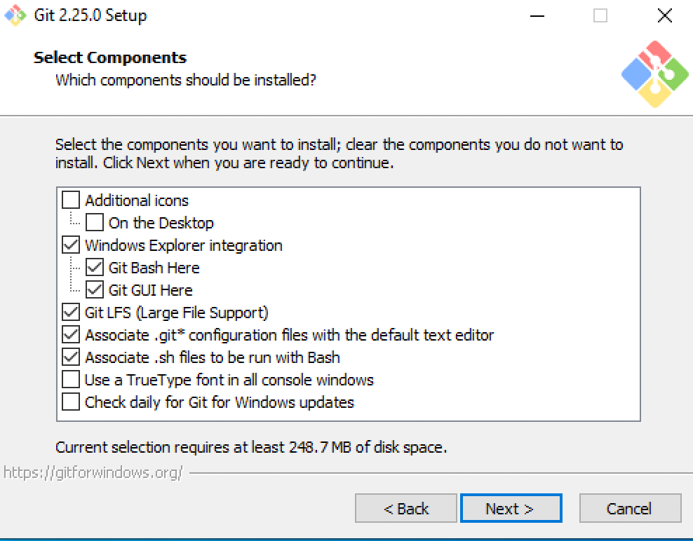
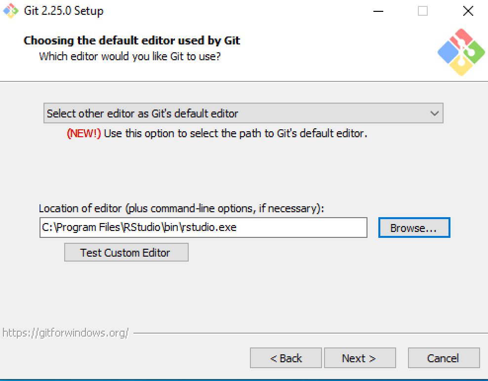
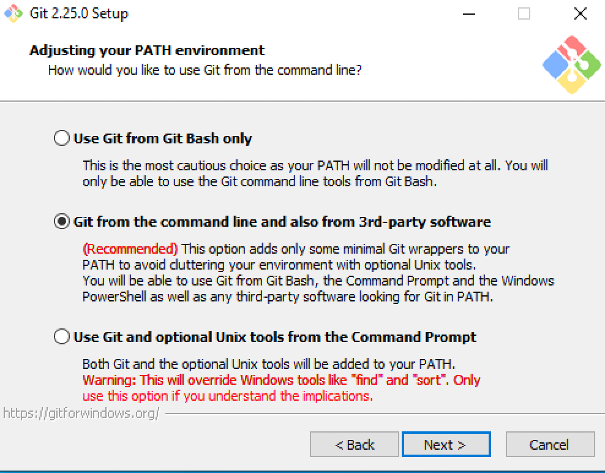

## Requirements

Please note the following requirements for the class on Friday,
Feb 1, 2019. 

Our guide will be the book by Jenny Bryan, et. al. titled [Happy Git
and GitHub for the useR](https://happygitwithr.com/). It is online and
is an excellent resource. However, due to time constraints, we will
only do a few operations in class to get you started and mainly
establish a workflow.

- Bring your laptop to participate
- Complete the steps below as the downloads can steal valuable time in
  class
- Ensure you have Stanford GitLab access. You should, and typically,
  all this takes is to log into [Stanford
  GitLab](https://gitlab.stanford.edu). 
- Please follow the steps below to install the `git` software, if you
  have not already done so.  On Windows, follow the recommendations so
  as not to hose your `Rtools` installation.
- Then install the Github desktop client.


## Git Software

### MacOS

Ensure `git` is installed by typing:

```
xcode-select --install
```

If you get a message saying stuff is already installed, you're ok.
Otherwise, ensure they are by following the prompts. 

You can check you have git by typing, in a terminal, 

```
git --version
```

This should return the version of git that is installed. 

### Windows

Install Git for Windows from [here](https://gitforwindows.org/). 

When installing, choose the default options. In particular, use the
pictures below to double check.

- 

- 

- 


