## What is `git` ?
- Git is a version control system. It is a set of tools that allows
    you to sanely manage changes to documents or code files, all while
    collaborating with others.
- Git works with a _repository_ (short name: _repo_) which is nothing
    but an organized collection of code and document files pertaining
    to a project.
- Git can be combined with services like Github, a cloud collaboration
    platform to make collaboration even more manageable.  Note that
    Git itself is a free program originally written by Linus Torvalds,
    but Github is a commercial service provider (now owned by
    Microsoft) that provides free and commercial plans.
	
I am now going to assume you have set up your Git account on GitLab.

## Getting Started

- Create a folder called `gitstuff` that we will use for all operations
  somewhere on your computer.
- Go to the [GitLab website](https://gitlab.stanford.edu) and sign
  in with your Stanford credentials.
  
Note that the Stanford GitLab website is really under
`https://code.stanford.edu` and `https://gitlab.stanford.edu`
redirects to it a URL on that site.

The credentials business can get a bit involved, so I am not going to
discuss later.

## Exercise 1: Creation

Goal: Create a repository on [Stanford GitLab](https://gitlab.stanford.edu)

- Go to the [GitLab website](https://gitlab.stanford.edu) and sign in if you
  have not already done so.
- Along the lines in [Chapter
  9](https://happygitwithr.com/push-pull-github.html), create a
  repo. On Stanford GitLab this is called a _Project_, so I will use
  the term project/repo interchangeably. 
  1. Use the project name `ex01`
  2. Description: "Exercise 1"
  3. Check the _Public_ option
  4. Check the _Initialize repository with README_ option
  5. Click _Create Project_
  
These instructions create a project/repository on the _remote
server_. 
___

### Exercise 1: Cloning

Goal: Clone repository to your local machine.

- On the website, navigate to the repo and then click on the blue
  `Clone ` drop-down. This gives you an option to copy a URL
  to your clipboard. Choose the `https` option and copy the
  corresponding URL. 
- Bring up a terminal, clone the repo to a local folder inside
  the `gitstuff` folder you created above. This will create a local
  folder `ex01` with a `README.md` file inside it. On Windows, you do this
  using the _Git Bash_ shell as shown below.

```{r, out.width = "800px", echo = FALSE}
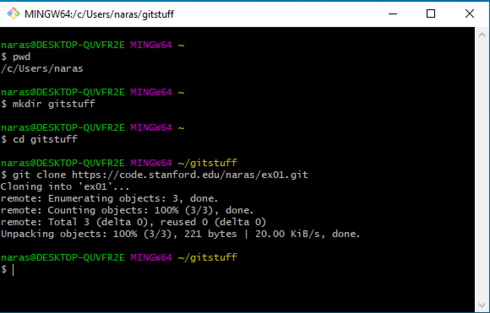
```
  
___

### Exercise 1: Manage in Rstudio

Goal: Associate this directory with Rstudio.

On your local machine, create a new Rstudio project.

- Choose existing directory and navigate to existing directory. 

You will get something like this. Note the appearance of a __Git__
menu tab on the upper right panel.

```{r, out.width = "800px", echo = FALSE}
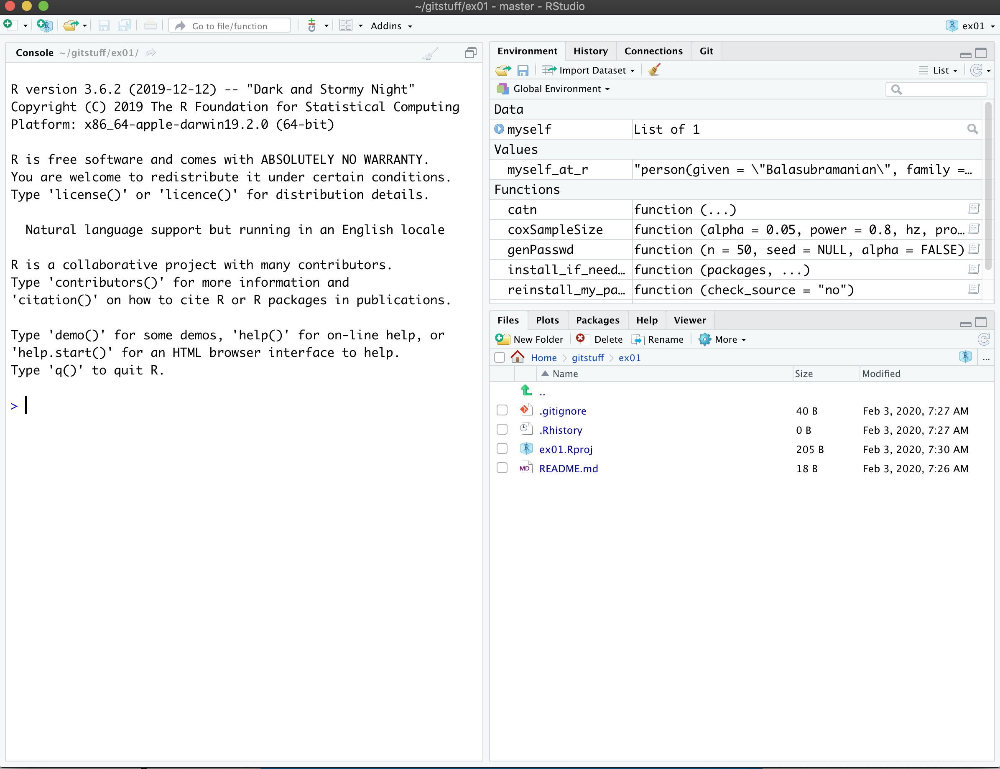
```


___

### Exercise 1: Make changes to `README.md`

- Make changes to the `README.md` file by clicking on it and adding
  some junk lines and saving it.
  
- Click on the Rstudio __Git__ tab on the upper right panel. This will
  show you a window such as the one below.


```{r, out.width = "800px", echo = FALSE}
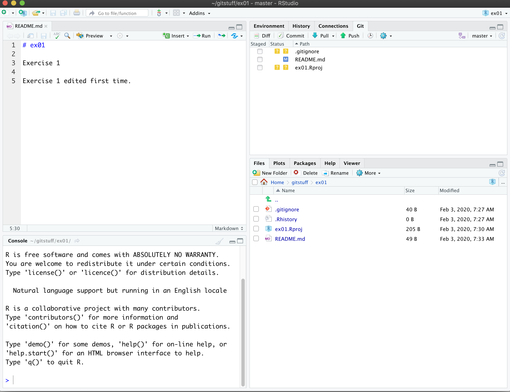
```

Notice that the display shows one file modified---the _M_ icon, and
two other files `.gitignore` and `ex01.Rproj` have question marks
associated with them: Git is telling you it does not know about those
two files, they seem to have appeared from somewhere!
  
Click on the `.gitignore` file at the bottom to see what it
contains. Mine shows:

```{r, out.width = "800px", echo = FALSE}
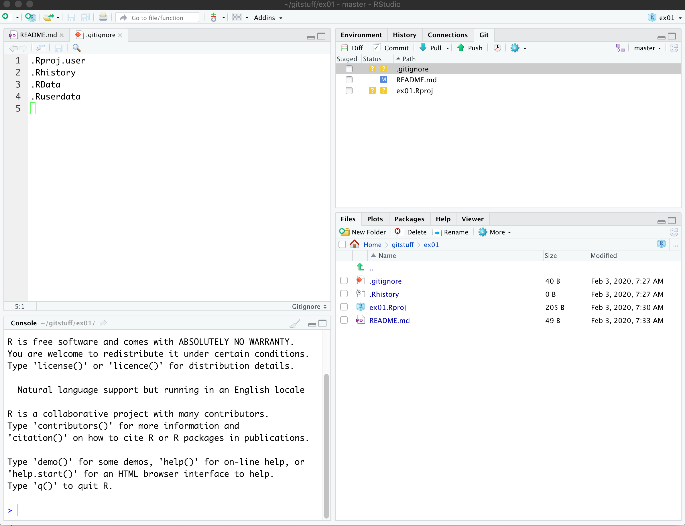
```


This means that these are files that Git will ignore in all its
actions. 

___

### Exercise 1: Commit

On the Rstudio upper right __Git__ tab you will see subtabs. 

- Choose _Commit_. This will bring up a new window.

- Click on each of the three files to see what has changed. Old stuff
  is in pink, and new changes are in green.  For files added anew,
  everything is green!

- Go ahead and fill out the commit message on the right with something
  like:
```
Added project to Rstudio and edited README.
```
- Press commit button

Notice that you got a message dialog as below and _nothing changes_. 

```{r, out.width = "800px", echo = FALSE}
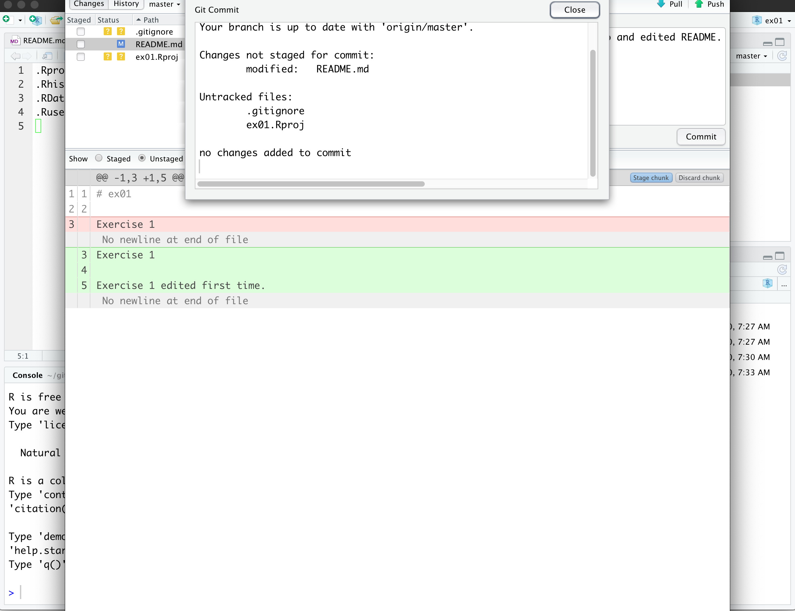
```

Commit always requires a message; make it meaningful in real work.

___

### Exercise 1: Commit (continued)

_You must stage your files before committing_.

- Check the boxes under the stage column
- Press _Commit_

```{r, out.width = "800px", echo = FALSE}
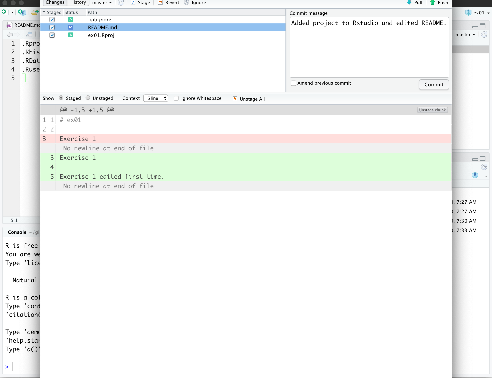
```

```{r, out.width = "800px", echo = FALSE}
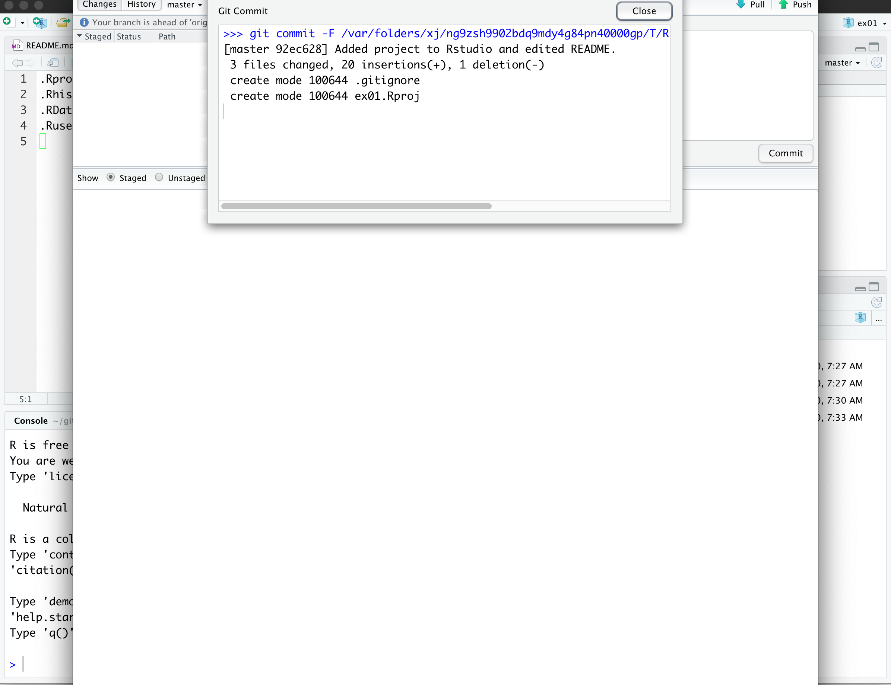
```


This just commits the changes you made to your local copy of the
repository. Commits are groups of edits you want to group as a unit so
that you can make sense of them.

___

What this means is that even if you clobber your files in the
repository, you can always get back to the point at which you
committed.

(However, nothing prevents you from your machine being corrupted and
completely hosing the `ex01` folder. Then nobody can help you unless
you have a backup. )

Note that a `Push` button has appeared on the top right. This `Push`
button allows you to _push_ your changes to the remote server, so that
there is a record of your commits on the server.


## Exercise 02

Goal: To address authentication issues. 

1. In Rstudio, choose _Tools_ -> _Global Options_ -> _Git/SVN_.
```{r, out.width = "800px", echo = FALSE}
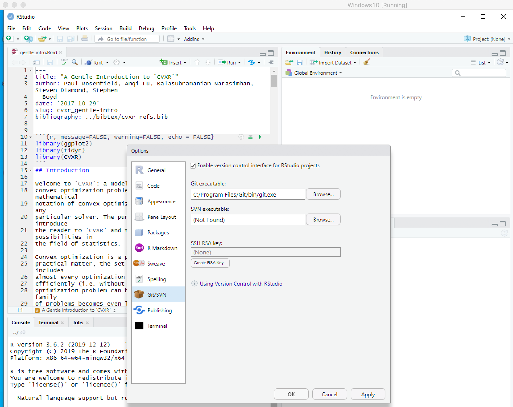
```
2. Click on the _Create RSA Key_ button to generate an RSA key. Choose
   defaults and leave passphrase empty for now.
```{r, out.width = "800px", echo = FALSE}
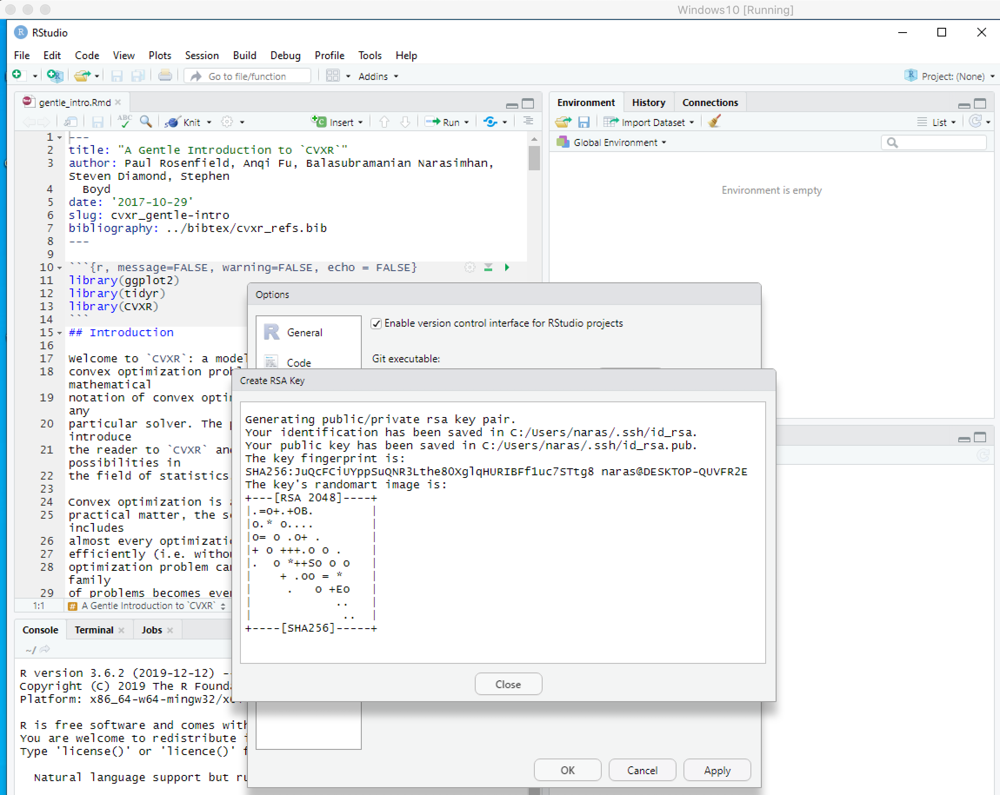
```
3. Remember where Rstudio created the file and open it in Rstudio.
```{r, out.width = "800px", echo = FALSE}
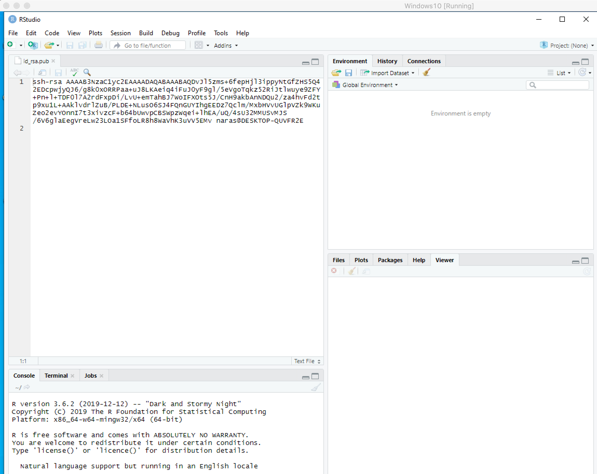
```
4. Apply the changes and Rstudio will ask to restart. 

5. On [Stanford Gitlab](https://gitlab.stanford.edu), choose settings
```{r, out.width = "800px", echo = FALSE}
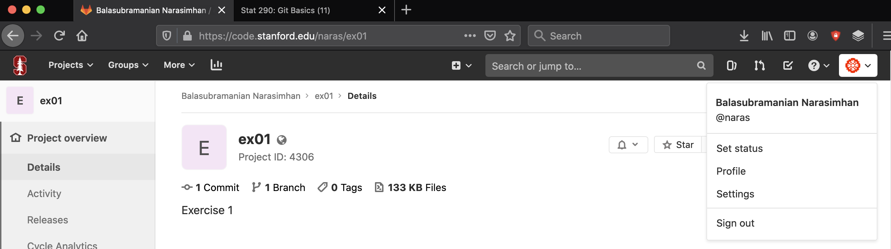
```

6. Paste the public key from Rstudio (one line) into the text
   box. __Do not edit, copy as is, into the textbox__. Click on the
   _Add key_ button.
```{r, out.width = "800px", echo = FALSE}
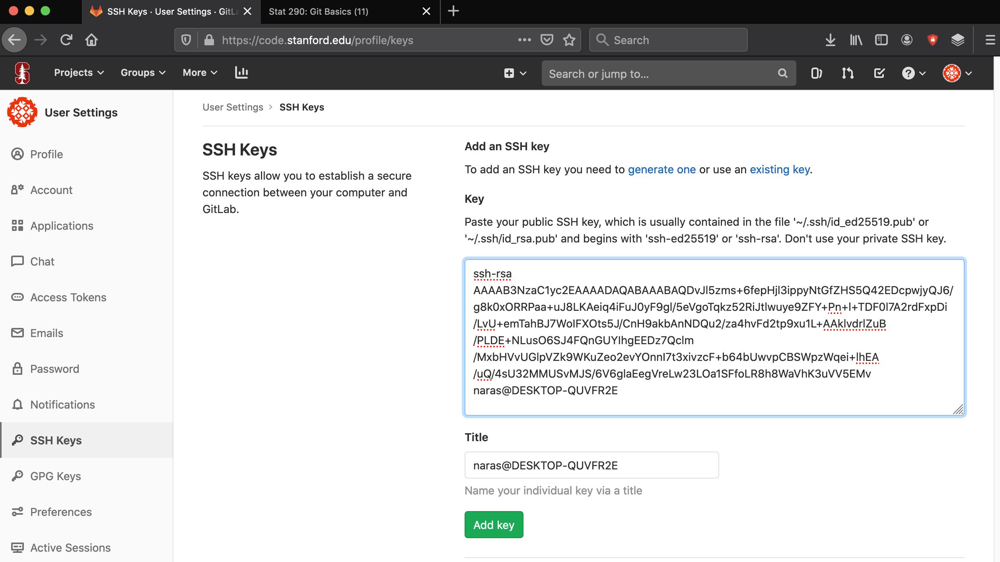
```

Now you have added an SSH key that makes your identity known to
GitLab!

## Exercise 02: Commit to remote repo without prompt

Goal: To now commit without being prompted for authentication

- As efore, create a new project `ex02` on [GitLab
  website](https://gitlab.stanford.edu)
  1. Use the project name `ex02`
  2. Description: "Exercise 2"
  3. Check the _Public_ option
  4. Check the _Initialize repository with README_ option
  5. Click _Create Project_
  
- As before, clone the project locally into `gitstuff`. Except that
you now use the `Clone with SSH` option (the first one) shown below.
```{r, out.width = "800px", echo = FALSE}
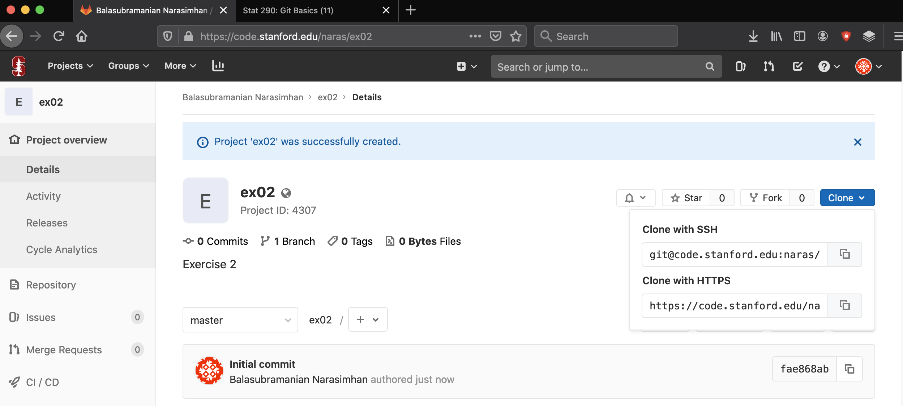
```

On windows, here is how it looks. 
```{r, out.width = "800px", echo = FALSE}
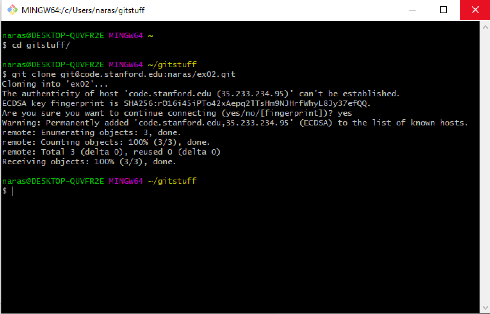
```

- On your local machine, create a new Rstudio project. Choose existing
  directory and navigate to existing `gitstuff/ex02` directory.

- Make changes to `README.md`, stage files, commit with a message.

- Now push to remote repository. When you press the _Push_ button, you
should get something like this.
```{r, out.width = "800px", echo = FALSE}
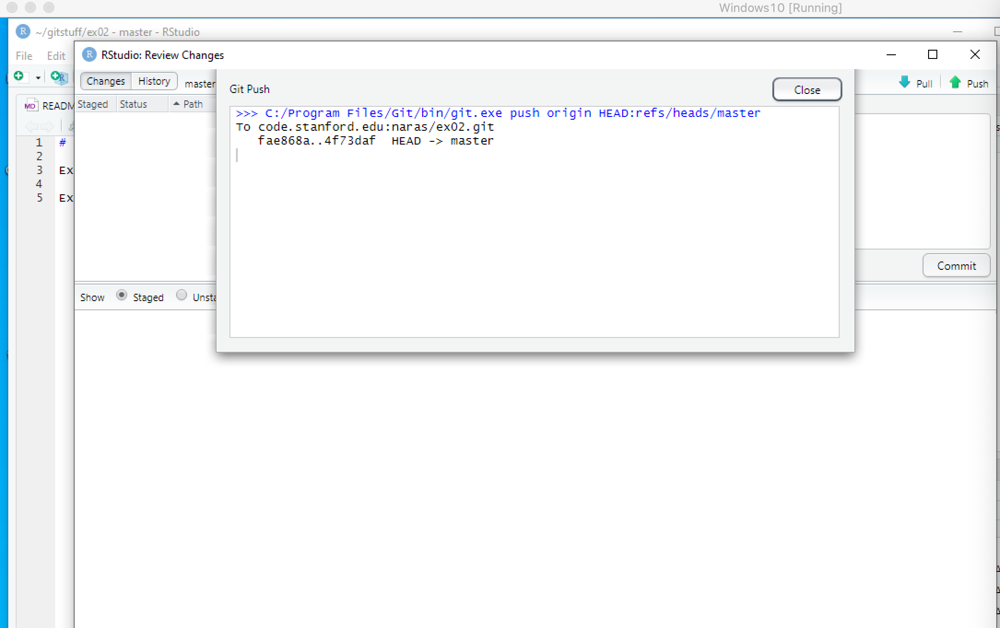
```

- On the [GitLab website](https://gitlab.stanford.edu), check the files
in your `ex02` project to ensure that the changes were indeed pushed
to the server.

At this point, even if your machine were to crash, you can retrieve
your _complete_ set of commits from the remote server and go back to
any commit.

   
   


