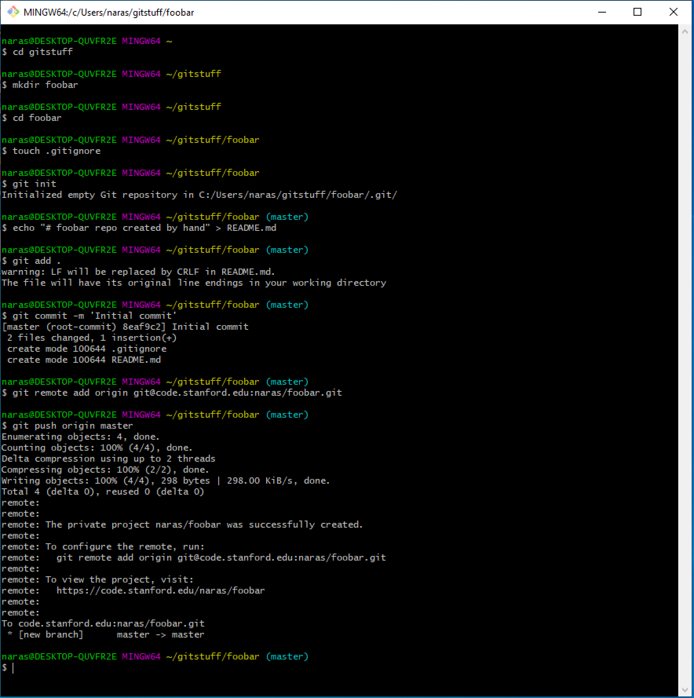
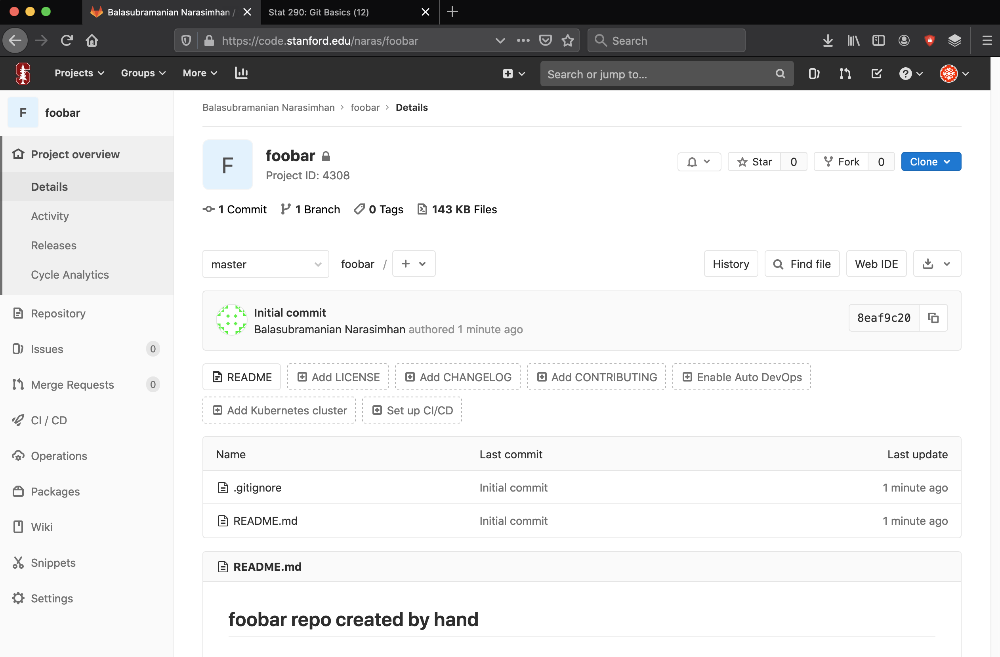

## Behind the scene

Behind the scene, all that is happening is that a series of git
commands are being executed. 

For example, you could set up a bare repository on the GitLab website,
say `foobar`. 

Then one could have executed the following commands on the command
line.

```{bash, eval = FALSE}
mkdir foobar
cd foobar
touch .gitignore
git init
echo "# foobar repo created by hand" > README.md
git add .
git commit -m "Initial commit"
git remote add origin git@code.stanford.edu:naras/foobar.git
git push origin master
```

Here is the session on windows.
```{r, out.width = "800px", echo = FALSE}

```

I can also check that this indeed worked on the GitLab website. 

```{r, out.width = "800px", echo = FALSE}

```

Note, however, that GitLab makes the repository _private_ by default!

## References

- Jenny Bryan & Co. [book online](https://happygitwithr.com)
- [Github cheatsheet]
- Youtube videos on Git and Github. Some of these are usually more
  technical and it is probably worth viewing them as needed.


   
