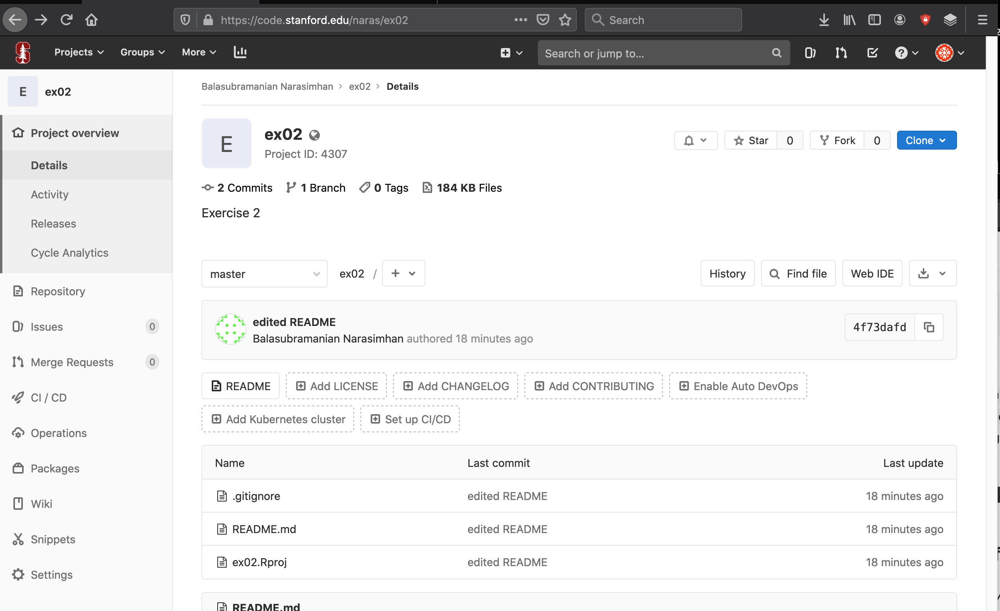
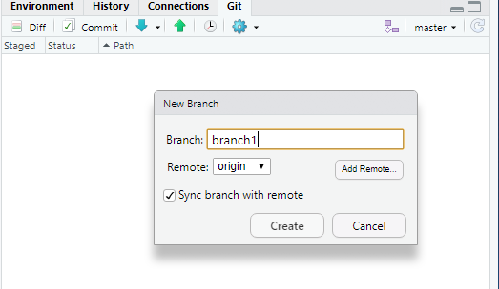
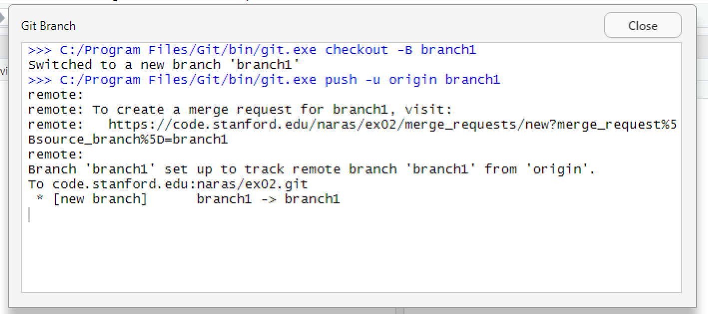
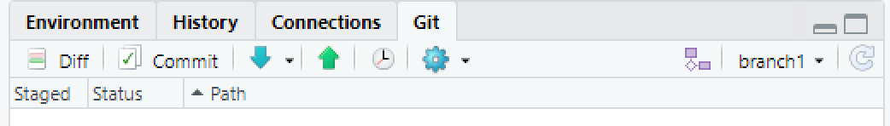

## Exercise 02: Branching

Here we will create a branch, make a pull request and merge.

Actually, you have always been working on a branch. The default branch
is `master`. 

Visit the repo website on [GitLab
   website](https://gitlab.stanford.edu) for `ex02`  and see how it looks.

```{r, out.width = "800px", echo = FALSE}

```

Notice the line at the top that says `2 commits` and `1 Branch`.

Click on the `1 Branch` and you will see that all along, we have been
working on a branch called `master`. The `master` is a typically a
special branch: that is the branch where we expect the current state
of work to be.

Although we can create branches on the website, we will do everything
now from Rstudio.

2. Create a new branch called `branch1` in Rstudio by clicking on the
   branch picture in the __Git__ tab.  This will be a branch off
   `master`.  You can create branches off other branches!

```{r, out.width = "400px", echo = FALSE}

```

Notice that because we set a remote server to be the origin, this
branch is immediately also created on the remote server as the
following dialog box informs us.

```{r, out.width = "400px", echo = FALSE}

```

4. We are now working on the branch `branch1` as seen from the Git
   Tab.
```{r, out.width = "400px", echo = FALSE}

```
5. Edit `README` by adding some text `Edits from branch 1`. Also add a
   new file `code.R` with text `plot(1:10)`.
   
6. Commit and push the branch.

7. Go to the website, refresh and see what's in the repo. Notice how
   you can view the contents of each branch!
   
8. Switch back and forth between the `master` and `branch1` branches
   on the website to see what files you have

9. Do the same on Rstudio to see how things change. 


