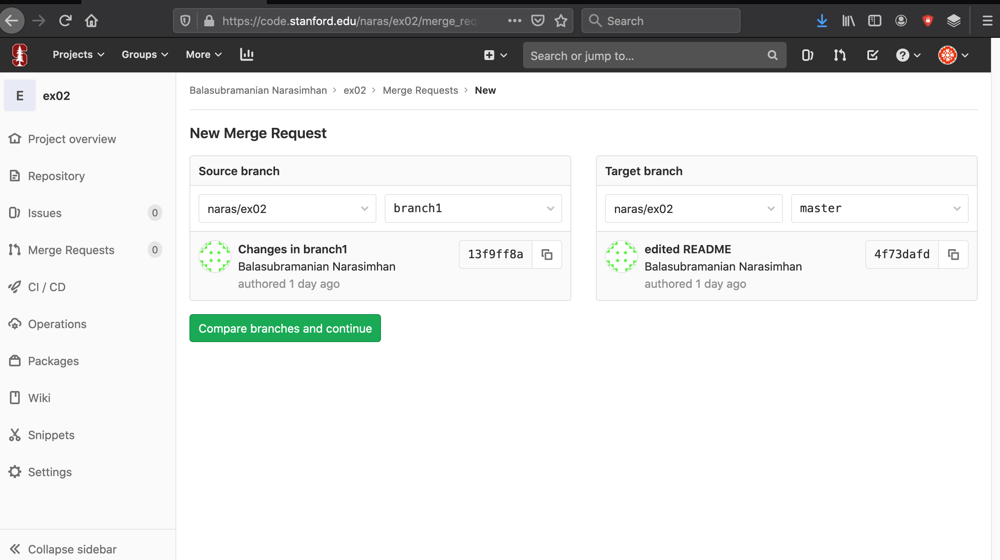
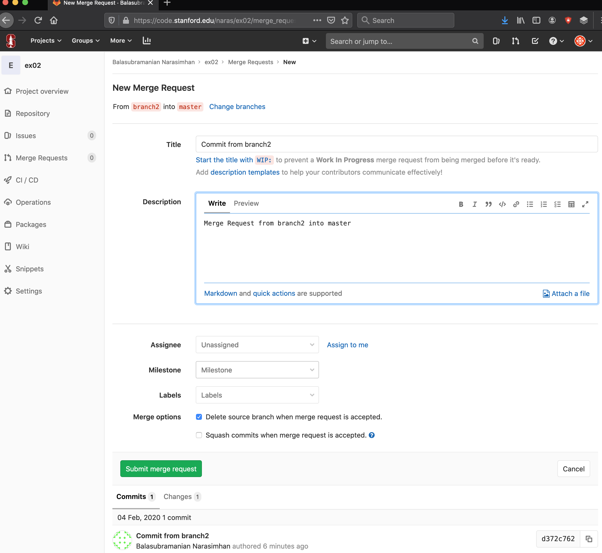

## Exercise 03

Goal: Merge the changes we made in `branch1` into `master` branch.
We will use the `ex02` repo we created previously.

__NOTE__: This is done on the website!

1. On GitLab repo, choose the _Merge Requests_ option on left and
click on _New merge request_.

```{r, out.width = "800px", echo = FALSE}

```

You will get the following dialog.

```{r, out.width = "800px", echo = FALSE}

```

___


2. Since we want to merge `branch1` into `master`, ensure that your
   page looks as below showing the source and target branches.
   
```{r, out.width = "800px", echo = FALSE}

```

___


3. Click on _Compare branches and continue_ to get the dialog
below. Note how I have added some text describing the changes. Go ahead and _Submit merge request_


```{r, out.width = "800px", echo = FALSE}

```

___


4. This is the ensuing dialog. By default, it gives you the option to
delete the source branch, but I have unchecked it here, to retain it
for use later, as we shall see.

```{r, out.width = "800px", echo = FALSE}

```

___


5. When you click on the green `Merge` button, you will get the
   following dialog with the checkbox indicating that the merge has
   been made. 


```{r, out.width = "800px", echo = FALSE}

```

___


6. (Optional) If you now go back to your project website `ex02` on top
   left, you will see that the `master` branch has all the changes
   that belonged to `branch1`, i.e. both are identical.
	

## Exercise 04

Let us go back to `ex02` and work further on `branch1`.

1. In Rstudio, switch to `master` branch.  Notice that you don't see
the merged changes. Use _Pull_ in the __Git__ tab to sync up: you will
see the files change.

```{r, out.width = "600px", echo = FALSE}

```

___

2. Switch to `branch1` in Rstudio and make further edits to
   `README.md` by adding `Edited a bit more after merge request.`

3. Commit with message `Commit after Merge Request` and _push_ changes.

4. Check that GitLab reflects the changes to `branch1`.

5. Switch back to `master` branch on Rstudio and create another branch
   `branch2` off the `master` branch.

6. Now edit the file `README.md` again and add a line `Update from
   branch2`.

7. Commit with message `Commit from branch2` and push `branch2`.

___

8. On GitLab you should now see three branches: `master`, `branch1`,
   `branch2`.

```{r, out.width = "800px", echo = FALSE}

```   

___

9. Make a _Merge Request_ from `branch2` into master on the website
   and complete the merge with message `Merge Request from Branch2`.

```{r, out.width = "800px", echo = FALSE}

```

Submit the merge request.

```{r, out.width = "800px", echo = FALSE}

```


Go ahead and merge it but once again, do not delete source branch.


```{r, out.width = "800px", echo = FALSE}

```

___

10. In Rstudio, use _Pull_ to pull in the changes. Notice how `branch2`
   changes are now in master.

11. Go back to GitLab and make a _Merge Request_ from `branch1` into master on the website
   and try to complete the merge with message `Merge from Branch1 after Branch2`.


```{r, out.width = "800px", echo = FALSE}

```


```{r, out.width = "800px", echo = FALSE}

```


Go ahead and merge it but do not delete source branch.
```{r, out.width = "800px", echo = FALSE}

```

___

10. _The merge will fail!_  Notice that the _Merge_ button is not
   green. You have to resolve the conflicts!


```{r, out.width = "800px", echo = FALSE}

```

___

What happened? Here is the picture that helps.

```{r, out.width = "800px", echo = FALSE}

```

___


11. You can click on _Resolve conflicts_ to resolve the conflict. 

```{r, out.width = "800px", echo = FALSE}

```

___

11. If you choose _Edit inline_ you will see the 
    are always highlighted using the

```
<<<<<<<<<<<
```

and

```
>>>>>>>>>>>
```
delimeters. We reconcile it and note it and mark as resolved. 

___


12. After resolving the conflict, go ahead and merge.

```{r, out.width = "800px", echo = FALSE}
knitr::include_graphics("resolve-conflict2.png")
```

14. You can now fetch and pull from the origin in Rstudio to have
    sanity back.

15. You can also delete the branches, now that they have served their
    purpose. 
	
## Notes on conflicts

The conflict resolution issue is what I get asked most about
especially by team members on a project.

- Most of the time, collaborators are working on different parts of
  project code or documentation and so this is usually not a problem.

- To prevent it from becoming a major problem, it is best to make
  incremental changes in branches as I advise below. That way, it is
  easy to narrow down what the source of the conflict.

- Commiting and pushing often to origin ensures that your changes are
  never lost. It also lets your collaborator know what you are doing
  and surface any potential conflicts.

- Make a merge request as soon as you think you have finished a
  feature and try to merge it, so that don't go too far down the
  development process which can cause conflict resolution to become
  very complicated.


## Workflow Recommendation

I create a branch whenever I want to make some feature changes.
Making changes in my branch is a good way to create my edits away
from the `master` branch.

If you don't use branches, you are working directly with the `master`
branch.

To create a new branch, I execute

```{bash, eval = FALSE}
git branch mybranch
```
which creates a local branch named `mybranch`.

Now I have to inform the remote repo that I have a new branch as shown
below.

```{bash, eval = FALSE}
git push --set-upstream origin mybranch
```

Now I can do all my work with my branch as follows, first by checking
it out.

```{bash, eval = FALSE}
git checkout mybranch
```

I then make my changes as usual and do commits and push changes
upstream as outlined earlier.  When I push my branch to the remote
repo, I can choose to merge my branch into the master.  I have to
approve it and in the process resolve any conflicts that may
arise. Once it is approved, stuff from my branch, gets merged into the
master branch.

Once done with a branch, I can delete it.

```{bash, eval = FALSE}
git branch -d mybranch
```
This does not affect the changes that have already been merged into
the master via my merge request.

## Important Rstudio note

When you delete branches on remote repository, Rstudio, not being a
full Git IDE, can sometimes get confused.  

In such cases, I quite Rstudio, and if I am sure that the remote
repository is fully updated and current, I would either rename my
project directory and clone the repo again to synchronize. 

Yes, unfortunately, Rstudio only goes so far.


## References

- Jenny Bryan & Co. [book online](https://happygitwithr.com)
- [Github cheatsheet]
- Youtube videos on Git and Github. Some of these are usually more
  technical and it is probably worth viewing them as needed.


   

   
   


