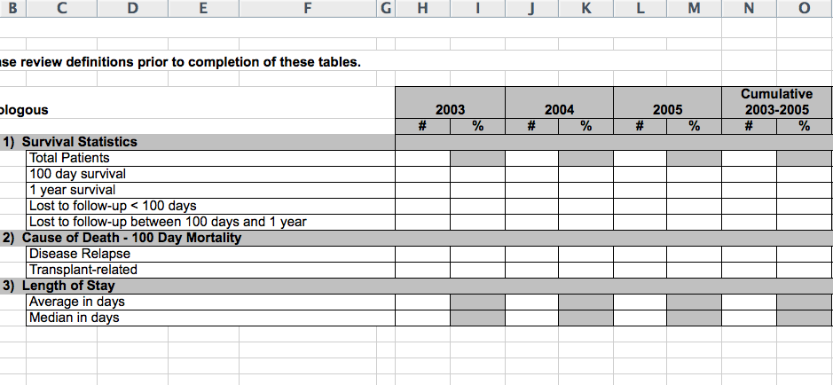
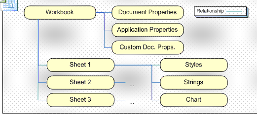
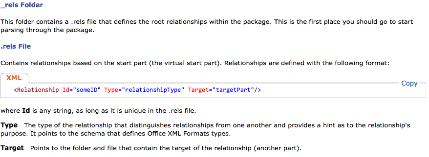
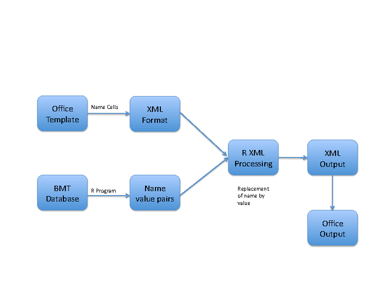

In modern data science environments, it is rarely the case that one
has the luxury of completely working within one system. There are data
producers and data consumers, real-time and offline.

Even if the data is offline, data has often to be moved from one
system to another. Indeed _objects_ have to be created using data from
one system in another.

This means, that data has to be _serialized_ into some format by one
system so that another system can read it.

_Serialization is the glue of data science!_

In a way, CSV data format is one form of serialization. Every modern
language will allow you to read this data format.

___

## 14.1.1 Object Serialization

In R, you serialize _objects_ to disk whenever you save data using
`save` or `saveRDS` and unserialize/deserialize them it using `load`
or `readRDS` respectively.  Here the term serialize/unserialize means
writing stuff in an external format that can be read back _without
loss_ of information.

If you were completely cocooned in the R world, those two functions
would suffice. But in the modern world, serialization and
deserialization needs to be done _over the wire_.


Thus other data formats are needed, since many datasets/objects may
not necessarily be rectangular in format; for example, data with
hierarchical structure. (In fact, it would be very inefficient to
store them in rectangular formats.)

___

## 14.1.2. XML, JSON, Protocol Buffers

We will first discuss other data formats in some detail.

- XML, the eXtensible Markup Language
- JSON, the JavaScript Object Notation

Then, for objects, as time permits, we will discuss Protocol Buffers.

___

## 14.1.3. A Local Example

This is a real problem we tackled in the School of Medicine.

Stanford is well-known for its _Bone Marrow Transplant Program_. As
part of the [CIBMTR network](https://www.cibmtr.org), Stanford has to
produce reports about the transplants performed here at Stanford.

So the problem statement is:

> Populate a spreadsheet with values for a report.



The problem is that a spreadsheet report does not adhere to what
Djikstra called the _Separation of Concerns_. The spreadsheet combines
_presentation_ with _data_ which makes it a nuisance.

As an example, consider the `iris.xlsx` file included here.

Let us examine the innards of this file.

___

### Container Format

The container format is well documented (with changes occuring over
time).




___

### Innards




___

### The solution

> Exploit the fact that a spreadsheet is actually an XML
> document!



___

## Session Info

```{r}
sessionInfo()
```

