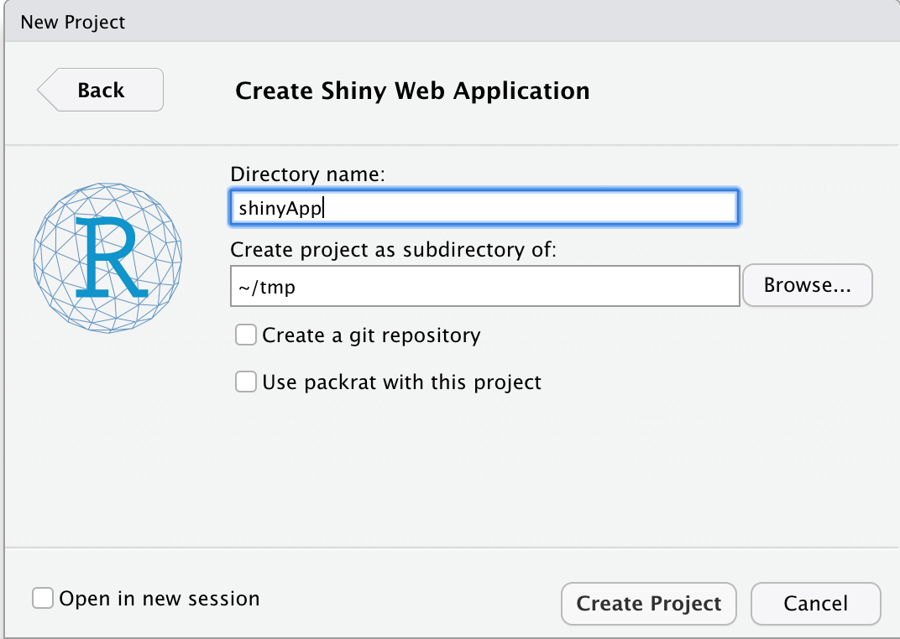

The [Shiny](http://shiny.rstudio.com) is a web programming framework
for R developed by Joe Cheng at RStudio. Our outline today is as
follows:

> [Introduction](#intro)

> [A simple example](#simple-example)

>> [Running the App](#runapp)

>> [User Interface and Server Code](#ui-server)

>> [Package Integration](#package)

>> [Alternative specification for App code](#alternative)

> [Basics of Reactive Programming](#reactivity)

> [Resources](#resources)

## Requirements

```{r, echo = FALSE}
installIfNeeded <- function(packages, ...) {
    installedPackages <- installed.packages()[, 1]
    toInstall <- setdiff(packages, installedPackages)
    if (length(toInstall) > 0) install.packages(toInstall, ...)
}
installIfNeeded(c("shiny", "devtools"), repos="https://cloud.r-project.org")
```

<a id="intro"></a>

## 21.1. Introduction

The `shiny` package provides a number of facilities:

- Lets you to create web applications with only a few lines of R
  code. The user then interacts with the application using a
  browser. You can create dynamic applications so that outputs can
  react to changes in inputs. For example, one can build animations
  very easily using `shiny`.

- Provides a good number of customizable UI (input) for user
  interactions. Interactivity and animations become possible.

- Provides pre-built output widgets for displaying plots, tables, and
  printed output of R objects

- Shiny apps can be included in R packages so that your users can have
  both a command-line interface as well as graphical user
  interface. This is useful to disseminate your work to a broad
  audience.

Shiny apps have become popular as a way of disseminating dynamic
content. Once you develop the app, you can deploy it either locally,
or on the cloud at the
[http://www.shinyapps.io/](http://www.shinyapps.io/) website.


Applications of shiny include:

- Dashboards
- Analytic interfaces
- Dynamic documents and graphics

We're going to go through a set of exercises. The focus today is not
the user interface, but rather the logic and computation involved.

<a id="simple-example"></a>

## 21.2. Simple Example

In RStudio

1. Create a new project
2. Use a new Directory
3. Select Shiny Web Application
4. Maybe name the directory `shinyApp`. Other checkboxes are not
   important for us today
5. Create Project

Here is a picture of my setting.



This will create a project with a file: `app.R` with the following contents.

```{r, eval = FALSE}
#
# This is a Shiny web application. You can run the application by clicking
# the 'Run App' button above.
#
# Find out more about building applications with Shiny here:
#
#    http://shiny.rstudio.com/
#

library(shiny)

# Define UI for application that draws a histogram
ui <- fluidPage(

    # Application title
    titlePanel("Old Faithful Geyser Data"),

    # Sidebar with a slider input for number of bins 
    sidebarLayout(
        sidebarPanel(
            sliderInput("bins",
                        "Number of bins:",
                        min = 1,
                        max = 50,
                        value = 30)
        ),

        # Show a plot of the generated distribution
        mainPanel(
           plotOutput("distPlot")
        )
    )
)

# Define server logic required to draw a histogram
server <- function(input, output) {

    output$distPlot <- renderPlot({
        # generate bins based on input$bins from ui.R
        x    <- faithful[, 2]
        bins <- seq(min(x), max(x), length.out = input$bins + 1)

        # draw the histogram with the specified number of bins
        hist(x, breaks = bins, col = 'darkgray', border = 'white')
    })
}

# Run the application 
shinyApp(ui = ui, server = server)

```

<a id="runapp"></a>

## 18.3. Running the App

In RStudio, click `Run App` to run it. You should be able to change
the slider to control the number of bins in the histogram. You can run
it in RStudio's view pane or in a browser.

Notice that when you run the app, the console is no longer available
since the server that runs has grabbed the console, so that all your
interactions are executed by the R process associated with the
console.

<a id="ui-server"></a>

## 18.3.1. User Interface and Server Code

The `ui` object contains your _User Interface_ (UI), a web page that
the function `fluidPage` creates. It lays out elements of the web page
containing controls that you would like the user to manipulate.

The function `server` contains the _server logic_, that is what
computation R performs when the user manipulates those controls in the
UI.

_You, the developer, have to write both!_

___

Explanation for the simple example above. First the user interface.

-  The UI consists of a titlePanel with a specified title
   `Old Faithful Geyser Data`.

-  There are two panels: a `sidebarPanel` on the left for inputs and a
   `mainPanel` of outputs (which goes on the right). There is also a layout
   specification.

-  The `sidebarPanel` consists of a `sliderInput` widget. This takes
   several parameters:

1. An `inputId` named `bins`; this will be the name you will use to
refer to this ui control

2. A `label` for the control called `Number of bins:`

3. The minimum value (`min`) for the slider control

4. The maximum value (`max`) for the slider control

5. The starting value (`value`) for the slider control

- The `mainPanel` consists of the output from a plot
  (`plotOutput`). The handle used to refer to that plot is
  `distPlot`.

___

The server logic code is specified in the function named
`server`. This function should have a particular form:

```{r, eval = FALSE}
server <- function(input, output, session) ...
```

- `input` which will contain all the input parameters created by the
user interface
- `output` which will contain _your_ server logic will have to
  populate appropriately.
- `session` is an object you can use to manipulate the session
  variables

Often, only the first two are used. 

Notice how the `inputId` parameter value `bins` is used in the server
logic as `input$bins`. Notice also how the server logic creates a new
output object `output$distPlot`; you'll recall that the UI used the
`distPlot` in a call to `plotOutput`.

___

Thus this example _wires_ the input object `input$bins` to the output
object `output$distPlot`. This is the simplest example of Shiny's
_reactive programming_ model: if an input changes, the output changes
appropriately. (Internally, shiny uses a fast bidirectional
communication between the web browser and R using `httuv`, an http and
websocket server.)

The reactive programming model in shiny is easy to understand compared
to the usual event-driven approaches one has to use in many languages
used to build user interfaces.

___

In the shiny server code, you saw the expression:
```{r, eval = FALSE}
output$distPlot <- renderPlot({... })
```

It is important to understand that functions like `renderPlot`,
`renderTable` are all _recipes_ for updating the value of
`distPlot`. 

They don't mean: _run this code to update the plot_.

Rather they mean _here's how you would update the plot_ or _here's how
you would update the table_. Naturally, they are functions.

The latter makes sense, because reactivity implies that shiny be able
to know the _recipe_ (dynamic), rather than the _result_ (static).


<a id="package"></a>

## 18.4.0. Run the app from outside RStudio

Open up a terminal (or a command prompt shell on Windows) and change
directory to the place where you created your project.

In my case, it was `~/tmp` in the above picture and `shinyApp` will be a
subdirectory there.

___

### 18.4.1. Exercise 0

Navigate to the directory that contains the `shinyApp` folder, fire up
R on the command line, and execute:

```{r, eval = FALSE}
library(shiny)
shiny::runApp("shinyApp")
```

Hit `Cntrl-C` or equivalent at the R prompt to get out.

Thus, the function `shiny::runApp("directory")` will run an app in
`directory`. Basically, `shiny` looks for a call to `shinyApp` in the
code in that directory and executes that. 

___

### 18.4.2. Put the shiny app in a package

1. Create a package named `ted` as follows in the same directory as
   above for exercise 0 or in the same R session. (The following code
   may do it, but due to changes to the packages, an error message may
   appear.)

```{r, eval = FALSE, error = TRUE}
library(devtools)
devtools::create(path = "ted",
                 fields = list(
                     `Authors@R` = 'person("Ted", "The crazy cat", email = "ted@catparadise.com", role = c("aut", "cre"))',
                     License = "GPL-2"
                 ))
```

___

2. Add a simple `hello` function. For the sake of this example, we
   provide this simple function as a character vector.

```{r, eval = FALSE}
helloFunc <- c(
    "#' Greet someone",
    "#' @description Greets anyone at the console",
    "#' @param who the person or entity to greet",
    "#' @export",
    "hello <- function(who = 'world') {",
    "    cat('Hello, ', who, '\\n')",
    "}")
writeLines(text = helloFunc, con = "R/hello.R")

```
___

```{r, eval = FALSE}
devtools::document()
ted::hello()
```

The last should return `Hello,  world`.

___

3. Now that you have the package structure, where would you put the
   app?

```{r, eval = FALSE, echo = FALSE}
base::dir.create("inst")
base::file.copy(from = "~/tmp/shinyApp", to = "inst", recursive = TRUE)
```

4. Check to see that the `inst` directory of `ted` is correctly
populated. Remove extraneous files; for example, `.Rproj.user` and `shinyApp.Rprojin
our case.

___

4. How will you allow users of the `ted` package to invoke the app?

```{r, eval = FALSE}
tedAppFunc <- c(
"#' Run the test shiny app",
"#' @description Runs a shiny app for a graphical user interface example",
"#' @export",
"#' @importFrom shiny runApp",
"tedApp <- function() {",
"    shiny::runApp(system.file('shinyApp', package = 'ted'))",
"}")
writeLines(text = tedAppFunc, con = "R/tedApp.R")
```

Note the import of `shiny::runApp` and use of `system.file`.

___

Now you can try running the app.

```{r, eval = FALSE}
devtools::document()
devtools::install()
ted::tedApp()
```

You can have as many shiny apps in a package as you wish. Just create
separate folders for it and appropriate helper functions. The helper
functions are important because they provide a context for the shiny
apps within your package.

___

### 18.4.3 Notes

When one works with files on a system, it is important to be aware of
your sorroundings; i.e., what the current working directory is, where
can you locate files etc. 

- The function `base::getwd()` will return the current working
  directory. 

- The function 
```{r}
base::file.path("foo", "bar", "file.txt")
```
will return a file path constructed using the correct path
separator. Thus `file.path(getwd(), "foo", "bar", "file.txt")` will correctly
return the _full path_ to `file.txt`.

- The function `base::setwd("foo")` will set the current working
 directory to the directory `foo` relative to the current working
directory. You can also specify a full absolute path name. _There are
only very few situations this should ever be done in your code or
packages!_

- The function `system.file(package = "foo")` returns the absolute
  path of the _installed_ package `foo` in the R installation. This
  can be exploited very nicely. Familiarize yourself with this!

- There are a full host of functions for file and directory
  manipulation in R. See `?files` for more info, particularly the
  _seealso_ sections and try out the examples.


<a id="alternative"></a>

## 18.5.1. Alternative specification for App code

Note that you can also specify code for shiny apps in alternative
ways.  The only real requirement is that your shiny app directory
_must_ contain either an `app.R` or a `server.R` file which makes the
call to `shiny::shinyApp`. 

For example, the initial example above for the default shiny app could
have also been coded as follows in several files: `file1.R`,
`file2.R`, `app.R`.

```{r, eval = FALSE}
## file1.R  contents
ui <- fluidPage(...)
```

```{r, eval = FALSE}
## file1.R  contents
server <- function(input, output) {...}
```

```{r, eval = FALSE}
## app.R  contents
library(shiny)
source("file1.R")
source("file2.R")
server <- function(input, output) {...}
```

That would produce the same app.  Several things to note.

- Shiny Apps modify search path!
- Shiny App directories can contain arbitrary code in files and can be
  sourced. 

<a id="reactivity"></a>

## 18.6.1. Basics of Reactive Programming

To make reactive values do something on a web page, assign them to
`output` object. You can then render them on the web page.

___

### 18.6.2. Exercise 1 (`Ex1.R`)

Problem: Goal is to plot and print the first `nrows` of the `cars`
dataset which has two columns. You need to let the user select a
number of rows (`nrows`).

```{r}
plot(head(cars, n = 10))
```

Load `Ex1.R` in RStudio and complete the code in the function
`server`.

___

### 18.6.3. Exercise 2 (`Ex2.R`)

Here is the code in `Ex2.R`.

```{r, eval = FALSE}
library(shiny)
ui <- fluidPage(
  h1("Ex2"),
  sidebarLayout(
      sidebarPanel(
          numericInput("nrows", "Number of rows", 10)
      ),
      mainPanel(
          plotOutput("plot"),
          tableOutput("table")
      )
  )
)
server <- function(input, output, session) {
    ## Factor out the head(cars, input$nrows) so that the code isn't
    ## duplicated and the operation isn't performed twice for each
    ## change to input$nrows.
    output$plot <- renderPlot({
        plot(head(cars, input$nrows))
    })
    output$table <- renderTable({
        head(cars, input$nrows)
    })
}

shinyApp(ui, server)
```

__Problem__

We have a plot as well as a table in this shiny app. However, the code
is wasteful, especially with large datasets or computation that
generates this dataset: it computes two `head` twice every time the
user changes the number of rows. How can we avoid that?

___

Recall that all action in R occurs via functions and expressions. To
create reactive _expressions_, shiny provides a function called `reactive`
which can be used to wrap any R expression to make it reactive. That
is, shiny will ensure the value of the expression is recalculated if
any of the variables in the expression change.

So just wrap _your expression_ with `reactive` to enable
reactivity. For example:

```{r, eval = FALSE}
d <- reactive({
    head(cars, input$nrows)
})
```
creates a reactive value `d` that will be kept up-to-date any time the
user chooses a different number of rows.

However, to use the reactive expression, you call it _like a function_:
`d()`, not plain `d`.

Load `Ex2.R` in RStudio and complete the code in the function
`server`.

___

### 18.6.4. Exercise 3 (`Ex3.R`)

In `Ex3.R` remove duplication of `selected` and `model`
code/calculations in the server code.

```{r, eval = FALSE}
server <- function(input, output, session) {

  ## Remove duplication of `selected` and `model` code/calculations.

  output$plot <- renderPlot({

    selected <- head(iris[, c(input$xcol, input$ycol)], input$rows)
    model <- lm(paste(input$ycol, "~", input$xcol), selected)

    plot(selected)
    abline(model)
  })

  output$modelInfo <- renderPrint({

    selected <- head(iris[, c(input$xcol, input$ycol)], input$rows)
    model <- lm(paste(input$ycol, "~", input$xcol), selected)

    summary(model)
  })

  output$dataInfo <- renderPrint({

    selected <- iris[, c(input$xcol, input$ycol)]

    summary(selected)
  })

  output$table <- renderTable({

    selected <- head(iris[, c(input$xcol, input$ycol)], input$rows)

    head(selected, input$rows)
  })
}

shinyApp(ui, server)
```

___


### 18.6.5. Exercise 4 (`Ex4.R`)

Often, you need some action to take place based on a whole set of
inputs. Often, you would like your user interface to gather a set of
inputs and then when the user presses a button, you would like to do
some action that might be computationally intensive.

We're going to do a simple exercise that illustrates this by means of
action buttons.  From the `shiny` web pages:

>Action buttons are different from other widgets because the value of
>an action button is almost never meaningful by itself. The value is
>designed to be observed by one of `observeEvent()` or
>`eventReactive()`. These functions monitor the value, and when it
>changes they run a block of code.

Action buttons take two arguments: the `inputId`, the ID of the button
or link, and the `label`, the label to display in the button.  It
appears as a button in your app.

When you have an action button, you want to combine it with
`observeEvent` to trigger an action.

In the most common invocation, `observeEvent` takes two arguments, the
first an event expression , such as the input id of the action button,
and a handler expression (`{ some_r_code }`) to execute, when pressed.

___

In `Ex4.R` add logic that when the `save` button is pressed, the
current data is saved in a file called `data.csv` in the current
working directory.

```{r, eval = FALSE}
ui <- fluidPage(
    h1("Example app"),
    sidebarLayout(
        sidebarPanel(
            numericInput("nrows", "Number of rows", 10),
            actionButton("save", "Save")
        ),
        mainPanel(
            plotOutput("plot"),
            tableOutput("table")
        )
    )
)
server <- function(input, output, session) {
    df <- reactive({
        head(cars, input$nrows)
    })
    output$plot <- renderPlot({
        plot(df())
    })
    output$table <- renderTable({
        df()
    })
    ## Add logic so that when the "save" button is pressed, the data
    ## is saved to a CSV file called "data.csv" in the current
    ## directory.
}
```

___


### 18.6.6. Exercise 5 (`Ex5.R`)

Consider an app where we have two buttons, one for plotting a
histogram of 100 normals and another for plotting a histogram of 100
uniforms. Of course, we could also have a simple drop down for doing
this, and use the techniques discussed before, but let us consider
this simple example for the sake of explaining a new function
`reactiveValues()`.

What are reactive values? They are like lists, but with special
capabilities for reactive programming.  You already saw an example of
this: the `input` object. It is a reactive value. However, in a
shiny app, you don't get to write stuff into the `input` object; that
is controlled by shiny.

___

The function `reactiveValues()` lets you create objects like the
`input` object for your own use.  So for example, you can stuff
arbitrary things in your own reactive values object.

```{r}
library(shiny)
rvObj <- reactiveValues()
rvObj$a <- 3
rvObj[['b']] <- 4
```

Then, in your code, you can use the reactive value object `rvObj` to
react when any value in the list `rvObj` changes, just like you did
with `input`.

So when you have an application where several action buttons that
control the same object, you can combine `observeEvent()` calls with
`reactiveValues()`.

___

In `Ex5.R`, we have the data that we want to plot that is
changing. Can you use `reactiveValues()` to solve it?

```{r, eval = FALSE}
ui <- fluidPage(
    h1("Example app 5"),
    sidebarLayout(
        sidebarPanel(
            actionButton("rnorm", "Normal"),
            actionButton("runif", "Uniform")
        ),
        mainPanel(
            plotOutput("plot")
        )
    )
)
server <- function(input, output, session) {
    ## When "rnorm" button is clicked, the plot should show a new
    ## batch of rnorm(100). When "runif" button is clicked, the plot
    ## should show a new batch of runif(100).

    output$plot <- renderPlot({
        hist(rnorm(100))
    })
}
```

_Hint:_ Create a `plotData` reactive value object that contains the
appropriate data to plot.  You will use `observeEvent` to monitor
which button was pressed.

___

### 18.6.7. Exercise 5a (`Ex5a.R`)

Although one can tell if the data is normal or uniform from the
histogram, add a little label to show if you have 100 normals or 100
uniforms to the plot.


<a id="resources"></a>

## 18.6.8. Resources

There are many useful tutorials and articles on the [RStudio
website](http://shiny.rstudio.com). There is also an active Google
group called shiny discuss, where many questions are answered.

___

## Session Info

```{r}
sessionInfo()
```


