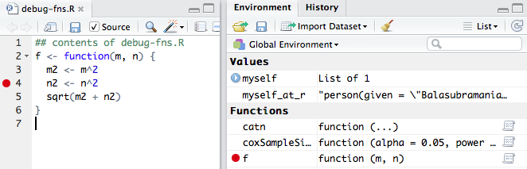
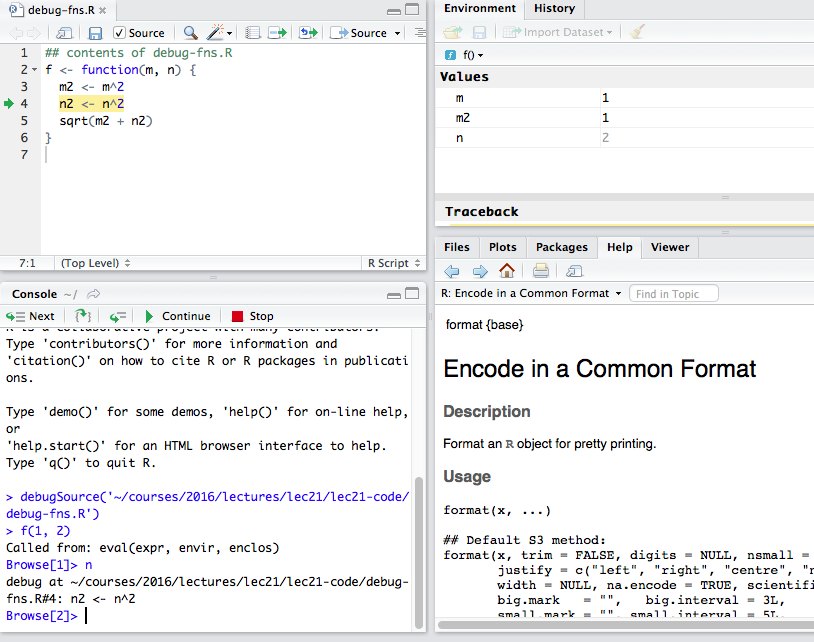

R signals errors and warnings using the following functions.

1. `stop` signals an error condition. What happens when an error
   occurs is controlled by functions called _error handlers_. The
   default error handler (`NULL`) prints a message and jumps to the
   top level prompt or top level browser no matter what R is
   executing. (This behavior can of course be controlled; more below.)
   The last error message can be obtained using `geterrmessage()`.

2. `warning` emits warning messages specified in the arguments. The
    default behavior of R is to print the warning messages. Sometimes,
    you know ahead of time that some warnings might be generated and
    therefore choose to ignore them. `suppressWarnings(expr)` will
    execute an expression in a context where it will ignore warnings.

___

## 20.1.1. Throwing an error or warning

In your code, you can throw an error condition any time by calling
`stop`.

```{r, error = TRUE}
f <- function(a) {
    stop("A test error")
}
f(1)
```

Similarly, you can use `warning` for warning messages.

```{r}
f <- function(a) {
    warning("Do not call me!")
    a
}
f(1)
suppressWarnings(f(1))
```

___

The default behaviors on errors and warnings alluded to above are
controlled using several variables defined in a list generally knowns
as `options`. A call of `options()` will list them, about 84 of them!

Function `getOption()` retrieves the value of an option, returning
`NULL` by default if no such option exists.

Unfortunately, there is no equivalent `setOption()`: the `set` version
for an option is merely `options()`. For example,

```{r}
getOption("error") ## returns NULL by default
getOption("warn")  ## zero by default
getOption("show.error.messages") ## TRUE by default
```

The help pages for these functions `stop` and `warning` provide
further detail. For example, warnings can be completely ignored by
setting `options(warn = -1)` or smaller. They can be promoted to
errors by setting `options(warn = 2)` or higher, etc.

These options are global and can have side-effects. So beware. 

## 20.1.2. Debugging R Code

R provides several functions for debugging problematic code. Note that
if you use RStudio you have a menu for debugging. That menu lets you
set break points and control a few options when you encounter errors.

But before using it, let us first examine how you would debug at the R
console directly.  Since everything that happens in R is via
functions, consider the following function.

```{r}
f <- function(m, n) {
  m2 <- m^2
  n2 <- n^2
  sqrt(m2 + n2)
}
```

Suppose we want to stop just before the point where `n2` is
calculated.

___

The function `browser()` is used for such debugging. You modify the
function by making a call to a debugging function called `browser`. A
call to `browser()` allows you to interactively step through a
function from the point where it is called and see what is happening.


```{r, eval = FALSE}
f <- function(m, n) {
  m2 <- m^2
  browser()
  n2 <- n^2
  sqrt(m2 + n2)
}
```

___

In a markdown which is meant to be rendered, I can only show you the
results.  If you now call invoke say `f(1,2)` in an R session, you
will get a `Browse` prompt with which you can interact as follows:


```
> f(1,2)
Called from: f(1, 2)
Browse[1]>
debug at /var/folders/xj/ng9zsh9902bdq9mdy4g84pn40000gp/T/debug.Rmd!32681Nxc#4: n2 <- n^2
Browse[2]> help                   #show help
n          next
s          step into
f          finish
c or cont  continue
Q          quit
where      show stack
help       show help
<expr>     evaluate expression
Browse[2]> n                      #next statement
debug at /var/folders/xj/ng9zsh9902bdq9mdy4g84pn40000gp/T/debug.Rmd!32681Nxc#5: sqrt(m2 + n2)
Browse[2]> where                  #where am I?
where 1: f(1, 2)

Browse[2]> m2                     #evaluate the expression m2
[1] 1
Browse[2]> print(n)               #print the value of the variable n
[1] 2
Browse[2]> n2                     #evaluate the expression n2
[1] 4
Browse[2]> n                      #next statement; returns from the function.
[1] 2.236068
>
```

## 20.1.3. Browser Command Summary

At the browser prompt, various commands can be used and any R
expression evaluated. The common commands are single character
commands

- `help` lists available commands
- `n` executes the next step in the function; use `print(n)` if you
  have a variable named `n`. Same for other variables whose names
  might clash with browser commands!
- `s` will step into the next step in the function. So if the next
  step is a function call, you will go one level deeper into that
  function
- `f` finishes the current loop or function
- `c` leaves the interactive mode and continues through the function
  as usual
- `Q` stops debugging, terminates the function and returns
- `where` shows the stack trace of active calls

## 20.1.4. Debugging a function

Using the `browser()` function is inconvenient because it requires you
to _modify_ the function source in order to take effect. Often what
you want is just to be put in a debug mode where you can step through
a function, examine variables in the environment etc.

Function `debug(f)` will debug an existing function `f` in the
environment. When `f` is invoked, you will be put at a `browser`
prompt inside the function. 

A call to `debug(f)` will force debugging of `f` everytime it is used
unless you redefine `f` although you can turn debugging off using
`undebug(f)` any time.

If you are debugging a function called from within a loop, the above
behavior where debugging is always invoked can get annoying. Often,
the first instance of debugging leads you to a solution, so there is a
convenience function call `debugonce(f)` which will only debug the
_first_ invocation of `f`.  Otherwise, it works exactly as `debug`
would.

___

Here's an example session of using `debug`.

```
> f <- function(a, b) a + b
> debug(f)
> f(1,2)
debugging in: f(1, 2)
debug: a + b
Browse[2]> a
[1] 1
Browse[2]> b
[1] 2
Browse[2]> a*b
[1] 2
Browse[2]> a+b
[1] 3
Browse[2]> n
exiting from: f(1, 2)
[1] 3
>
```

Note how in the above you can evaluate arbitrary expressions like
`a + b` and `a*b` to verify computations.

___

As noted earlier, you can always turn off debugging: use `undebug(f)`
to turn off debugging of function `f`.

When to use `debug` and when to modify the function to include an
explicit call to `browser`?  The latter is preferable is you are sure
of the point at which you want debugging to start. Otherwise, you'd
normally use `debug`.

In RStudio, you can set a breakpoint anywhere in the source of your
code. So suppose my source file `debug-fns.R` contains the
following.

```{r, eval = FALSE}
## contents of debug-fns.R
f <- function(m, n) {
  m2 <- m^2
  n2 <- n^2
  sqrt(m2 + n2)
}
```

___

If you open this file in RStudio, you can toggle a breakpoint anywhere
inside the function by placing your cursor at a line of your choice
and using the `Toggle breakpoint` option of the `Debug` menu. The
picture below shows a breakpoint at the line 4 where `n2` is
assigned. The right hand side panes also change to show you that `f`
has a breakpoint.



And when `f` is actually invoked, the right hand side panes change to
show the variables in the environment of `f`.  See picture below.



Even if you use RStudio, nothing stops you from examining expressions
in the console window in the right context.

## 20.1.5. Error options

The important point is that you can control R's behavior when an error
happens by defining your own error function.

Here is an example. The expression below will fail with an error as
we would expect.

```{r, error = TRUE}
m <- 1 + "x"
m
```

___

However, we can make R return a value and do silly things like that by
setting the `error` option. _This is not something you should ever do,
but I'm just making a point!_

```{r, error = TRUE}
## define our own error handler
options(error = function() cat("Hey! I can make R do silly things!", "\n"))
m <- 1 + "x"
```

Oh, it still shows `"Error"`. We can clean that up as well. Here's my
session.

```
options(show.error.messages = FALSE)
m <- 1 + "x"
print(m)
```

So the result of `1 + "x"` is a character vector stating `Hey! I can
make R do silly things!`

So, let's now return to sanity.

```{r, error = TRUE}
options(show.error.messages = TRUE)
options(error = NULL)
m <- 1 + "x"
```

OK, we are back to normal.

__NOTE__ In general, it is important practice to keep track of changed
options, do whatever you want, and then set it back. This will avoid
surprises.  Reading the documentation is important when setting
options!


## 20.1.6. Call Stack

The call stack is the sequence of calls leading to the current point
in the execution. The function to examine the call stack is `traceback`.

```{r}
f <- function(x) g(x + 1)
g <- function(x) h(x * x)
h <- function(x)  stop("Forced error")
```

Now if we invoke the function `f`:

```
> f(2)
Error in h(x * x) (from #1) : Forced error
> traceback()
4: stop("Forced error") at #1
3: h(x * x) at #1
2: g(x + 1) at #1
1: f(2)
```

___

The function `recover` allows you to inspect the variables in the
environment of any function call in the call stack. Recall that the
term `frame` is used to describe the list of symbol names bound to
values in that environment. Note that frame is sometimes
(inconsistently) used to also refer to environments in R.

First note that the arguments to all the three functions are named
`x`. After setting

```{r, eval = FALSE}
options(error = recover)
```
one can get a complete picture of what is happening inside a
function as shown below.

___

```
> options(error = recover)
> f(2)
Error in h(x * x) (from #1) : Forced error

Enter a frame number, or 0 to exit

1: f(2)
2: #1: g(x + 1)
3: #1: h(x * x)

Selection: 3
Called from: h(x * x)
Browse[1]> x
[1] 9
Browse[1]> c

Enter a frame number, or 0 to exit

1: f(2)
2: #1: g(x + 1)
3: #1: h(x * x)

Selection: 2
Called from: g(x + 1)
Browse[1]>
Browse[1]> x
[1] 3
Browse[1]> c

Enter a frame number, or 0 to exit

1: f(2)
2: #1: g(x + 1)
3: #1: h(x * x)

Selection: 1
Called from: f(2)
Browse[1]>
Browse[1]> x
[1] 2
Browse[1]> Q
>
```

In the above, we called `f` with `x = 2`. We first entered the
call to `h` (frame number 3) and examined `x` in the frame of `h` at
that point.  Note that `x` has the value 9 because it was called by
`g` which used `x * x` where `x` was 3 (2 + 1) due to `f` calling `g`
with `x + 1`.

___

If you do the same session above in RStudio, you will see the changed
value of `x` as you step through the frames. However, since R lazily
evaluates its arguments, some of the values may be grayed out until
you explicitly evaluate a variable or force its values to be
computed.

__Note__ `options(error = recover)` is typically used to examine the
values of variables etc. and not to actually step through code. That's
because the error has already been triggered and if you continue with
`c` or `n`, you will find that you once again get a choice to pick the
frame to examine. (This is despite the `Browse` prompt!)

## 20.1.7. Example of debugging an `R6` class

Recall that an R6 object instance is created by a generator (or
factory) function via call to `new`. Let's look at our stock example
from lecture 13.4 again.

```{r}
library(R6)
Stock <- R6Class("Stock",
                 private = list(symbol = NA,
                                data = NA,
                                valid = function(symbol, data) {
                                    if (!is.data.frame(data) || nrow(data) < 2) {
                                        return(FALSE)
                                    }
                                    dfNames <- sort(names(data))
                                    expectedNames <- c("date", "price")
                                    if (length(expectedNames) != length(dfNames) ||
                                        !all.equal(expectedNames, dfNames)) {
                                        return(FALSE)
                                    }

                                    if (length(symbol) == 0 || nchar(symbol) == 0) {
                                        return(FALSE)
                                    }
                                    TRUE
                                }),
                 public = list(
                     initialize = function(symbol = "JUNK",
                                           data = data.frame(price = rnorm(10, mean = 100, sd = 5),
                                                             date = as.Date(Sys.Date()) - 1:10)) {
                         if (!private$valid(symbol, data)) {
                             stop("Bad input values")
                         }
                         private$symbol <- symbol
                         private$data <- data
                     },
                     print = function() {
                         ## Have to use private$ for even our own private stuff
                         cat(sprintf("Stock Symbol: %s\n", private$getSymbol))
                         ## Have to use self$ for public stuff
                         str(self$getData())
                     },
                     getSymbol = function() private$symbol,
                     setSymbol = function(symbol) {
                         if (!private$valid(symbol, private$data)) {
                             stop("Bad symbol!")
                         }
                         private$symbol <- symbol
                     },
                     getData = function() private$data,
                     setData = function(data) {
                         if (!private$valid(private$symbol, data)) {
                             stop("Bad data!")
                         }
                         private$data <- data
                     },
                     plot = function() {
                         data <- private$data
                         ggplot2::qplot(data$date, data$price, data = data, geom = "line")
                     })
                 )
```

___

For example, we can trigger an error by passing a data frame that
doesn't have the price and date columns.

```{r, eval = FALSE}
s <- Stock$new(symbol = "foobar",
               data = data.frame(LETTERS[1:5], rnorm(5)))
```

All `R6` objects have a `debug` method that can be called. For
example, to debug the `plot` function one merely needs to invoke:

```{r, eval = FALSE}
Stock$debug("plot")
```
Note that `private` methods can be debugged just as well. Which means
the stuff below also works.

___

```
> Stock$debug("valid")
> s <- Stock$new(symbol = "foobar",
+                data = data.frame(LETTERS[1:5], rnorm(5)))
debugging in: private$valid(symbol, data)
debug at #4: {
    if (!is.data.frame(data) || nrow(data) < 2) {
        return(FALSE)
    }
    dfNames <- sort(names(data))
    expectedNames <- c("date", "price")
    if (length(expectedNames) != length(dfNames) || !all.equal(expectedNames,
        dfNames)) {
        return(FALSE)
    }
    if (length(symbol) == 0 || nchar(symbol) == 0) {
        return(FALSE)
    }
    TRUE
}
Browse[2]> Q
```


## 20.1.8. Further facilities (Optional)

R provides several other functions for condition handling that we will
discuss. One function, `dump.frames`, is a very useful tool when
embedding R in another languages; for example VBA calling R. It is the
batch equivalent of `recover` and can be useful for developers. When
you load the file using `debugger()` post-mortem, you can pretty much
do the same kind of debugging as with `recover()`.

This turns out to be incredibly useful when hooking up R to other
systems and languages because there are many ways to fail. For
example, in earlier versions of Significance analysis of Microarrays
(SAM), Prediction Analysis of Microarrays (PAM) and Correlate, we had
VBA calling an RDCOM server calling R. Thus, before debugging the R
code, we had to ensure that the error was indeed in the package,
rather than in the structures being passed around. So when users
reported bugs, it was tricky to track down the source of the bug.

___

The following code shows one approach that can be used where we use a
custom error handler.

```{r, eval=FALSE}
samrOptions <- list(debug = TRUE, #whether to turn on debugging or not
                    errFile = "samrtrace.txt"
                    wsFile = "samrimage.Rdata"
                    dumpFile = "samr.dump")
##
## Our error handler
##
samrErrorHandler <- function() {
  dump.frames(dumpto = samrOptions$dumpFile, to.file = TRUE)
  errMsg <- geterrmessage()
  save.image(samrOptions$wsFile)
  sink(samrOptions$errFile)
  print(errMsg)
  traceback()
  sink()
  print(paste("Please send the files",
              samrOptions$errFile,
              samrOptions$wsFile,
              samrOptions$dumpFile,
              "\n in", getwd(), "for debugging."))
}
```

When the package was loaded, we could ensure that the error handler
would be set via `options(error = samrError)`.  Finally, when a user
encountered an error, we could examine the dump file `samr.dump` to do
post-mortem debugging.


## 20.1.9. Controlling error behavior with `try`, `tryCatch`

Sometimes, you want your code to continue execution in the face of an
error. You can use `try` for that.

```{r, error = TRUE}
w <- try(log(10))
w
w <- try(log("a"))
w
```

In the second case, in spite of the error, `w` was invisibly assigned
a value; the result is an R object and you can compute with it as you
would normally.

___

Suppose you want a function to do something mathematical and return an
invalid number if the input is unacceptable.

```{r}
is.error <- function(x) inherits(x, "try-error")

f <- function(x) {
  result <- try(log(x), silent=TRUE)
  ifelse(is.error(result), NaN, result)
}
f(10)
f("a")
```

Any arbitrary expression can be wrapped with `try`; just wrap the
whole code section around `{}`.

___

The sister function `tryCatch` is a general tool for handling
conditions such as errors, warnings, and even interrupts.

I recommend using `tryCatch` over `try` since it is more efficient and
flexible. You define your own handlers and those handlers are passed
the condition that caused the error.

```{r}
w <- tryCatch(log("a"),
              error = function(c) print(c),
              warning = function(c) print(c),
              message = function(c) print(c))
w
```
Now we can examine `w` like any other object.

```{r}
names(w)
w$message
w$call
is.call(w$call)
w$call[[1]]
log
w$call[[2]]
```

Thus you can process the condition in any manner you wish.

This sort of programming is often needed for requesting external
resources such as a database table or some other network
resource. There is no guarantee that your code will succeed and
therefore you can provide some meaningful feedback to the user if a
site is down or an API call did not succeed.

Please also note that you should not abuse `try` or `tryCatch` to get
around errors that require your attention. 


## 20.1.10. On Exit

Functions can set up some exit actions when done. For example, if you
have set the graphics settings in a function, you may want to reset it
on exit.

```{r, eval = FALSE}
myplot <- function(g1, g2) {
    opar <- par(mfrow = c(1,2))
    plot(g1)
    plot(g2)
    on.exit(par(opar))
}
```

A call to `on.exit()` without an expression argument removes any
current existing expression to be executed upon exit. 
___

## 20.1.11. References

As you can see R has a pretty general system for handling
conditions. In your packages, you will most likely not need the
advanced facilities.

1. The R implementation technical reference is by Luke Tierney at
[http://homepage.stat.uiowa.edu/~luke/R/exceptions/simplecond.html](http://homepage.stat.uiowa.edu/~luke/R/exceptions/simplecond.html)
2. Hadley Wickham's _Advanced R_ book contains further examples of
custom error handling. See later sections of chapter 9.
3. Roger Peng's document on R debugging facilities
[http://www.biostat.jhsph.edu/~rpeng/docs/R-debug-tools.pdf](http://www.biostat.jhsph.edu/~rpeng/docs/R-debug-tools.pdf).

## 20.1.12. Session Information

```{r}
sessionInfo()
```

