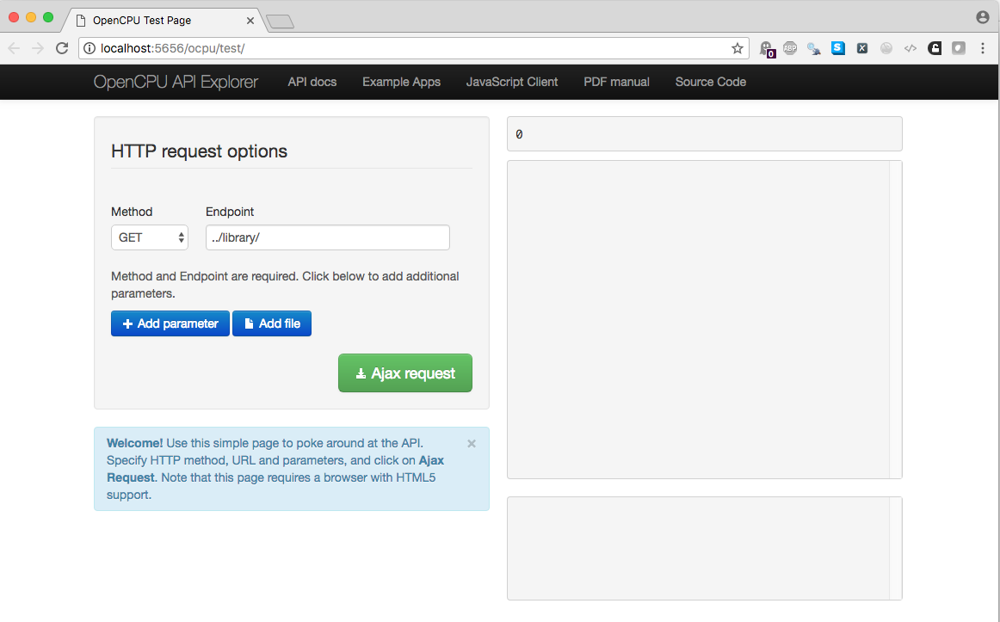

__NOTE:__ To render this document, you must follow instructions on
running `opencpu` below.  I provide the rendered HTML for you as
well. 

R is a powerful system for any kind of data science oriented
computation. In the modern world, many resources are web-oriented. 

- Java program functionality can be exposed as web services using a servlet
  container such as [Tomcat](https://tomcat.apache.org)
  
- Python programs can be exposed via CGI, `mod_python` in Apache, or
  [WSGI](https://www.wsgi.org), or
  [Flask](https://flask.palletsprojects.com/en/1.1.x/) or even a
  full-fledged [Django](https://www.djangoproject.com/) web framework.

So it is natural to ask:

_Can R be exposed as a web service?_

The answer is __yes!__ 


## 21.1.1. The HTTP Protocol Summary

The HTTP API defines methods (verbs) that indicate what action is to
be performed on an internet resource. A request consists of:

- An internet URL to which to send the request
- The verb: a method or operation such as `GET`,
  `POST`, `PUT`, `DELETE`, or `HEAD`
- Further header information in the request providing additional
  meta-data (protocols, versions etc.)
- An optional body for the request which contains the data
  characterizing the request. This might be included in the URL
  itself, or in the body, e.g., for a `POST` or `PUT`
  method request.

___

### Request

The HTTP request verbs tell the server what kind of action
  the client wants the server to take.  The four verbs most commonly
  seen in APIs are:

- `GET` Retrieve a resource from server. This may be
parametrized, by means of a _query_ string

- `POST Create a new resource, usually with some data

- `PUT` Asks the server to edit/update an existing
resource

- `DELETE` Asks the server to delete a resource

The first two are the ones mostly used for obvious reasons.

___

### Response

The server processes the request and returns its response. This again
  consists of a a header and an optional body.

The header starts with a line that tells us the status of the request.

The remaining lines are name value pairs that tell you about the
  content, its type, the character encoding etc.

The body really what usually interests us.

_We have to examine the headers before processing the body!_


## 21.1.3 OpenCPU

Jeroen Ooms wrote `opencpu` which is an HTTP interface to R. It opens
up many possibilities.

You can install `opencpu` like any other package. Once installed, you
can start the web server via `opencpu::ocpu_start_server()`. 

By default it starts listening on port 5656 on the local host.
Requests can be sent to this server by means of `GET` and `POST` HTTP
commands. 

___

Individual requests within the OpenCPU API are _stateless_; there is
no notion of a persistent process. However, you can get _stateful_
behavior through persistence of objects which have a unique name/key
associated with them.

OpenCPU handles all the standard formats.

- Datasets can be retrieved as CSV, JSON, Protocol Buffers,
  tab-delimited text
- Graphics can be retrieved in svg, png, pdf
- Files can uploaded using standard HTTP mechanics

Associated with every request is a session.  R libraries are accessed
via a general abstraction; CRAN packages can be accessed seamlessly in
the cloud server.

## 21.1.4. OpenCPU Methods

The only two methods used are `GET` and `POST`.

- `GET` is a _safe_ method that is used for information reading and
  will not change the state of the server. Used for retrieving
  objects, graphics, files
- `POST` is a remote procedure call or running scripts. It changes the
  server state.

The complete API can be seen at
[the opencpu website](http://www.opencpu.org/api.html).

## 21.1.4. OpenCPU Examples

In another terminal, the commands

```{r, eval = FALSE}
library(opencpu)
ocpu_start_server()
```
will start a local opencpu server on port 5656.  You can then navigate
to the URL [http://localhost:5656/ocpu](http://localhost:5656/ocpu). 

There is also a [public OpenCPU server](https://public.opencpu.org)
which you can access.

If you do that, you will get a web page like this.



___

The root of the `opencpu` server API is `/ocpu/` by default. For
example, you can run these commands using `curl` (or equivalently
`wget`).

1. `GET` the `aml` data in JSON format
```{bash}
#curl uses http get method by default
curl http://localhost:5656/ocpu/library/survival/data/aml/json
```
___

2. `POST` a request to get the
```{bash}
#curl uses http post method for -X POST or -d "arg=value"
curl http://localhost:5656/ocpu/library/stats/R/rnorm -d "n=3&mean=5"
```

We can retrieve the actual value of the normal variates by using the
session info. 

___

In an R session, here are the equivalents.

```{r}
library(httr)
ocpu_url <- "http://localhost:5656/ocpu"
url <- paste0(ocpu_url, "/library/survival/data/aml/json")
url
r <- GET(url)
```

Notice the form of the URL where the path components refer to sections
of the package. For example, the above URL refers to the `aml` data
object in the package `survival`.

```{r}
library(survival)
str(aml)
```

Examine the result.
```{r}
names(r)
r$status_code
```

___

From the API pages.


__HTTP Code__    |	__When__                   |	__Returns__
---------------- | --------------------------- | --------------------------
200 OK	         | On successful GET request   | Resource content
201 Created	     | On successful POST request  | Output location
302 Found	     | Redirect	                   | Redirect Location
400 Bad Request	 | R raised an error.	       | Error message in text/plain


The headers shows what the content type is. Of course, we asked for
JSON content. Note how that is also part of the URL.

```{r}
headers(r)
```

___

So, we can retrieve the data by using the `jsonlite` package

```{r}
library(jsonlite)
d <- fromJSON(rawToChar(r$content))
str(d)
```
That should be identical to `aml`.

```{r}
identical(d, aml)
```

Hmmm.. No, why?

```{r}
str(aml)
str(d)
```

Let's fix that.

```{r}
dd <- d
dd$x <- factor(dd$x)
dd$time <- as.numeric(dd$time)
dd$status <- as.numeric(dd$status)
rownames(dd) <- as.character(seq_len(nrow(dd)))
identical(aml, dd)
```

___

Note that the default action in R is to `print` an object when you
evaluate it.

```{r}
url <- paste0(ocpu_url, "/library/MASS/data/Boston")
r <- GET(url)
headers(r)['content-type']
```

So the result of the above is merely to return the output resulting
from typing `Boston` at the R prompt, actually a small portion of it
even then. The resulting output is just text.

```{r}
w <- rawToChar(r$content)
nchar(w)
```

## 21.1.5. The R object API

What about other data formats? Refer to the opencpu API.
You can list R objects in a session or data objects in a package. The
generic format is: `../{R|data}/{object}/{format}`.


```{r}
url <- paste0(ocpu_url, "/library/survival/data/aml/csv")
r <- GET(url)
headers(r)['content-type']
```

So to get this data, just for sake of example, we need to do:

```{r}
d2 <- read.csv(textConnection(rawToChar(r$content)))
str(d2)
```

Protocol Buffers.

```{r}
url <- paste0(ocpu_url, "/library/survival/data/aml/pb")
r <- GET(url)
headers(r)['content-type']
```

To get at the result, we need to deserialize the protocol buffer
encoded data.

```{r, eval = FALSE}
library(RProtoBuf)
d3 <- unserialize_pb(r$content)
str(d3)
```

___

One can, therefore, use a somewhat general deserializer function as
follows.


```{r}
deSerialize <- function(q) {
  cType <- headers(q)[['content-type']]
  switch (cType,
          "application/json" = jsonlite::fromJSON(rawToChar(q$content)),
          "application/x-protobuf" = RProtoBuf::unserialize_pb(q$content),
          "text/csv" = read.csv(textConnection(rawToChar(q$content))),
          stop("deSerialize: Unhandled content type"))
}
```

## 21.1.6. Passing parameters to requests

With `curl` the `-d` option indicates data for `POST` requests. In R,
we can do the same thing by passing parameters to `POST`.

```{r}
url <- paste0(ocpu_url, "/library/stats/R/rnorm/json")
r <- POST(url, body = list(n = 5, mean = 2))
deSerialize(r)
```

## 21.1.7. Graphics

We can return generic png as follows

```{r}
url <- paste0(ocpu_url, "/library/graphics/R/plot")
r <- POST(url, body = list(x = "cars"))
headers(r)
```

Notice that the header `x-ocpu-session` gives us a session id.  We can
use that to get the graphics.

```{r}
url <- paste0(ocpu_url, "/tmp/", headers(r)[["x-ocpu-session"]], "/graphics/last/pdf")
q <- GET(url)
headers(q)
```

We can now save the pdf.

```{r}
pdf <- content(q, "raw")

writeBin(pdf, "plot.pdf")
```

## 21.1.8. Other capabilities

Opencpu can also process R scripts, markdown documents etc.  Refer to
the API.

See also the papers by Jeroen Ooms on the
[opencpu](http://www.opencpu.org) website.


## Session Info

```{r}
sessionInfo()
```
