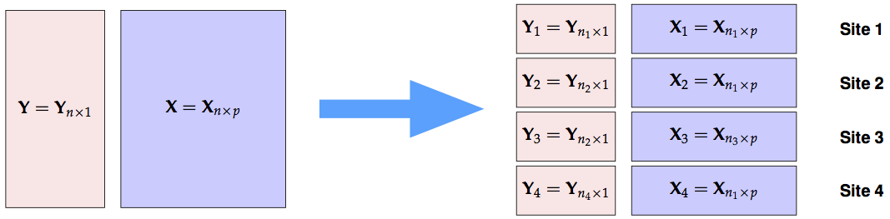
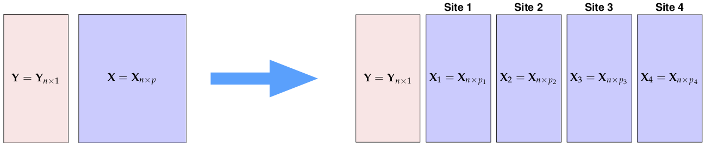
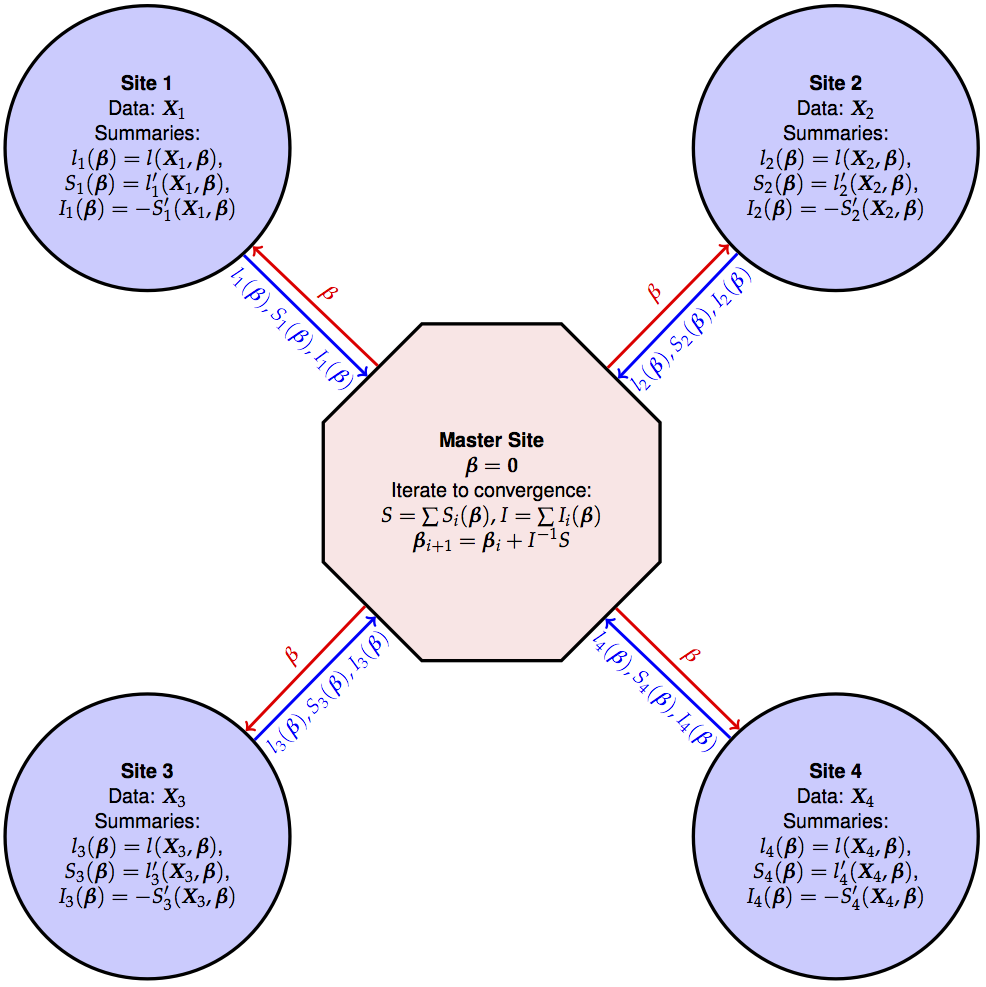
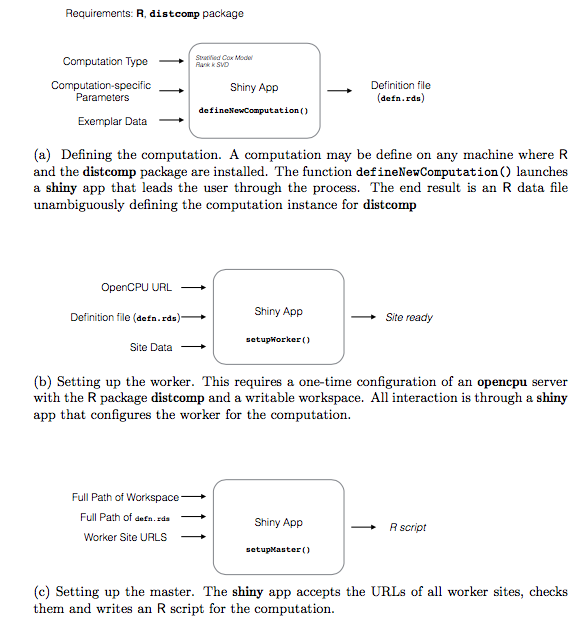

In healthcare, much depends on our ability to share information across
healthcare providers and research institutions.

However, there are barriers to successful, useful aggregation.

- Patient Privacy
- Ownership and control
- Use of data (purpose)
- Diverse platforms and data structure

As medicine develops more refined methods of personalization of
prognosis, and attempts to use them to guide treatment decisions, the
mechanisms for bringing multiple dispersed resources to bear will
determine how fast the system can learn.

I use medicine as an example, but same concerns privacy prevail in
social data, finance etc.

___

Particularly true in Cancer: Stanford being a small cancer center
almost never has adequate numbers for rare diseases.

Aggregation of data from several sites into a combined repository,
along with a plan for analytic access provides one such mechanism, and
there are many efforts of that general type underway in all areas of
medicine. But they are expensive and slow

Furthermore, there are only gentlemanly guarantees on data control: if
a site decides at a later date to stop participation, they can only
request that their data be removed. In most cases, there is really no
check on whether it actually was in most cases.

___

## 21.2.1. The `distcomp` package


The package [`distcomp`](http://cloud.r-project.org/package=distcomp)
demonstrates how one can perform distributed computations without
aggregation. A companion package
[`homomorpheR`](http://cloud.r-project.org/package=homomorpheR) shows
how one can even do this on a encrypted data.

The paper describing this is online
[Journal of Statistical Software](https://www.jstatsoft.org/article/view/v077i13)


The latest version is 1.3 on
[Github](https://github.com/bnaras/distcomp) which will soon land on
CRAN (which now has version 1.1).


## 21.2.1. Row Partitioned Data

When many sites have data on different subjects with same set
of variables measured on all of them.




## 21.2.2. Column Partitioned Data

When many sites have data on same set of subjects but with different
variables measured on all of them.




## 21.2.3. Master-Worker Topology

We focus on the row-partitioned case. 

We will have a master site and worker sites, and the topology will be
as shown below.




## 21.2.4. The Steps



___

To summarize the steps"

1. A specific computation is defined and codified in a data
   object `compdef`. This object contains details such as what data set is
   expected, what particular computation is to be executed. The
   computation to be executed is one of those implemented in
   `distcomp` package!
   
   Note that `compdef` contains no secrets and can be shared via any
   channel. 

2. Each participating site is asked to set up the computation by
   setting up an `opencpu` server along with `compdef` and the
   appropriate data for the computation.
   
3. A master script is given `compdef` object URLs of
   the sites. This will run the computation and return the results. 
   

## 21.2.5. Distributed Cox Model Example

One can fit a distributed Statified Cox model this way, and indeed any
generalized linear model. Here is a fit using the UIS dataset from
Hosmer and Lemeshow on time until return to drug use for patients
enrolled in two different residential treatment programs. 

___

Assuming all data is in one place, one would fit a stratified cox
proportional hazard model using `site` (0 or 1) as a stratification
variable.

```{r, eval = FALSE}
> uis <- readRDS("uis.RDS")
> coxOrig <- coxph(formula=Surv(time, censor) ~ age + becktota +
+                      ndrugfp1 + ndrugfp2 + ivhx3 +
+                      race + treat + strata(site), data=uis)
> summary(coxOrig)
Call:
coxph(formula = Surv(time, censor) ~ age + becktota + ndrugfp1 +
ndrugfp2 + ivhx3 + race + treat + strata(site), data = uis)

n= 575, number of events= 464
(53 observations deleted due to missingness)

               coef exp(coef)  se(coef)      z Pr(>|z|)
age       -0.028076  0.972315  0.008131 -3.453 0.000554 ***
becktota   0.009146  1.009187  0.004991  1.832 0.066914 .
ndrugfp1  -0.521973  0.593349  0.124424 -4.195 2.73e-05 ***
ndrugfp2  -0.194178  0.823512  0.048252 -4.024 5.72e-05 ***
ivhx3TRUE  0.263634  1.301652  0.108243  2.436 0.014868 *
race      -0.240021  0.786611  0.115632 -2.076 0.037920 *
treat     -0.212616  0.808466  0.093747 -2.268 0.023331 *
---
Signif. codes:  0 '***' 0.001 '**' 0.01 '*' 0.05 '.' 0.1 ' ' 1
...
```

___

To get the same results using a distributed computation, we proceed as
before, executing the steps in order.

```{r, eval = FALSE}
> coxDef <- list(compType = names(availableComputations())[1],
+  formula = paste("Surv(time,censor)~",
       "age+becktota+ndrugfp1+ndrugfp2+ivhx3+race+treat"),
+  defnId = "UIS")
> siteData <- with(uis, split(x=uis, f=site))
> nSites <- length(siteData)
> siteNames <- sapply(seq.int(nSites),
+   function(i) paste("site", i, sep=""))
> siteURLs <- lapply(seq.int(nSites), function(i) opencpu$url())
> names(siteData) <- names(siteURLs) <- siteNames
> siteDataFiles <- lapply(seq.int(nSites),
+   function(i) paste("site", i, ".rds", sep=""))
> ok <- Map(uploadNewComputation, siteURLs,
+           lapply(seq.int(nSites), function(i) coxDef),
+           siteData,
+           siteDataFiles)
stopifnot(all(ok))
> master <- coxMaster$new(defnId = coxDef$defnId,
+           formula=coxDef$formula, localServer=TRUE)
> for (i in seq.int(nSites)) {
+     master$addSite(siteNames[i], siteURLs[[i]],
+                  dataFileName=siteDataFiles[[i]])
+ }
> result <- master$run()
```


At the end of the run, a summary can be printed.

```{r, eval = FALSE}
> print(master$summary(), digits=5)
        coef exp(coef)  se(coef)       z          p
1 -0.0280495   0.97234 0.0081301 -3.4501 5.6041e-04
2  0.0091441   1.00919 0.0049918  1.8318 6.6979e-02
3 -0.5219296   0.59337 0.1244240 -4.1948 2.7315e-05
4 -0.1941709   0.82352 0.0482507 -4.0242 5.7168e-05
5  0.2636376   1.30166 0.1082448  2.4356 1.4868e-02
6 -0.2400609   0.78658 0.1156319 -2.0761 3.7887e-02
7 -0.2125720   0.80850 0.0937466 -2.2675 2.3359e-02
```


As can be seen, the results are similar to the original model fit.


## 21.2.6. The Implementation

The code in `distcomp` uses a number of facilities of R we discussed
in class, including serialization, `httr`, `opencpu`, `R6` classes.

It also includes a `shiny` app to ease the distributed computation.

For further details see the paper [Journal of Statistical
Software](https://www.jstatsoft.org/article/view/v077i13).


## 21.2.7 Homomorphic Computation

The _master-worker_ topology below has a limitation in that the
_master_ process is in direct contact with _worker_ processes: over
time, it may learn the characteristics of each site. So information
may leak. 

How to prevent that?  One way is to work with encrypted data. But
first we need some concepts.

Let $x$ be a large integer. Denote $E(x)$ as the encrypted message and
$D(x)$ as the decryption of $x$ in some public cryptographic
scheme. That is.

$$
x = D(E(x)).
$$

We say the scheme is homomorphic over addition if

$$ E(x) + E(y) = E(x + y). $$

In words: The encrypted value of $x+y$ is the same as the encrypted
  value of $x$ added to the encrypted value of $y$

Special cryptographic schemes have this property and so they are
called homomorphic encryption schemes.

As a consequence, if one is given the sum of two encrypted values and
wants to figure out the sum, all one has to do is decrypt the sum of
the two encrypted values:

$$ D(E(x) + E(y)) = D(E(x + y)) = x + y! $$

The package `homomorpheR` on CRAN implements the Paillier homomorphic
encryption scheme. The package `distcomp` can be combined with
`homomorpheR` to perform distributed homomorphic computations.

## 21.2.8 Non-cooperating Parties Scheme

As an example, suppose we have three sites that have the same data
variables in a database: `age` and `sex`. 

__Question__ We want to get a count of how many female subjects are
below 50 years of age among all sites.  This may be needed to figure
out the feasibility of a clinical trial or a study say.

__Desiderata__

1. The master process should only get the aggregate count, not the
   individual counts
2. The master should not know how many sites there are. 

This requires the use of two _Noncooperating Parties_. 

___


```{r, out.width = "800px", echo = FALSE}
knitr::include_graphics("ncqm.png")
```

## 21.2.9 A Query Count Example.

The script `query_count_example.R` is the code for running a query
count example for `age > 50 & sex == "M"`. 


## Session Info

```{r}
sessionInfo()
```

