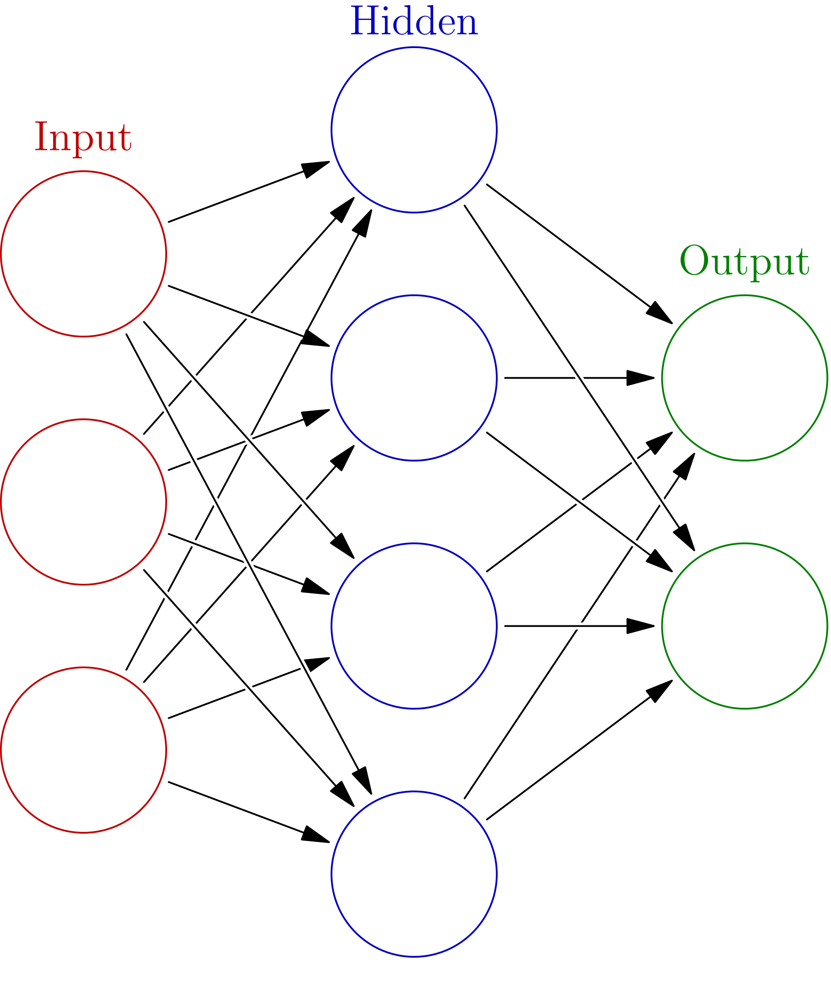

```{r setup, include=FALSE}
library(keras)
```

## A Single-layer Neural Network

```{r, out.width = "800px", echo = FALSE}

```

Source: Wikipedia

__Source: Keras library vignette__

## MNIST Example

We can learn the basics of Keras by walking through a simple example:
recognizing handwritten digits from the
[MNIST](https://en.wikipedia.org/wiki/MNIST_database) dataset. MNIST
consists of 28 x 28 grayscale images of handwritten digits like these:


The dataset also includes labels for each image, telling us which
digit it is. For example, the labels for the above images are 5, 0, 4,
and 1.

### Preparing the Data

The MNIST dataset is included with Keras and can be accessed using the
`dataset_mnist()` function. Here we load the dataset then create
variables for our test and training data:

```{r}
library(keras)
mnist <- dataset_mnist()
x_train <- mnist$train$x
y_train <- mnist$train$y
x_test <- mnist$test$x
y_test <- mnist$test$y
```

The `x` data is a 3-d array `(images,width,height)` of grayscale
values . To prepare the data for training we convert the 3-d arrays
into matrices by reshaping width and height into a single dimension
(28x28 images are flattened into length 784 vectors). Then, we convert
the grayscale values from integers ranging between 0 to 255 into
floating point values ranging between 0 and 1:

```{r}
# reshape
x_train <- array_reshape(x_train, c(nrow(x_train), 784))
x_test <- array_reshape(x_test, c(nrow(x_test), 784))
# rescale
x_train <- x_train / 255
x_test <- x_test / 255
```

Note that we use the `array_reshape()` function rather than the
`dim<-()` function to reshape the array. This is so that the data is
re-interpreted using row-major semantics (as opposed to R's default
column-major semantics), which is in turn compatible with the way that
the numerical libraries called by Keras interpret array dimensions.

The `y` data is an integer vector with values ranging from 0 to 9. To
prepare this data for training we [one-hot
encode](https://www.quora.com/What-is-one-hot-encoding-and-when-is-it-used-in-data-science)
the vectors into binary class matrices using the Keras
`to_categorical()` function:

```{r}
y_train <- to_categorical(y_train, 10)
y_test <- to_categorical(y_test, 10)
```

### Defining the Model

The core data structure of Keras is a model, a way to organize
layers. The simplest type of model is the [Sequential
model](https://keras.rstudio.com/articles/sequential_model.html), a
linear stack of layers.

We begin by creating a sequential model and then adding layers using
the pipe (`%>%`) operator:

```{r}
model <- keras_model_sequential() 
model %>% 
  layer_dense(units = 256, activation = 'relu', input_shape = c(784)) %>% 
  layer_dropout(rate = 0.4) %>% 
  layer_dense(units = 128, activation = 'relu') %>%
  layer_dropout(rate = 0.3) %>%
  layer_dense(units = 10, activation = 'softmax')
```

The `input_shape` argument to the first layer specifies the shape of
the input data (a length 784 numeric vector representing a grayscale
image). The final layer outputs a length 10 numeric vector
(probabilities for each digit) using a [softmax activation
function](https://en.wikipedia.org/wiki/Softmax_function).
 

Use the `summary()` function to print the details of the model:

```{r}
summary(model)
```

Next, compile the model with appropriate loss function, optimizer, and metrics:

```{r}
model %>% compile(
  loss = 'categorical_crossentropy',
  optimizer = optimizer_rmsprop(),
  metrics = c('accuracy')
)
```

### Training and Evaluation

Use the `fit()` function to train the model for 30 epochs using batches of 128 images:

```{r, results='hide'}
history <- model %>% fit(
  x_train, y_train, 
  epochs = 30, batch_size = 128, 
  validation_split = 0.2
)
```

The `history` object returned by `fit()` includes loss and accuracy metrics which we can plot:

```{r}
plot(history)
```


Evaluate the model's performance on the test data:

```{r, results = 'hide'}
model %>% evaluate(x_test, y_test)
```

Generate predictions on new data:

```{r, results = 'hide'}
model %>% predict_classes(x_test)
```

Keras provides a vocabulary for building deep learning models that is
simple, elegant, and intuitive. Building a question answering system,
an image classification model, a neural Turing machine, or any other
model is just as straightforward.

## Some Definitions

Below are some common definitions that are necessary to know and
understand to correctly utilize Keras:

Sample: one element of a dataset.

Example: one image is a sample in a convolutional network

Example: one audio file is a sample for a speech recognition model

Batch: a set of N samples. The samples in a batch are processed
independently, in parallel. If training, a batch results in only one
update to the model.  A batch generally approximates the distribution
of the input data better than a single input. The larger the batch,
the better the approximation; however, it is also true that the batch
will take longer to process and will still result in only one
update. For inference (evaluate/predict), it is recommended to pick a
batch size that is as large as you can afford without going out of
memory (since larger batches will usually result in faster
evaluation/prediction).

Epoch: an arbitrary cutoff, generally defined as "one pass over the
entire dataset", used to separate training into distinct phases, which
is useful for logging and periodic evaluation.  When using
validation_data or validation_split with the fit method of Keras
models, evaluation will be run at the end of every epoch.

Within Keras, there is the ability to add callbacks specifically
designed to be run at the end of an epoch. Examples of these are
learning rate changes and model checkpointing (saving).


