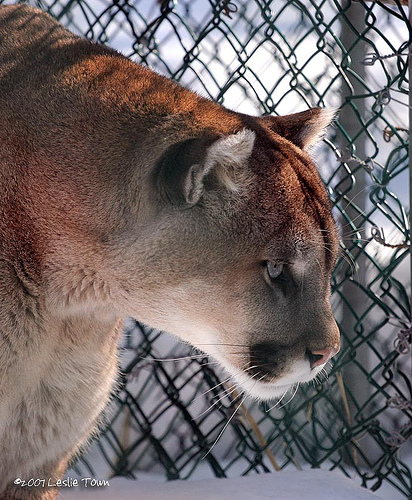
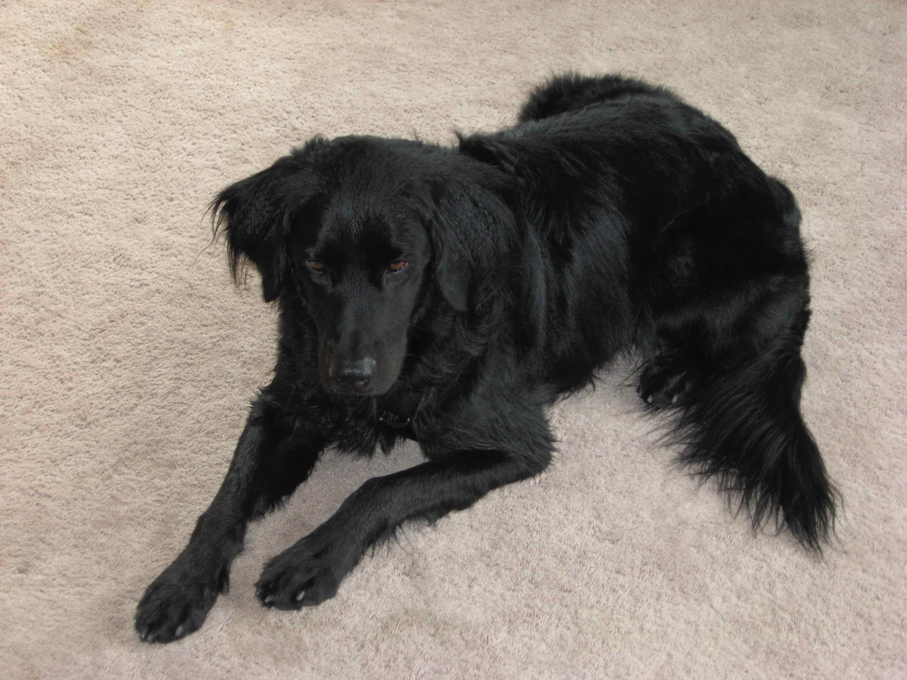
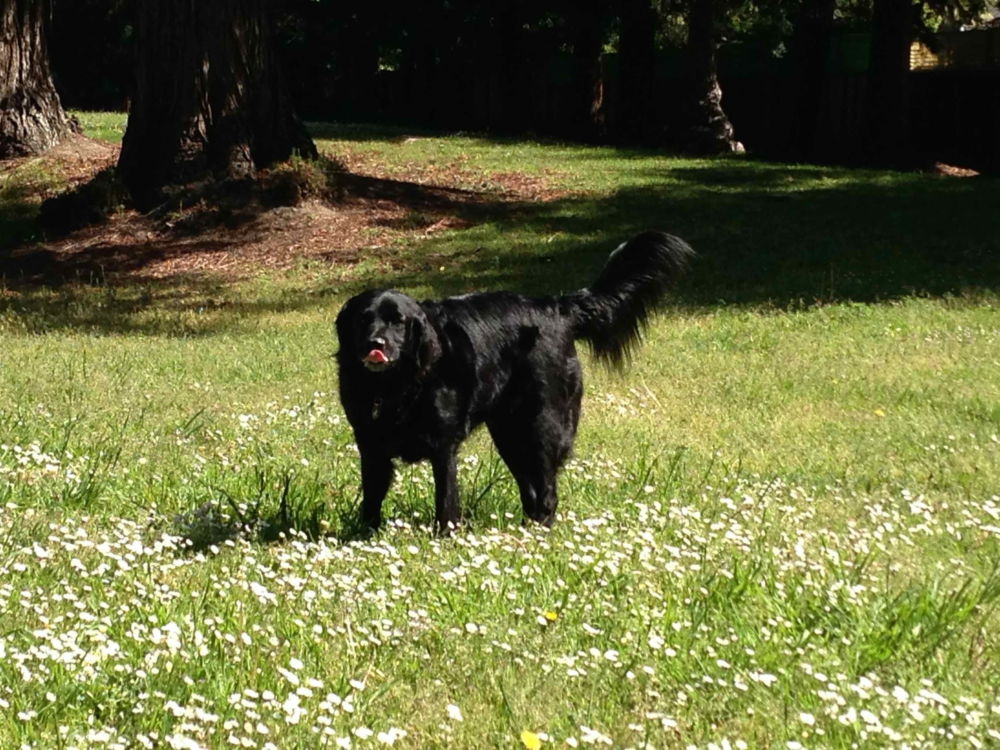

```{r setup, include = FALSE}
library(keras)
```

## Classify Images

Keras allows you to use trained models for prediction with new
data. Here is an example where we will predict the class label of this
cougar.


```{r, out.width = "400px", echo = FALSE}

```

ImageNet in the context of NN prediction really refers to the ImageNet
Large Scale Visual Recognition Challenge, or ILSVRC for short. The
goal of the challenge was train a model to correctly classify an input
image into 1,000 separate object categories. 

Models are trained on ~1.2 million training images with another 50,000
images for validation and 100,000 images for testing.  The weights
that have been learned for the models, are provided and so one can use
them directly, bypassing the learning phase.


## Using Imagenet in Keras


In Keras, you can instantiate this pre-trained model as follows. 

```{r}
# instantiate the model
model <- application_resnet50(weights = 'imagenet')
```

Then we load the image, scale it appropriately and feed it to the
network for prediction.

```{r}
# load the image
img_path <- "lion.jpg"
img <- image_load(img_path, target_size = c(224,224))
x <- image_to_array(img)

# ensure we have a 4d tensor with single element in the batch dimension,
# the preprocess the input for prediction using resnet50
x <- array_reshape(x, c(1, dim(x)))
x <- imagenet_preprocess_input(x)

# make predictions then decode and print them
preds <- model %>% predict(x)
imagenet_decode_predictions(preds, top = 5)[[1]] %>%
    knitr::kable()
```

___

Here's another example where I used a picture of my late buddy, Noah.

```{r, out.width = "400px", echo = FALSE}

```

Let us first use ResNet50 and try this out. 

```{r}
# load the image
img_path <- "noah.jpg"
img <- image_load(img_path, target_size = c(224,224))
x <- image_to_array(img)

# ensure we have a 4d tensor with single element in the batch dimension,
# the preprocess the input for prediction using resnet50
x <- array_reshape(x, c(1, dim(x)))
x <- imagenet_preprocess_input(x)

# make predictions then decode and print them
preds <- model %>% predict(x)
imagenet_decode_predictions(preds, top = 5)[[1]] %>%
    knitr::kable()
```

For the record, Noan _looked_ like a flat-coat retriever, but he
actually was a mix of all kinds of things: pomeranian, labrador,
etc. We know this from the dog version of 23andMe!

___

Let us try another photo of Noah.

```{r, out.width = "400px", echo = FALSE}

```


```{r}
# load the image
img_path <- "noah2.jpg"
img <- image_load(img_path, target_size = c(224,224))
x <- image_to_array(img)

# ensure we have a 4d tensor with single element in the batch dimension,
# the preprocess the input for prediction using resnet50
x <- array_reshape(x, c(1, dim(x)))
x <- imagenet_preprocess_input(x)

# make predictions then decode and print them
preds <- model %>% predict(x)
imagenet_decode_predictions(preds, top = 5)[[1]] %>%
    knitr::kable()
```

Now, ResNet50 is no longer completely sure that this Noah is a
flat-coated retriever! 

## Other models

Keras provides a choice of pre-trained models to use. Among them are: 

- Xception
- VGG19
- InceptionV3
- InceptionResNetV2
- MobileNet
- DenseNet
- NASNet

They differ in the NN architecture such as number of hidden layers,
how the training was done etc. 


## VGG16

Let us try another model pre-trained models Keras provides,
[VGG16](https://www.cs.toronto.edu/~frossard/post/vgg16/).

```{r, out.width = "800px", echo = FALSE}
knitr::include_graphics("vgg16.png")
```

```{r}
model <- application_vgg16(weights = 'imagenet', include_top = TRUE)
img <- image_load(img_path, target_size = c(224,224))
x <- image_to_array(img)
x <- array_reshape(x, c(1, dim(x)))
x <- imagenet_preprocess_input(x)
# make predictions then decode and print them
preds <- model %>% predict(x)
imagenet_decode_predictions(preds, top = 5)[[1]] %>%
    knitr::kable()
```

This does better than ResNet50.


