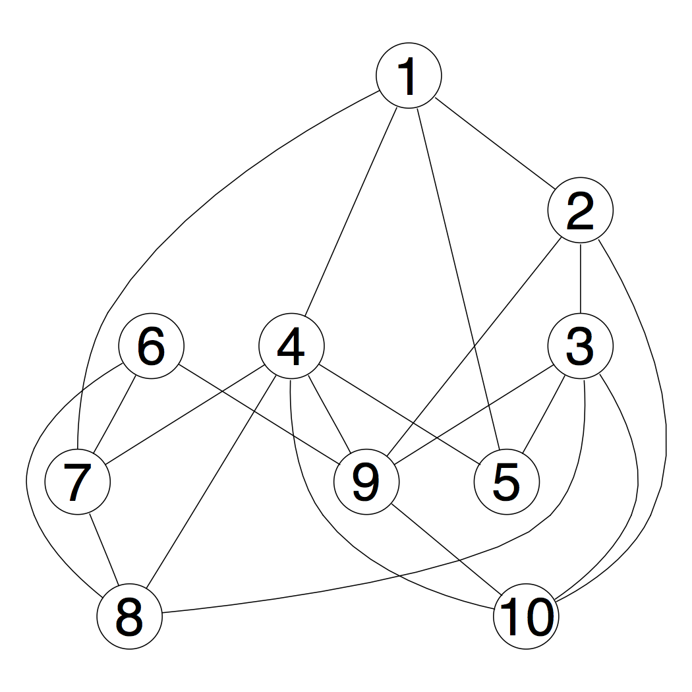

According to Wikipedia: 

> Mapreduce is a programming model and an associated implementation for
> processing and generating big data sets with a parallel, distributed
> algorithm on a cluster.

> A MapReduce program is composed of a map procedure, which performs
> filtering and sorting (such as sorting students by first name into
> queues, one queue for each name), and a reduce method, which
> performs a summary operation (such as counting the number of
> students in each queue, yielding name frequencies). The "MapReduce
> System" (also called "infrastructure" or "framework") orchestrates
> the processing by marshalling the distributed servers, running the
> various tasks in parallel, managing all communications and data
> transfers between the various parts of the system, and providing for
> redundancy and fault tolerance.

While we won't use an infrastructure, we can understand the paradigm
rather easily by means of examples which we do below. (However, it
should be noted that R does have facilities for working with Spark via
[sparklyr](https://spark.rstudio.com) using several clusters including
cloudera, databricks, yarn, etc.)


## Exploring Social Network Data

A popular problem in data mining courses is to recommend friends using
a MapReduce computation.

The key idea is that if two people have a lot of mutual friends, then
the system should recommend that they connect with each other. Data is
provided in the file `soc-LiveJournal1Adj.txt`. It contains the
adjacency list and has multiple lines in the following format:

```
User<TAB>Friends
```

`User` is a unique integer ID corresponding to a unique user and
`Friends` is a comma separated list of unique `ID`s corresponding to
the friends of the user with the unique id `User`. The friendships are
mutual (i.e., edges are undirected): if $A$ is a friend of $B$ then
$B$ is also a friend of $A$.

This dataset is too large for you to work on your laptop. So for this
exercise, use the simple network of friends below to try out your
strategies.



For example, friends 1 and 2 have no other friends in common. Friends
1 and 4 also have friends 5 and 7 in common. User 3 has 4 friends in
common with 4, 2 with 1, 2 with 6 and 1 with 7, but is not friends
with them.

## Mutual friends

For each friend pair $(U,V)$, we first produce a list of friends they have in
common.

```{r}
## The data
records <- list(c(1, 2, 4, 5, 7),
                c(2, 1, 3, 9, 10),
                c(3, 2, 5, 8, 9, 10),
                c(4, 1, 5, 7, 8, 9, 10),
                c(5, 1, 3, 4),
                c(6, 7, 8, 9),
                c(7, 1, 4, 6, 8),
                c(8, 3, 4, 6, 7),
                c(9, 2, 3, 4, 6, 10),
                c(10, 2, 3, 4, 9))
```

The above requires the use of hash tables for keys and values, so we
use the `hash` library on CRAN.  Install it if you haven't already
done so.

Our solution strategy is the following:

1. Map the data to 1a set of key-value pairs, where the keys are
friend pairs and the values are their sets of friends.

2. Reduce the values for each key by computing the intersection of the
sets of friends.

So we start by generating, for each user $u$ and for each friend $v$
of $u$, a set of key-value pairs. The key is the friend pair $(u, v)$
and the value is the list of friends of $u$.  Thus, for the first
record above, we will get key-value pairs as shown below. Note how the
key always has the userids in sorted order.

|Key     | Value
|--------|----------------------
|`"1,2"` | `list(c(2, 4, 5, 7))`
|`"1,4"` | `list(c(2, 4, 5, 7))`
|...     | ...
|`"1,7"` | `list(c(2, 4, 5, 7))`


After the first friend in the second record is processed for example,
the key `"1,2"` shows up again and so the value above changes to:

|Key     | Value
|--------|--------------------------------------
|`"1,2"` | `list(c(2, 4, 5, 7), c(1, 3, 9, 10))`
|`"1,4"` | `list(c(2, 4, 5, 7))`
|...     | ...
|`"1,7"` | `list(c(2, 4, 5, 7))`


etc. and so on. As you can see we the values keep accumulating the
sets of friends, which when intersected will give the desired result.

So here is our _mapper_ function.


```{r}
library(hash)
##
## For each id, for each friend, emit as key the string
## "id,friend_id" and value: the original list of friends of id
## So for example, for the first record above, we get:
##
keyMap <- hash()
mapper <- function(x) {
    id <- x[1] ## first element of the record
    rest <- x[-1] ## the rest of the record
    lapply(rest,
           function(z) {
               key <- do.call(paste, as.list(c(sort(c(id, z)), sep = ",")))
               value <- keyMap[[key]]
               ## if key is not yet in keyMap, value will be NULL, so put it in
               if (is.null(value)) { ## not yet in hash table, so put it in
                   keyMap[[key]] <- list(rest)
               } else { ## there's a value already in keyMap, so append
                   keyMap[[key]] <- c(value, list(rest))
               }
           })
    TRUE
}
```

All we need to do now is apply it to our records.

```{r}
lapply(records, mapper)
```

You can print keyMap to see what we got.

```{r}
keyMap
```

Let's dig deeper since the printed value of `keyMap` does not convey
the structure.

```{r}
keyMap[["1,2"]]
keyMap[["4,10"]]
```

All we need to do now is reduce the values in the key value pairs
using `intersection`.

```{r}
## Grouping by keys done, so now reduce
for (key in keys(keyMap)) {
    values <- keyMap[[key]]
    keyMap[[key]] <- Reduce(f = intersect, x = values)
}
```

At this point the hash table will contain the common friends for the
friend pairs.

```{r}
for (key in keys(keyMap)) {
    cat(key, "\t", keyMap[[key]], "\n")
}
```

## Friend Recommendations

For each user $U$, we want to recommend users who are not already
friends with $U$, but have the most number of mutual friends in common
with $U$. So the first recommendation should be the user with most
number of common friends and the last with the least number of common
friends. That is why the recommendation for user 3 above would be 4, 1
or 6 in any order, and finally 7.

Here is a solution that just distinguishes friends of lengths 1 and 2
and generates suitable key value pairs. The former are, of course, the
direct friends and the latter, the mutual friends.

There is a menial task of adding a key-value pair to a table that we
can relegate to a function. The logic is simply this: if the value
isn't there for a key, add the key-value pair, else, if it is already
there, append the value to what was already there for the key. (We
could have also used this function above in finding mutual friends.)

```{r}
keyMap <- hash()
pushKeyValue <- function(key, value) {
    key <- as.character(key)
    existingValue <- keyMap[[key]]
    ## if key is not yet in keyMap, existingValue will be NULL, so put it in
    if (is.null(existingValue)) { ## not yet in hash table, so put it in
        keyMap[[key]] <- list(value)
    } else { ## there's an existing value already in keyMap, so append
        keyMap[[key]] <- c(existingValue, list(value))
    }
    TRUE
}

mapper <- function(x) {
    user <- x[1]
    directFriends <- x[-1]
    lapply(directFriends, function(z) {
        pushKeyValue(key = user,
                     value = list(user = z, dist = 1))
    })
    if (length(x) > 2) { ## more than 1 friend
        ## Compute all possible combinations of user's friends
        tuples <- combn(directFriends, 2)
        apply(tuples, 2, function(z)
            pushKeyValue(key = z[1],
                         value = list(user = z[2], dist = 2)))
        apply(tuples, 2, function(z)
            pushKeyValue(key = z[2],
                         value = list(user = z[1], dist = 2)))
    }
    TRUE
}

ignore  <- lapply(records, mapper)
```

Grouping by keys (the map phase) is now done, so now reduce. 

```{r}
for (key in keys(keyMap)) {
    userMap <- hash()
    values <- keyMap[[key]]
    for (v in values) {
        user <- as.character(v[["user"]]) ## make key as char for hashing
        dist <- v[["dist"]]
        if (dist == 1) { ## direct friends, we ignore
            userMap[[user]] <- NA
        } else if (dist == 2) { ## mutual friends
            currentValue <- userMap[[user]]
            if (!is.null(currentValue)) {
                if (!is.na(currentValue)) { ## bump the count
                    userMap[[user]] <- currentValue + 1
                }
            } else {  ## count 1
                userMap[[user]] <- 1
            }
        }
    }
    ## Drop direct friends
    for (user in keys(userMap)) {
        if (is.na(userMap[[user]])) {
            del(user, userMap)
        }
    }
    list <- as.list(userMap)
    order <- order(as.integer(list), decreasing=TRUE)
    list <- list[order]
    storage.mode(list) <- "integer"
    keyMap[[key]] <- list
}

catn("Recommendation, top row is user, bottom row frequency")
for (key in keys(keyMap)) {
    catn("Recommendation for User", key)
    print(keyMap[[key]])
}

```

## Note

We could actually run this code on the data file
`soc-LiveJournal1Adj.txt` provided to generate all the friend
recommendations.  Takes about an hour on my laptop.

The only change is to generate the `records` from the data file, which
you can do as follows.

```{r, eval = FALSE}
lines <- readLines("soc-LiveJournal1Adj.txt")

## Records is a list of vector ids, first being the subject id, the rest being friend ids.
records <- lapply(lines, function(x) as.integer(strsplit(x, split="[\t,]")[[1]]))
```


## Session Info
```{r}
sessionInfo()
```
